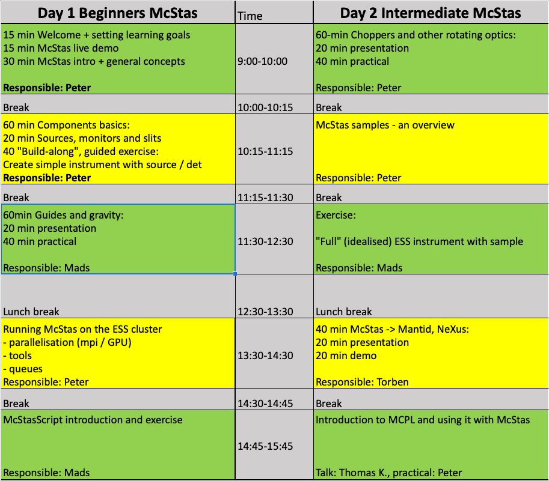

# Welcome to the 2022 ESS DMSC IDS / Scipp McStas Workshop

## Workshop programme:
[](https://docs.google.com/spreadsheets/d/1RMFaRqcZqTjQbEYwzrxLUHSRA8gp7LkbhQMr1bG3izs/edit?usp=sharing)

## Prerequisites, 
- Local installation of [docker](https://www.docker.com/products/docker-desktop)
- Account on ESS DMSC server
- ([XQuartz](https://www.xquartz.org) if on macOS or [Xming](https://sourceforge.net/projects/xming/files/latest/download) if on Windows)


## Starting the docker
- ```docker run -p 8888:8888 docker.io/mccode/mcstas-2.7.1-3.1-scipp:1.0``` 
- (add ```-v /some/folder:/home/jovyan/otherfolder``` before the image name to map a folder from your local machine to the docker image)
- Connect to the URL communicated by the docker (will open a
  JupyterLab that includes a link to a browser-based X-session)

## Zoom 
https://dtudk.zoom.us/j/67485632586?pwd=L29lbUNxQmh5VXpYT1E0ZGZNS3ZLQT09
