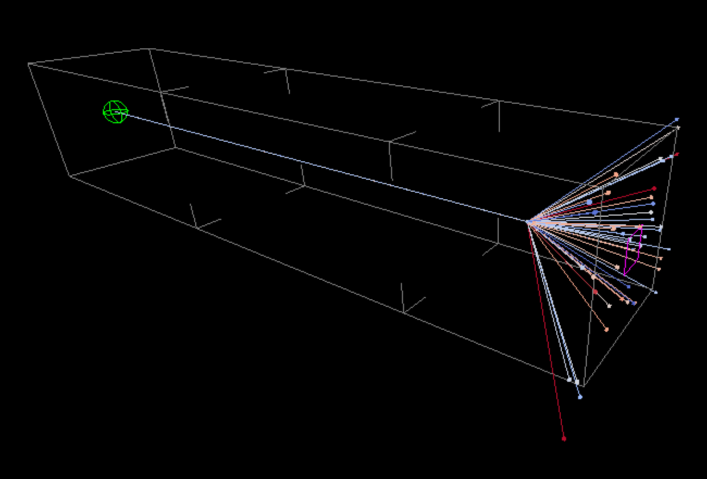

# SRSS22 McXtrace - Lab-Course 1: Ray tracing with X-rays

This is a quick tutorial/practical session on Sept 5th 17:30-19:30 organized in the frame of the [SRSS22](http://xafslab.physics.auth.gr/srss22.html) school.

We shall use the [McXtrace](https://www.mcxtrace.org) software, which allows to describe X-ray (synchrotron and X-FEL) beam-lines with sources, optics, monitors/detectors, samples and more.

## Description

The tutorial start with an initial presentation of the [McXtrace](https://www.mcxtrace.org) software, and follows with a hands-on session.

| Date             | Sept 5th, 2022                                  |
| -----------------|-------------------------------------------------|
| Location         | [CIRI-Building A](https://kedek.auth.gr/#)      |
| Topic            | synchrotron beam-line modelling with samples    |
| Language         | English                                         |
| **Presentation** | [McXtrace introduction](presentations)          |
| **Hands-on**     | [Powder diffractometer with McXtrace](tutorial) |

Organizers:

- Dr. Emmanuel Farhi, Synchrotron SOLEIL, France
- Dr. Peter Kjær Willendrup, Technical University of Denmark

## About McXtrace

[McXtrace](http://www.mcxtrace.org/) is a general Monte Carlo ray-tracing software for simulation X-ray beam-lines and experiments, distributed under the open source license of GPL.

It is a collaborative effort between DTU Physics, European Synchrotron Radiation Facility, Niels Bohr Institute, and now SOLEIL. Initial funding came from a grant under the NaBiIT program of the Danish Strategic Research Council DSF and from SAXSLAB ApS, in addition to the above parties.

It is built upon the code base of the proven and successful neutron ray-tracing package [McStas](http://mcstas.org/) and today McXtrace and McStas share a central code repository at https://github.com/McStasMcXtrace/McCode.

**References:**

1. McXtrace http://www.mcxtrace.org/
2. Downloads (version 3.0 from February 8th 2022) for Windows, Mac and Linux (CentOS, Fedora, Debian) at http://downloads.mcxtrace.org/mcxtrace-3.0/
3. E Bergbäck Knudsen, Andrea Prodi, Jana Baltser, Maria Thomsen, P Kjær Willendrup, M Sanchez del Rio, Claudio Ferrero, Emmanuel Farhi, Kristoffer Haldrup, Anette Vickery, et al. "Mcxtrace: a monte carlo software package for simulating x-ray optics, beamlines and experiments". _Journal of Applied Crystallography_, **46(3)**:679-696, 2013.
4. McXtrace/McStas Wiki https://github.com/McStasMcXtrace/McCode/wiki
5. McXtrace/McStas repository https://github.com/McStasMcXtrace/McCode

