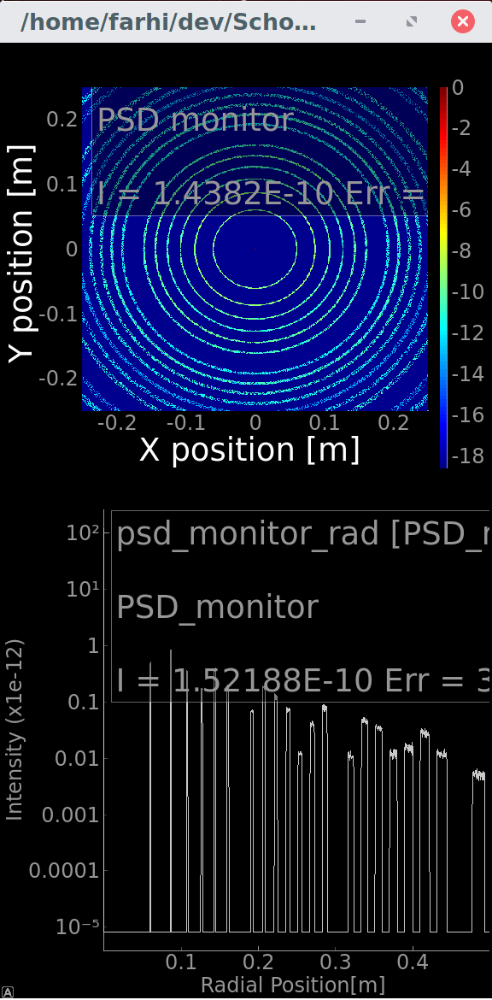

# McXtrace training: powder diffractometer

In this training, we present a sample components to be inserted into beam-line models in order to build so-called virtual experiments.

Currently, [McXtrace](http://www.mcxtrace.org) supports a limited set of sample types, and mostly focuses on diffraction related studies (powder and single crystal diffraction, absorption, small-angle). Other samples are planned e.g. IXS, EXAFS, fluorescence, ARPES, ...). We hope you can contribute to this effort in the future.

Inserting a sample component within a beam-line description constitutes a way to simulate a measurement. Such method is always limited by the amount of knowledge inserted both in the beam-line description, and the accuracy of the sample model.

In this session we shall simulate the output of a simple model for:

- X-ray powder Diffraction (XRD)

For this purpose, we build an extremely simple beam-line consisting of a source, a powder sample, and a set of detectors/monitors.

## Step 1. Open mxtrace.

- Start by either typing mxgui in the terminal, double clicking the McXtrace icon, or choosing McXtrace from the application/start menu.

Whatever is appropriate for your system. The McXtrace main window should now open, looking like this:


The Help menu in the main window provides access to documentation.

## Step 2. Start a new instrument description.

- In the 'File' menu, please choose the 'New Instrument' item.

This opens a file dialog window where you can choose a name for your new instrument file (e.g. `XRD.instr`). Do so and click save. This now opens the Editor window of the GUI where you can edit a very simple template instrument file.


A McXtrace instrument description is a text-file just like any other program you write. Generally the suffix `.instr` is used but you could use whatever you like for this.

## Step 3. Insert a source.

The editor can help you write instrument files, but really is just an editor. If you prefer to use something else this works equally fine.
Some of the allowed McXtrace code blocks have already been defined in the template file.

- Position your cursor below the keyword **TRACE** and go to the Insert menu. Choose the item `Sources -> Source_pt`. This opens the insert component dialog.

:warning: The _Insert_ dialog is not clever enough to figure out where your code should go, so you _do_ have to position the cursor where the component should be inserted.

## Step 4. Fill in some source parameters.

- Enter some values into the boxes on the right hand side of the window. 

For instance you may choose (for a 0.1 x 0.1 mm<sup>2</sup> slit at 2 m, and a 15 +/- 0.1 keV energy spread):

- focus_xw=1e-4
- focus_yh=1e-4
- dist=2
- E0=15
- dE=0.1

The source will be located at coordinates (0,0,0) in space. The X,Y,Z axes are e.g.left-wise, upwards, and straight-forward when siting on the source looking ahead.

Lastly click 'Insert'. This inserts code at the cursor position corresponding to the parameters which you entered.

```c
COMPONENT source_pt = Source_pt(
    focus_xw=1e-4, 
    focus_yh=1e-4, 
    dist=2, 
    E0=15, 
    dE=0.1)
AT (0, 0, 0) RELATIVE PREVIOUS
```

We could just as easily have entered these details by hand, in which case the editor helps us a little bit by auto-completing McXtrace keywords.

:warning: Other source models exist, e.g. wigglers, undulators, bending magnets, etc. It is also possible to parametrize the source input values, so that you do not need to edit the beam-line description in order to change e.g. the incident energy. Last, we could as well have inserted a Slit component before the sample (see below), but the source is here given a squared target area.

## Step 5. Insert a Powder sample.

The [PowderN](http://www.mcxtrace.org/download/components/3.0/samples/PowderN.html) component takes as input:
- some geometrical parameters (the sample shape) ;
- a list of F<sup>2</sup>(HKL) `reflections` which takes into account the crystal structure (space group, atom type and location, lattice parameters). We use the `lau` or `laz` extension, but this is arbitrary, and any other will work as long as the information is there ;
- an optional `material` file that provides absorption information.


The resulting scattered beam appears as so-called Debye-Scherrer cones which satisfy the equation:

n &lambda; = 2 _d_ sin &theta;

where  &lambda; = 2 &pi;/k is the incident wavelength, _d_ is a distance separating atomic planes in the material, and &theta; is the scattering angle (half take-off).

- Insert the PowderN sample (Insert menu -> samples -> PowderN)

and set the following parameters for a LaB<sub>6</sub> powder cylinder with diameter and height 1 mm (the others are optional):

- reflections = "LaB6_660b_AVID2.hkl"
- radius = .5e-4
- yheight = 1e-3

Set its location at 2.2 m away along the Z-axis wrt the PREVIOUS component (source_pt).

## Step 6. Insert a detector.

We shall use here ideal detectors, called 'monitors'.
Let's start with a PSD 30x30 cm (typical DECTRIS Eiger detector area).

- Insert a `Monitor` -> `PSD_monitor` component, with size 30x30 cm<sup>2</sup>, and a 500x500 binning (`nx, ny`), generating a "PSD.dat" file. Position it at 0.3 m away from the PREVIOUS component (powdern).

Now we also wish to generate a diffractogram. For this we use the same component `PSD_monitor` in its radial integration mode.

- Insert a 2nd `Monitor` -> `PSD_monitor` component, and give it a name `psd_monitor_rad`. Set its `radius` to 0.5 m with 2048 radial channels (`nr`), and a generated file "PSD_rad.dat". Position it on the PREVIOUS component.

## Step 7. Visualize the 3D geometry.

Save the beam-line description and press the **Run** button in the main window. (top right). Select the **Trace** mode, and press the **Start** button (bottom left).


A 3D view of the beam-line should pop-up.


:warning: If this does not work, carefully read the beam-line description file, and look for missing commas between component parameters, missing quotation marks around filenames, syntax errors, etc.

Close the 3D view (Firefox tab).

## Step 8. Simulate the scattering

Press the Run dialogue again in the main window, and select the **Simulate** mode. Press the **Start** button (bottom left).

After a very short time, simulation ends (e.g. 1 s). Press the **Plot** button in the main window the plot the last results. A window opens showing our 2 detectors (PSD and radial integration).



Question:

- What can you see/not see ? Why is it so ?

Press the **L key** to switch into log-scale.

Questions:

- Why is there no signal at small angle ?
- In the diffractogram, why do diffraction rings appear with a hat-shape ?

Press the Q key to close the window (control keys are indicated in the main window).

:warning: This was just an introduction to McXtrace. In practice simulations can be executed much faster, and models can be made very close to reality, with a wide list of available components. To get acquainted with McXtrace, you are invited to explore the set of Examples (File -> New from Template), as well as read the Manuals.

-------------------------


