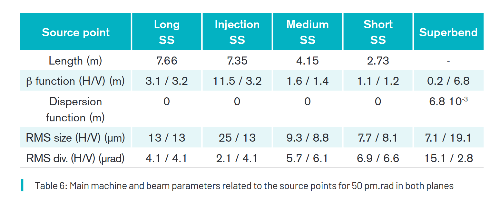

# Source modelling.

In this practical exercise we will try out a few ways of modelling an X-ray source in McXtrace and some possibilities for coupling McXtrace to other packages.

## Exercise: Using the native McXtrace Undulator model for SOLEIL photon sources


The default Undulator model is well suited to model a photon source [Ref: K.J. Kim, AIP, conf. proc., 184, 1989. doi:10.1063/1.38046](https://pubs.aip.org/aip/acp/article/184/1/565/788822/Characteristics-of-synchrotron-radiation). 

Currently, there exists a set of undulator uses in the McXtrace examples.

Undulators | parameters
-----------|-----------
Test\_BM Undulator | `Undulator(Ee=1.5, K=1, E0=0.39, dE=0.2, Ie=0.4, B=0, gap=4.2, Nper=134, lu=3.65e-2, sigex=0.05367e-3, sigey=0.004e-3, focus_xw=10e-3,focus_yh=10e-3, dist=20)`
Test\_BM Wiggler | `Wiggler(E0 = 25, dE = 24, phase = 0, randomphase = 1, Ee = 2.4, Ie = 0.4, B = 1.6, K=10, Nper=41)`
MaxIV / Bloch | `Undulator(E0=0.6,dE=0.4,Ee=1.5,dEe=((6e-9)*(60e-12))/1.5,Ie=0.5,tbunch=43,K=5.6,gap=14e-3,Nper=187,lu=84e-3,sigey=1.3e-5,sigex=185e-5,sigepx=32e-6,sigepy=4.6e-6,focus_xw=1.1e-3,focus_yh=1.1e-3,dist=zm_mirror1,E1st=1.0018*E0/5)`
MaxIV DanMAX | `Undulator(E0=35, dE=0.05, E1st=E0/15, dist=20, Ie=0.5, Ee=3.0, dEe=0.0008, K=0, B=0,quick_integ=1, Nper=187, lu=0.016, sigex=53.66e-6, sigey=4.008e-6, sigepx=5.963e-6, sigepy=2.004e-6)`
SOLEIL U18 ANATOMIX (long) | `Undulator( E0=17, dE=1, Ee=2.75, dEe=0.001, Ie=0.5, K=1.03118, Nper=140, lu=32e-3, sigey=6.17e-6, sigex=0.29979e-3, sigepx=0.01226e-3, sigepy=1.1e-6, dist=50, E1st=12.400)`
SOLEIL U24 PX2a (medium straight section) | `Undulator( E0=12.65, dE=1, Ee=2.75, dEe=0.001, Ie=0.5, K=1.788, Nper=80, lu=24e-3, sigey=9.3e-6, sigex=215.7e-6, sigepx=29.3e-6, sigepy=4.2e-6, dist=29.5, E1st=12.400)`

In order to model the SOLEIL photon sources, we first need to refer to the storage ring parameters for SOLEIL:

- [https://www.synchrotron-soleil.fr/en/research/sources-and-accelerators/electron-beam-parameters/transverse-size-electron-beam-source](https://www.synchrotron-soleil.fr/en/research/sources-and-accelerators/electron-beam-parameters/transverse-size-electron-beam-source)

Then we may for instance look at the [LUCIA](https://www.synchrotron-soleil.fr/fr/lignes-de-lumiere/lucia) beam-line (SD03C) which is illuminated with an Undulator HU52 "Apple II" type (NdFeB magnets), 32 periods, gap 15-150mm, variable linear polarization, left and right circular polarizations, operating on harmonics 3 to 21. The energy range is 0.6-8 keV on LUCIA. 


HU52 parameter | symbol/unit | value
------------------------|-----------|-----
Period | (mm) | 52.4
Nb of periods  | lambda_U | 32
Gap | mm | 15.5-150
Field remanence | Br(T) | 1.26
Magnetic field Z, max | Bz (T) | 1.974*exp(-3.1754*Gap/lambda_U)
Magnetic field X, max | Bx (T) | 1.901*exp(-4.3387*Gap/lambda_U)
Function beta horizontal |	beta_x (m)	|1.4
Function beta vertical|	beta_z ( m)	|1.4
emittance horizontale | ex (pm.rad)	|82.0
betatron	coupling | % | 30.0
emittance vertical |	ez (pm.rad)	|24.6
dimension RMS horizontal|	sigma_x (µm)	|218.2(current) / 10.7(upgrade)
dimension RMS vertical	|sigma_z (µm)	|8.2(current) / 5.9(upgrade)
divergence RMS horizontal	|sigma_x' (µrad)	|30(current) / 7.7(upgrade)
divergence RMS vertical	|sigma_z' (µrad)|	3.7(current) / 4.2(upgrade)

The corresponding HU52 Undulator component parameters are then:
``` c
Undulator(
  E0     = 3,
  dE     = 2.9,
  Ee     = 2.75,
  dEe    = 0.001,
  Ie     = 0.5,
  B      = 0.42, // for a 15.5 mm gap
  Nper   = 32,
  lu     = 52.4e-3,
  sigex  = 218.2e-6,
  sigey  = 8.2e-6,
  sigepx = 30e-6,
  sigepy = 3.7e-6) 
```

1. Start a new simulation and insert an Undulator source in it. The Undulator component has many possible parameters. In McXtrace, the (0,0,0)-point is taken to be the exit plane of the undulator. X is left-wise, Y is vertical, Z is forward. Use the typical HU52 Undulator component parameters for LUCIA or DEIMOS undulators.

2. Insert monitors **20 m** downstream: for instance one PSD "x y", one energy-resolved monitor, one divergence monitor "dx dy". Make sure that the monitors are big enough to catch all the radiation you expect, including the energy range. By using the `Monitor_nD`, you may add the "all auto" option to automatically adapt the monitor bounds to catch all photons. The corresponding code for the PSD could be `Monitor_nD(xwidth=0.1, yheight=0.1, bins=512, options="x y, all auto")` or the `PSD_monitor` component. You should get results such as 

3. Repeat the simulation with the expected SOLEIL-II Upgrade storage ring. Compare results in photon beam size and divergence.
 

References:

- F. Briquez et al., Proceedings of FEL08, Gyeongju, Korea, [https://accelconf.web.cern.ch/fel2008/papers/tupph015.pdf](https://accelconf.web.cern.ch/fel2008/papers/tupph015.pdf)
- T. Moreno et al., J Sync Rad 19 (2012) 179, [https://journals.iucr.org/s/issues/2012/02/00/kt5033/index.html](https://journals.iucr.org/s/issues/2012/02/00/kt5033/index.html)
- T. Moreno et al., [Proceedings Volume 8141, Advances in Computational Methods for X-Ray Optics II; 81410H (2011) DOI: 10.1117/12.893778](https://www.researchgate.net/publication/258548494_Undulator_emission_analysis_Comparison_between_measurements_and_simulations)
- M.E. Couperie 2013, [https://accelconf.web.cern.ch/ipac2013/talks/mozb102_talk.pdf](https://accelconf.web.cern.ch/ipac2013/talks/mozb102_talk.pdf)

## Exercise: using the native McXtrace Wiggler model for SOLEIL photon sources

We may replace the Undulator by a Wiggler, which is an Undulator for which K >> 1 i.e. `lu*B` is large. 

The PSICHE Wiggler at SOLEIL is built with 41 magnetic elements of period 50 mm each, and a field of 2.1 T. The electron beam cross-section at the centre is 333x5.9 µm^2, a 500 mA current at 2.75 GeV.

1. Create a copy of the above model, and change the photon source for a Wiggler feeding the PSICHE beam-line (E0=15-100 keV).

2. Update the e-beam parameters for the SOLEIL-II storage ring. Compare results in photon beam size and divergence.

## Exercise: Using the native McXtrace Bender model for SOLEIL photon sources

Let's now model a Bender at SOLEIL. For this we use the `Bending_magnet` component. Replace the above source by a `Bending_magnet` with a 1.72 T field, a 500 mA electron current at 2.75 GeV (for the ROCK@SOLEIL bender). The beam size at ROCK is 54.9 µm x 20.2 µm.

1. Create a copy of the above model, and change the photon source for a Bending_magnet feeding the ROCK beam-line (E0=4.5-40 keV).

2. Update the e-beam parameters for the SOLEIL-II storage ring. Compare results in photon beam size and divergence.

---

# SOLEIL electron beam specifications

We show below the e-beam at SOLEIL along the storage ring.

BeamLineName| Long_Pos(m)| RMS_H_Size(µm)| RMS_V_Size(µm)| RMS_H_div(µrad)| RMS_V_div(µrad)
-----|----|--|--|--|--
PtINJ|  1,4125|322,3|16,8|18|2
VSCRAP|4,295|330,3|19,3|18|2
MRSV|9,3169|87,6|20,4|140,7|1,8
HSCRAP_int|12,2845|336,7|11,7|23,2|2,9
ODE|14,8687|54,6|21|120,1|1,7
SMIS|28,232|87,9|22|142,6|1,6
THz|37,1005|55,5|22,2|117,8|1,5
PHC1|37,3625|45,2|22,6|95,8|1,5
AILES|50,4638|89,8|25|139,1|2,6
MARS|50,5573|79,6|25,3|124,9|2,2
PSICHE|55,4572|333,3|5,9|17|5,3
PLEIADES_1|64,6436|229,1|10,5|29,4|3,7
PLEIADES_2|67,3881|221,9|8,7|29,4|3,7
PHC2|78,2287|59,3|18,5|133,5|2
DISCO|78,4205|45,5|18,4|113,1|2
DESIRS|88,523|255,2|16|26,1|1,9
METRO|103,3917|56,3|20,5|125|1,8
PUMA_IdEntrance|109,053|213,9|9,9|31|3,6
PUMA|110,553|206,5|8,5|31|3,6
PUMA_IdExit|112,053|209,3|10,2|31|3,6
CRISTAL|121,7489|332,9|9,3|17,3|3,6
DEIMOS_1|132,4453|206,5|8|31,6|4
DEIMOS_2|134,4113|216,2|9,7|31,6|4
GALAXIES|143,9812|330,3|10,2|16,8|3,1
TEMPOCHI2|153,5048|217,3|9,5|29,9|4,1
TEMPO_1|154,6012|215,9|8,2|29,9|4,1
TEMPO_2|156,3502|223,8|9,9|29,9|4,1
SAMBA|191,9163|53,2|23,6|119,4|1,5
HERMES_1|199,0776|222,1|8|30,6|4,2
HERMES_2|200,9266|228,3|10,3|30,6|4,2
PX1|210,2734|311|9,9|17,1|3,2
PX2sp|222,8306|219,1|9,8|31,6|3,7
SWING|232,5058|321|9,4|17|3,5
ANTARES_1|241,7122|223,2|10,4|30,3|3,9
ANTARES_2|244,4367|214,7|8,7|30,3|3,9
AXD|250,1002|53,8|21,7|102,3|1,6
ROCK|255,3434|54,9|20,2|126,3|1,8
ANATOMIX|262,1977|267,9|8,4|30,1|3,9
NANOSCOPIUM|268,9467|258,6|8,8|31,2|3,5
DIFFABS|280,441|55,1|20,6|123,7|1,6
SEXTANTS_1|287,6024|210,7|8|30,9|3,5
SEXTANTS_2|289,3484|216,5|10,1|30,9|3,5
SIXS|298,7982|325,5|9,5|17,2|3,3
CASSIOPEE_1|308,0047|217,4|10,6|31,4|4,2
CASSIOPEE_2|310,6492|214,7|8,2|31,4|4,2
SIRIUS|320,9505|324,5|10|16,8|3,1
LUCIA|332,067|218,2|8|30|3,7
HSCRAP_ext|341,2838|329,4|11,8|22,8|3,2
PHC3|343,8681|62,2|17,3|128|2

And here are estimates of the e-beam specifications after the SOLEIL-II Upgrade, taken from the Conceptual Design Report, page 62.



---

## Exercise: Use MCPL files to couple to e.g. SRW and other codes (optional)

### Using the Undulator model

The typical Undulator parameters for a SPring-8 insertion device are:
``` c
    E0=13, dE=1, Ee=8, dEe=0.001, Ie=0.1, 
    K=1.03118, Nper=140, lu=3.2e-2, 
    sigey=6.17e-6, sigex=0.29979e-3, sigepx=0.01226e-3, sigepy=1.1e-6, 
    dist=20, E1st=12.400
```

1. Copy the initial SOLEIL Undulator model above, and use the SPring-8 parameters.

2. Perform a simulation using a large energy range, and look at the beam energy and spatial distribution, 20 m down-stream.

### Using MCPL files which store photon events

We will now use a different utility to drive a McXtrace-simulation: MCPL. 

[MCPL](https://mctools.github.io/mcpl/) is an interchange file format to communicate with e.g. GEANT4, PHITS, MCNP, and SRW. The SOLEIL Optics group is developing the [OptiX](https://gitlab.synchrotron-soleil.fr/OPTIQUE/optical-simulation/pyoptix) code which generates MCPL as well.

In this case the MCPL-file is actually generated using [SRW](https://www.github.com/ochubar/SRW). The expert tool for this purpose, a C++-program [`srw2mcpl`](https://github.com/McStasMcXtrace/srw2mcpl) is in development status and based on SRWlib and MCPL. The tool makes repeated calls to SRW and generates rays from that, and is not in its current form in an end-user state. 

The method of calling SRW pr. ray is rather slow, so for this tutorial (to save time) we provide a pre-generated MCPL-file that you may use. We are working on solutions to make the program available to McXtrace users in an easy-to use form. 

The file you need is called [sp8stdU.mcpl.gz](data/sp8stdU.mcpl.gz?raw=true ""). There is also a bigger version of this same file for better sampling [sp8stdUl.mcpl.gz](data/sp8stdUl.mcpl.gz?raw=true ""). But this obviously takes longer to download.

1. Use the McXtrace component **MCPL_input** to read rays from it and start them in a McXtrace simulation. 
2. Insert a downstream `PSD_monitor` and an `E_monitor` to catch the generated radiation. Leave some room (2 m or so) between the MCPL-file and the monitor. SRW considers the undulator centre its reference point and so rays may actually originate there. 
3. What was the fundamental energy of the 1st harmonic?
4. This procedure relies on the undulator spectrum being sufficiently sampled by the `srw2mcpl`-program. Determine the sampling limits of the file using your monitors. 
5. Compare with the pure McXtrace Undulator model above.

### References:

- [Undulators](https://en.wikipedia.org/wiki/Undulator) at Wikipedia
- [Kim, AIP Conference Proceedings 184, 565–632 (1989)](data/Kim_Undulator-1989.pdf) dealing with Undulators, Wigglers and Bending magnets
- [Patterson, American Journal of Physics 79, 1046 (2011); doi: 10.1119/1.3614033](data/Patterson-2011a.pdf)
- [Elleaume 1992 EPAC](data/Elleaume-1992-EPAC1992_0661.PDF) Undulators and Wigglers
- [Elleaume 1990](data/Elleaume-Undulator-p142-1990.pdf) Undulators and Wigglers
- [Elleaume 2005](data/Elleaume-2005.pdf) presentation about Undulators
- [Chavanne 1998](data/Chavanne-1998.pdf) presentation about Undulators
- [Bartolini 2016](data/Bartolini-2016-Lecture2Undulatorsandwigglers.pdf)
- [Barret 2016)(data/Barrett_2016-TOGIS.pdf)
