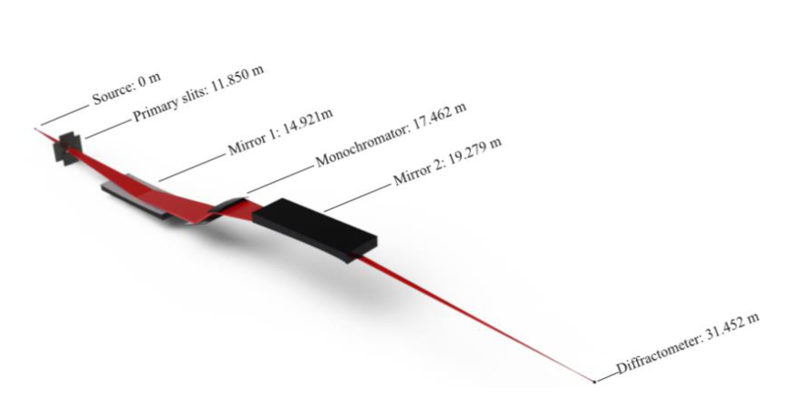

# Starting your own beam-line model: we help you !

In this 'anarchy' session, we shall do our best to get you started with your own beam-line model.

## Global methodology

1. Assemble a succinct list of elements that compose your beam-line. As a start, focus on the main components.
2. Identify which [McXtrace components](http://mcxtrace.org/download/components/) best match your beam-line elements. Prefer simple components when there are many possibilities.
3. Search for existing models that use these components. They are often in the 'Tests' category, but you may as well find a model which is pretty close in spirit to your beam-line. These examples will demonstrate how to actually use the components (syntax, parameters, etc) you envisage. Get inspiration here.
4. For each identified [McXtrace component](http://mcxtrace.org/download/components/), look at their main properties (parameters, geometry) and search for these in real life. This means you will need to estimate plausible values, and potentially refer to some documentation. As a start, use approximate values to avoid loosing time in details.
5. Position these elements in space w.r.t. the other elements. :bulb: A special note on mirrors and monochromators: the positioning/orientation of these can be tricky. It is usually a good advice to search for examples that contain them, and copy/paste/adapt the corresponding code in your own model. You will save a lot of time scratching your head this way.
6. Once done, you may optionally identify which values/parameters could be tunable in the beam-line model in order for instance to further scan or optimize their values. This can be an initial energy, a slit aperture size, a sample tilt, etc. These can then be moved to the DEFINE INSTRUMENT line as a variable, and transferred where appropriate in the INITIALIZE and TRACE sections. Set default values for these parameters.
7. Complete the header at the beginning of the `.instr` file to reflect your institution (SOLEIL), the beam-line, yourself as author, a description of the beam-line (copy-paste from [SOLEIL website](https://www.synchrotron-soleil.fr/en/beamlines)), a description of the model parameters (those from the step above).
7. Send us your beam-line, even basic/incomplete, so that we can further help you and enrich the gallery of SOLEIL beam-lines given as examples. By gathering beam-line models and distributing them with McXtrace releases, we are all happy to find examples to start with. 

## Beam-line model structure

The structure of a beam line should have:

1. A photon source
2. Some optics (e.g. slits, monochromators, mirrors, lenses, ...)
3. A sample model as it provides a result which goes beyond a simple photon beam. Using even a simple sample component makes the model much more convincing scientifically, and it also allows to estimate the photon counts at the detector. The `PowderN` `Single-crystal`, `Saxs_spheres.comp` or `Absorption_sample` are good bets.
4. Monitors (you may position as many as required, not only at the end). The `Monitor_nD` is extremely versatile, but often you will start with e.g. `E_monitor` or `PSD_monitor`.

## Compilation errors

Of course, your model will hardly compile initially. Read the compilation output to decode the cryptic messages and identify where errors could be. An other strategy is to comment (use `/* ... */`) most of the components and leave only the source. Then compile and iteratively un-comment components one-by-one with intermediate compilation checks.

---

## SOLEIL beam-lines


### SOLEIL LUCIA Fluorescence

A simpflified LUCIA model would require to add:

- the HU52 undulator (see practical 4 "Sources")
- two mirrors that act as low pass filter (theta=0.4-1.3 deg), that can be ignored if we restrict the undulator bandwidth
- a DCM (Si111, theta=5-75 deg)
- a KB mirror set
- a sample stage with a Fluorescence component
- a set of detectors (e.g. XRF)


### SOLEIL DIFFABS diffraction/absorption

The [DIFFABS](https://www.synchrotron-soleil.fr/fr/lignes-de-lumiere/diffabs) beam-line at SOLEIL is illuminated with a Bender, such as the one discussed in session 4 "Sources".

``` c
Bending_magnet(
   E0 = 20, dE = 19, Ee = 2.75,
   Ie = 0.5, B = 1.72, sigey=9.3e-6, sigex=215.7e-6)
```

So, in order to assemble a DIFFABS model, we may quickly set-up:
- the Bender above in range 3-23 keV
- two bent mirrors as low-pass filters, can be ignored if we restrict the Bender bandwidth
- a Si111 DCM. See the practical 5 "Optics"
- a KB mirror set. See the practical 5 "Optics"
- a Fresnel zone plate (optional, we ignore it here)
- a sample stage with e.g. Fluorescence and/or PowderN components
- a set of detectors (transmission, XRD and XRF)



Reference: 

- Gallard, Thèse, (2019) ["Etude in situ de la cristallisation et des contraintes dans des nanostructures de GeTe par diffraction du rayonnement X synchrotron"](https://www.theses.fr/2019AIXM0037.pdf)

### SOLEIL PSICHE beam-line tomography/diffraction

Layout: [PSICHE motors](https://www.synchrotron-soleil.fr/fr/file/8068/download?token=UHm6fASX)

- 15-100 keV Wiggler 2.1 T lu=50 mm 38 periods, for instance `Wiggler(E0 = e0, dE = de, phase = 0, randomphase = 1, Ee = 2.4, Ie = 0.5, B = 2.1, Nper=41, sigey=9.3e-6, sigex=215.7e-6, length=38*50e-3)` (K=10)
- primary mirror (c1/c2), ignored here
- at 17.5 m, DCM Ge111, we use Si111 as it has been modelled previously
- KB mirrors for a focused beam 100x100 um (ignored here as we work in white beam)
- at 21 m, sample area 16.8x5.9 mm2
- a set of detectors (transmission, diffraction, fluo)

References:

- https://www.synchrotron-soleil.fr/en/beamlines/psiche
- A. King et al, Rev Sci Instrum 87, 093704 (2016), DOI: 10.1063/1.4961365
- E. Boulard et al, J Sync rad 2018 25, 818, DOI: 10.1107/S1600577518004861
- Guignot et al 2013, https://ui.adsabs.harvard.edu/abs/2013AGUFMMR31A2287G/abstract


### SOLEIL SWING SAXS

The [SWING](https://www.synchrotron-soleil.fr/fr/lignes-de-lumiere/swing) beam-line is using a U20 undulator between. 

.

The optics are basically:

- a U20 undulator (used between 5 and 16 keV) with sigma=388 (H) x 8.1 (V) um and divergence 14.5 (H) x 4.6 (V) urad
- a diaphgram (slit) 1x0.5mm2 at 11.7 m from the source
- a Si (111) double monochromator at 20m from the source
- a KB mirror set at 22.5m from the source
- a CRL (f=81 cm) at 31m from the source
- the sample position at 32 m from the source
- a 162x155 mm EigerX4M detector at 0.5-6.5m from the sample

We suggest you first insert a U20 undulator, as described in the [SOLEIL_PX2a](https://raw.githubusercontent.com/McStasMcXtrace/McCode/master/mcxtrace-comps/examples/SOLEIL_PX2a.instr) beam-line:
``` c
Undulator(
    E0=E0, 
    dE=1, 
    Ee=2.75, 
    dEe=0.001, 
    Ie=0.5, 
    K=1.788, 
    Nper=80, 
    lu=2.4e-2, 
    sigey=9.3e-6, 
    sigex=215.7e-6, 
    sigepx=29.3e-6, 
    sigepy=4.2e-6, 
    dist=29.5, 
    E1st=12.400)
```

Then make use of the KB example from e.g. the [test_KB](https://raw.githubusercontent.com/McStasMcXtrace/McCode/master/mcxtrace-comps/examples/Test_KB.instr). 
Use theta = 3 mrad and compute the KB curvatures to match the distance to the sample as f = R sin(theta/2). 
``` c
COMPONENT mirror_curved = Mirror_curved(
    radius=R,
    length=1,
    width=1)
AT (0, 0, 31.5) RELATIVE PREVIOUS
ROTATED (0, RAD2DEG*theta, 0) RELATIVE PREVIOUS
EXTEND
%{ 
	if (!SCATTERED) ABSORB; 
%}

COMPONENT arm = Arm()
AT (0, 0, 0) RELATIVE PREVIOUS
ROTATED (0, RAD2DEG*theta, 0) RELATIVE PREVIOUS

COMPONENT arm_2 = Arm()
AT (0, 0, 1.5) RELATIVE PREVIOUS
ROTATED (0, 0, 90) RELATIVE PREVIOUS

COMPONENT mirror_2 = Mirror_curved(
    radius=R,   
    length=1,
    width=1)
AT (0, 0, 0) RELATIVE PREVIOUS
ROTATED (0, RAD2DEG*theta, 0) RELATIVE PREVIOUS
EXTEND
%{ 
	if (!SCATTERED) ABSORB; 
%}

COMPONENT arm_3 = Arm()
AT (0, 0, 0) RELATIVE PREVIOUS
ROTATED (0, RAD2DEG*theta, 0) RELATIVE PREVIOUS
```

Then introduce the DCM from the [Template_DCM](https://raw.githubusercontent.com/McStasMcXtrace/McCode/master/mcxtrace-comps/examples/Template_DCM.instr) (satisfying `TTH=RAD2DEG*asin(12398.42/(2*DM*E0))` with DM=5.4309 for Si111)
``` c
COMPONENT dcm_xtal0 = Bragg_crystal(
    length=0.04, width=0.04, 
    alpha=alpha, h=1, k=1, l=1, material="Si.txt", V=160.1826)
AT(0,0,0.02) RELATIVE PREVIOUS
ROTATED (-TTH,0,0) RELATIVE PREVIOUS

COMPONENT dcm0 = Arm()
AT(0,0,0) RELATIVE dcm_xtal0
ROTATED (-TTH,0,0) RELATIVE PREVIOUS

COMPONENT dcm_xtal1 = COPY(dcm_xtal0)
AT(0,0,dcm_gap) RELATIVE dcm0
ROTATED (TTH,0,0) RELATIVE dcm0

COMPONENT dcm1 =Arm()
AT(0,0,0) RELATIVE dcm_xtal1
ROTATED (TTH,0,0) RELATIVE dcm_xtal1 
```

We suggest that, to start with, you skip the CRL, but if you so wish, you may extract the relevant CRL description from [Test_CRL](https://raw.githubusercontent.com/McStasMcXtrace/McCode/master/mcxtrace-comps/examples/Test_CRL_Be.instr). Adapt the number of lenses to get a focusing at about 1 m.
``` c
COMPONENT lens_parab = Lens_parab(
    material_datafile = "Be.txt",
    r=200e-6, 
    r_ap=0.5e-3, 
    d=50e-6, 
    N=16)
AT (0, 0, 1) RELATIVE PREVIOUS
```

Add a sample as above, and a detector (such as `Monitor_nD(options="x y", bins=2000)`).

You should then get a simplified SWING model.


