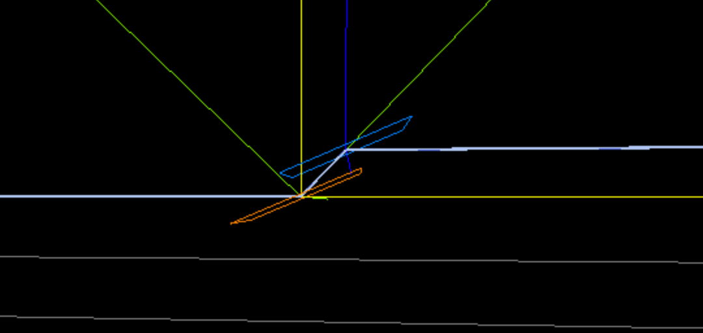

# McXtrace training: samples and virtual experiment: spectroscopy/fluorescence (hyperspectral)

For this exercise, we shall build a simplified model of the LUCIA@SOLEIL beam-line.

Let's review the main elements to be modelled:

Position | Element
---------|----------
0        | the HU52 undulator (see practical 4 "Sources") 2.75 GeV, 32x52.4 mm
13.4     | 0.5 x 0.5 mm slit
31.5     | a DCM (Si111, theta=5-75 deg)
39-39.3  | a KB mirror set, not modelled here
39.63    | a sample stage with a Fluorescence component
39.7     | a set of detectors (e.g. XRF)

## The LUCIA photon source

We already have modelled the HU52 LUCIA Undulator in session 4 "Sources". Use the `Undulator` component of 32 dipoles 52.4 mm long generating a field of 0.42 T, fed with an eletron beam 2.75 +/- 0.001 GeV, a 500 mA current, with a electron cross-section 218.2x8.2 &mu;m<sup>2</sup> and a divergence 30x3.7 &mu;rad<sup>2</sup>.

Define a new `SOLEIL_LUCIA` beam-line with input arguments `E0=5, dE=1`.

Position a monitor in energy and a PSD at 13.3 m from the source.

Position a 0.5x0.5 mm<sup>2</sup> slit at 13.4 m from the HU52,and a PSD monitor right afterwards.

:runner: Run a simulation and make sure the slit works.

## The LUCIA double monochromator 

We use the DCM model from session 5 "Optics" or the session 9 "tomography" (PSICHE). You may as well refer to the `Template_DCM` example.

Basically, it all boils down to rotating two Si(111) Bragg crystals. The rotation angle can be computed from the nominal energy `E0` using Bragg's law *&lambda;=2d sin(&theta;)*, with the Si _d_-spacing as 5.4309/n Angs, the norm _n_ of the <111> reflection and &lambda; = 12.39842 / E0. Declare a `dcm_theta` in the `DECLARE` block variable and set its value in the `INITIALIZE` section (:warning: must be in degrees, multiply by `RAD2DEG`). 

Then add the two crystals, at 31.5 m from the Undulator. We here use a gap of 2 cm between the two crystals. 

``` c
COMPONENT dcm_xtal0 = Bragg_crystal(
    length=0.04, width=0.04, 
    h=1, k=1, l=1, material="Si.txt", V=160.1826)
AT(0,0,0)          RELATIVE PREVIOUS
ROTATED (-dcm_theta,0,0) RELATIVE PREVIOUS

COMPONENT dcm0      = Arm()
AT(0,0,0)          RELATIVE PREVIOUS
ROTATED (-dcm_theta,0,0) RELATIVE PREVIOUS

COMPONENT dcm_xtal1 = COPY(dcm_xtal0) // gap is 2 cm
AT(0,2e-2,0.03)    RELATIVE PREVIOUS
ROTATED (dcm_theta,0,0)  RELATIVE PREVIOUS

COMPONENT dcm1      = Arm()
AT(0,0,0)          RELATIVE PREVIOUS
ROTATED (dcm_theta,0,0)  RELATIVE PREVIOUS 
```

Position an energy and a PSD monitor right after the DCM.

:runner: visualise the 3D geometry of the beam-line (Trace mode) and navigate to the DCM to check the arrangement.



:runner: Run a simulation to check that the energy range is indeed selected. In the following we may use e.g. `dE=0.1` to help the computation efficiency (no need to send photons out of the DCM range).

## The LUCIA sample stage

Position a PSD at the sample location at 8.13 m from the DCM.
It will be used as sample holder.

Define two new input arguments to the model, `string sample_material="CaCO3"` and `string sample_geometry="wire.ply"`.Insert a `Fluorescence` 1x1X0.5 mm2 sample with these arguments for the material and the geometry.

Insert a large bandwidth energy monitor at 10 cm (e.g. from 0 to E0). It is best to rotate this monitor out of the direct beam. For this, place an Arm at the sample stage, rotate it, then position the monitor at the given distance on the rotated axis frame.

:runner: visualise the 3D geometry of the beam-line (Trace mode). 
You may navigate to the sample area to check the fluorescence scattering.


:runner: Run a simulation and look at the fluorescence spectrum.


## Hyper-spectral imaging

We shall now use a complex geometry made with a material, and enclose it in a box with an other material. For this exercise, we shall use a GROUP arrangement. The 1st fluorescence sample will be set with a `geometry` parameter, while a 2nd Fluorescence component will be using a simple box with an other material. 

``` c
COMPONENT sample_stage = Arm()
AT (0,0,0) RELATIVE ...

COMPONENT sample = Fluorescence(material=sample_material, geometry=sample_geometry, 
  xwidth=0.001, yheight=0.001, zdepth=0.5e-3)
AT (0,0,0) RELATIVE sample_stage
GROUP samples

COMPONENT sample_box = Fluorescence(material="Na0.1Li1.8Mg0.1Sn0.9Bi0.1O3", 
  xwidth=1e-3, yheight=1e-3, zdepth=0.5e-3)
AT (0,0,0) RELATIVE sample_stage
GROUP samples
```

We define the sample box as a Li battery electrolyte which contains Na, Mg and Bi impurities.

:question: can you identify why this is not a perfect solution ? What type of interaction process is missing ? Is there a way to be closer to reality ?

- Modify the sample accordingly using the above GROUP solution.
- Add a 1D PSD-energy monitor, positioned parallel and close to the sample outer surface (to avoid summing up contributions for all parts of the sample). You may for instance use a `Monitor_nD(options="x bins=128, energy limits=[0 6] bins=1000", xwidth=1e-3, yheight=1e-4)` for a horizontal detector.

:runner: Run the simulation with `E0=5` and visualise the Energy map across the sample. Use the log-scale (press the 'L' key). The fluorescence spectra should show a varying material composition.


In reality, a KB mirror set allows to focus the beam on a tiny sample area, which is then scanned across the sample. 
Adding a sample translation in a further step, you should obtain a series of images, one per beam location in the sample. This is a 3D hyper-spectral data set which can be merged into a 3D array with e.g. NumPy or Matlab.

