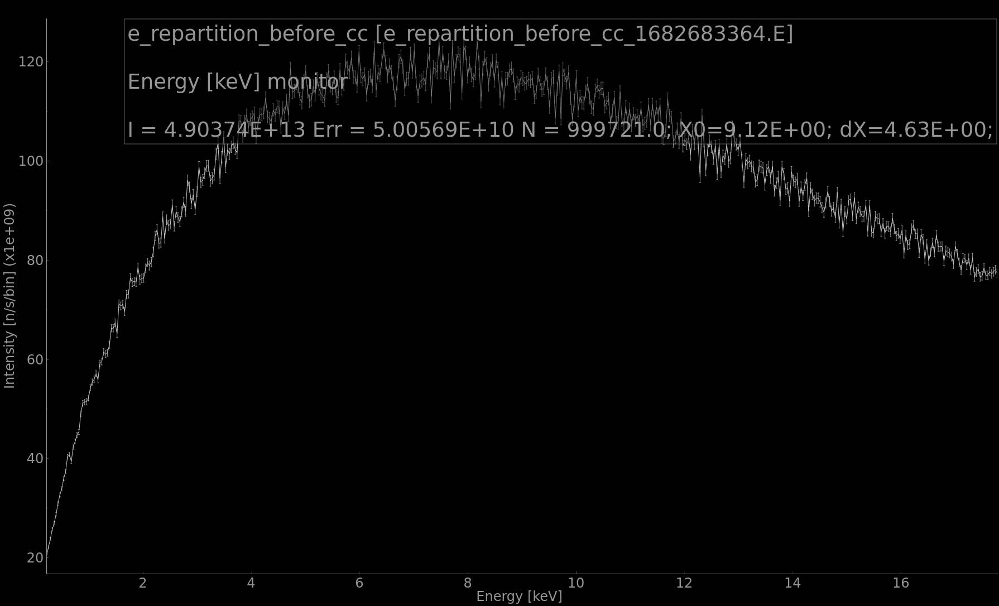
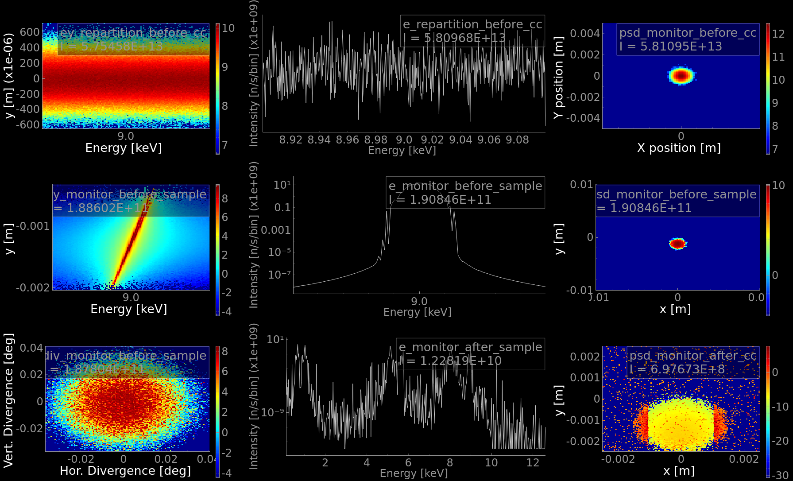

# McXtrace training: samples and virtual experiment: spectroscopy/absorption

## Absorption edge

In the absorption process, a photon excites a core electron in an atom (e.g. K n=1 level), e.g. to a upper unoccupied level. When the photon energy is larger than the photo-ionization, the electron is ejected and it can be analyzed as in XPS, PEEM, ARPES etc. The emptied initial core level is then filled by upper level electron states (n=2,3...), and this transition generates a fluorescence line between levels. So, at the absorption edge, photons are absorbed, the transmitted intensity is decreased, and some lower desexcitation transitions emit lower energy X-ray fluorescence lines. 

There are tables (see [RuppWeb](https://www.ruppweb.org/Xray/elements.html)) describing the absorption energies for each atom, and the corresponding fluorescence lines.

Only the `Fluorescence` component allows both any-shape, and any compound material (but requires XrayLib to be installed, and is about a factor 10 slower). The other absorption samples require to prepare absorption data files, and only work with pure mono-atomic materials.

## Simplified ROCK beamline simulation 

The goal of this short example is to simulate the behavior of a very simplified ROCK beamline that includes a bending magnet as the source, a channel cut for energy selection and an absorption sample. Several monitors will be placed between these equipments in order to show the evolution of the front of the beam across the beamline.

### Source

Let's start with inserting a bending magnet as the source. We want the energy spread to be white going from 4 to 40 keV. Make sure to choose an adequate E0 (center of emitted energy spectrum) and dE (half width of emitted energy spectrum). We suggest to define these as input arguments to the model (on the DEFINE line). The storage ring electron energy (Ee) is equal to Ee=2.75 GeV and the magnetic field (B) of the bending magnet is equal to B=1.72 T. The SOLEIL electron beam cross-section at the ROCK BL is `sigex=54.9e-6, sigey=20.2e-6`.
According to these parameters the Bender characteristic energy is : `Ec = 0.665*Ee*Ee*B = 8.65 keV`. 

Now insert an energy monitor after the source. You can also place a PSD monitor there.

:runner: Run the simulation and observe through the energy monitor the white source (for instance with E0=9, dE=8.8).

### Double Crystal Monochromator (channel cut)

To select an energy we need to insert a channel cut double crystal monochromator. There are different ways of doing this. In this example we will use two Bragg_crystal components to materialise the channel cut. This exercise has been proposed as well in session 5 "Optics".

If not done yet, add an input parameter E0=8 in the DEFINE INSTRUMENT line. We will calculate the Bragg angle from this energy. Use this variable at the Bending\_magnet as well.
From the Bragg law we can deduce the dcm\_theta : `dcm_theta = asin(m*lambda/(2*d))`. Where d is the interplanar distance (d = 3.1355 Angström for Si 111) and _m_ the Bragg order (here _m_ = 1). Lambda is the incident wavelength. To easily convert E(keV) to lambda(Angström) use the relation : `E(keV) = 12.39842 / lambda(Angström)`.
In the DECLARE section, declare the dcm\_theta variable by adding the line: `double dcm_theta;`
Do the angle calculation in the INITIALIZE section. The angle needs to be in degrees so use RAD2DEG to convert radians into degrees.

The channel cut is made up of two parallel crystals placed at a certain attack angle. To do this :

- Insert a Si 111 crystal in between the source and the monitors. Choose 2 as the crystal_type, 2 being the diamond type. We can keep the rest of the parameters as default.
Make the crystal rotate `-dcm_theta` (anti clockwise) around the X axis. Now position an arm on top of the crystal and make it rotate another `-dcm_theta` around the X axis. Make sure to use the PREVIOUS keywords.
- Place a second Si 111 crystal and it's following arm. This time the rotation will be done in the opposite direction.
Translate the second crystal in the Z direction 0.05 m (default length of the crystals) away from the first crystal.
The vertical separation between the two parallel crystals is equal to 0.01 m so translate the second crystal in the Y direction 0.01 m away from the first crystal.
Make sure to translate (AT) the second crystal relative to the first crystal, use `RELATIVE first_crystal_name`. 

:runner: Run the simulation (to get better stats, you may use dE=0.1 at the source). 
Look at the energy monitor now, does the channel-cut work ? 

### Monitor_nD (versatile monitor)
In order to show the vertical energy distribution insert a Monitor_nD after the channel cut, on top of the existing energy monitor. To do so :

Insert the Monitor_nD with `options="energy y, all auto", bins=500` as one of the parameters.

:runner: Run the simulation with dE=0.1. Explain the result of the monitor_nD.

linear plot              |  log plot
:-------------------------:|:-------------------------:
  |   

*Tip*: You can insert another Monitor_nD before the CC, just after the source.

### Absorption sample
Finally, let us add an absorption sample after the Monitor\_nD. We shall use the Fluorescence component. We want the sample in a box configuration. Choose a material as "ZnCu" for zinc and copper. Make sure the sample isn't too thick (e.g. 2 x 10 x 1 mm3). 

Add an energy monitor right after the sample. Check the [edge energy tables](https://www.ruppweb.org/Xray/elements.html) for Zn and Cu.

:runner: Do a single computation with E0=9 keV.
Do you see the absorption shadow of the sample in transmission, and the fluorescence lines ?

:runner: Do a scan in energy from 8 to 10 keV, e.g. in 11 steps (1e5 events should be enough).

Do you notice anything?
*Tip*: Pressing `l` to view the plots in log scale can make things more obvious.

*Tip*: To improve the computation efficiency, you may use a `SPLIT COMPONENT` as well as the `p_interact, target_index, focus_xw` and `focus_yh` arguments to the Fluorescence component.

### Post-scriptum

This short example of a very Simplified ROCK beamline did not include many core elements of the real ROCK beamline such as:
- the toroidal collimating mirror (called M1 on this beamline) 
- the harmonic rejection mirror (called M2a) 
- the harmonic rejection and vertical focusing curved mirror (called M2b) 
- the vertical and horizontal slits 

If you want to play and/or improve the more realistic ROCK beamline that comprises the elements listed above you can find it here:  [ROCK](https://github.com/McStasMcXtrace/McCode/blob/master/mcxtrace-comps/examples/SOLEIL_ROCK.instr)

Happy simulating!

---

