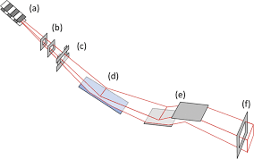
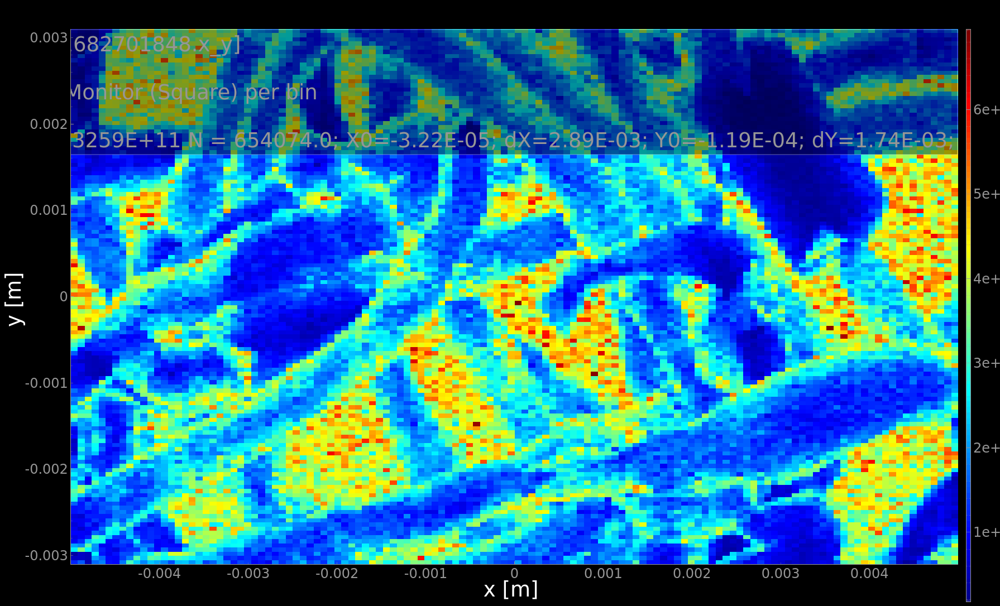
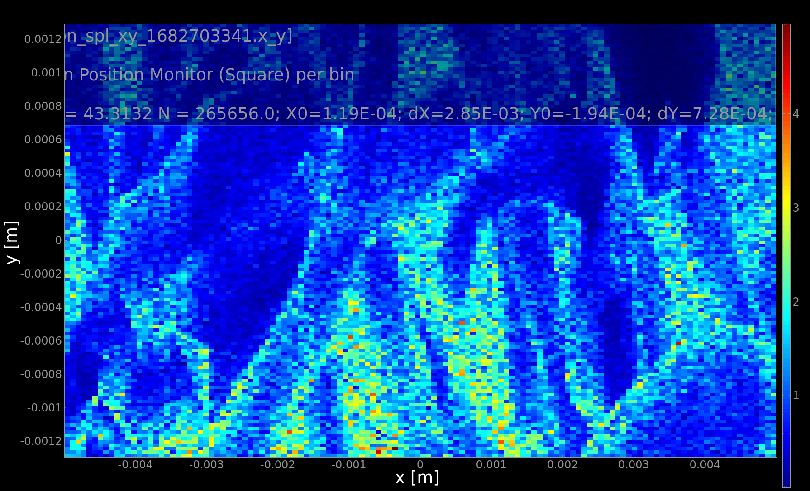

# McXtrace training: samples and virtual experiments: SAXS and tomography

In this session we shall simulate the output of simple models for:
- Small Angle X-ray Scattering (SAXS)
- Tomography (which is based on absorption)

## Table of Contents
1. [Exercise A: Small angle scattering (SAXS)](#exercise-a-small-angle-scattering-saxs)
1. [Exercise B: Tomography](#exercise-b-tomograohy)

---

## Exercise A: Small angle scattering (SAXS)

The small-angle X-ray scattering beam-lines measure very small beam deviations around the incident direction, following the Bragg-law _n_&lambda; = 2 _d_ sin(&theta;) where the incident wavelength &lambda; is fixed and we can see that small angles &theta; corresponds with large typical scattering unit sizes _d_.


There is large variety of SAXS sample models. Most of them correspond with isotropic scattering units.

The most complete one is using [SaSView models](https://www.sasview.org/docs/user/qtgui/Perspectives/Fitting/models/index.html) from which about [60 have been ported](http://mcxtrace.org/download/components/3.1/samples/SasView_model.html) into McXtrace. These include isotropic and anisotropic models.

In the following, we shall start from the [TestSAXS](http://mcxtrace.org/download/components/3.1/examples/TestSAXS.html) example instrument (from the _Tests_). It models a toy SAXS beam-line with a set of possible sample models via the input parameter `SAMPLE` (some sample models have been inactivated or are buggy). It also has a PSD and a |Q| monitor (with radial integration).

To run this model, you will need a PDB files accessible at https://www.rcsb.org/structure/6LYZ. Connect to the site and retrieve the PDB file (top right -> Download File -> PDB).

#### Step A.1: simulate the scattering from a set of samples

Load the [TestSAXS](http://mcxtrace.org/download/components/3.1/examples/TestSAXS.html) beam-line model and open the 3D view (run in Trace mode).
Accumulate the photon rays (click on 'keep rays') and start to visualize the scattering pattern.


Now re-run in Simulation mode, with SAMPLE=0, 1, 4, and 11. Use MPI (recompile) with e.g. 4 cores and 1e6 rays. 
These correspond with:
- 0=SAXSSpheres
- 1=SAXSShells
- 4=SAXSLiposomes
- 11=SAXSPDBFast (can use PDB files to compute I(q))

Plot the results, and visualize the scattering curve of all samples.

 
 

:question: what can you say about the scattering units in the sample ? Do they compare/differ ?

#### Step A.2: simulate more complex samples

We now use the [TemplateSasView](http://www.mcxtrace.org/download/components/3.1/examples/templateSasView.html) in _Templates_.

As can be see, the default model index is number 10.

:question: 
- Identify which structure is being used by looking at the table [SasView_model](http://mcxtrace.org/download/components/3.1/samples/SasView_model.html). :warning: links are broken. You should follow the [SasView documentation](https://www.sasview.org/docs/user/qtgui/Perspectives/Fitting/models/index.html). 
- Are we using the default SasView Cylinder model parameters ?

🏃 Run the simulation and plot the results.

A |q| detector would probably be a good idea. Add and instance of the `SAXSQMonitor` at 3.13 m away from the sample, with its `RadiusDetector=0.3`, the `DistanceFromSample=3.13`, `LambdaMin` and `Lambda0` set the nominal wavelength of the source, i.e. `lambda`.

🏃 Run the simulation again and plot the results, in Log-scale.


Now change the structure to a bcc-paracrystal, using the default parameter values extracted from the [SasView documentation](https://www.sasview.org/docs/user/qtgui/Perspectives/Fitting/models/index.html).

:runner: Run the simulation with the [bcc_paracrystal](https://www.sasview.org/docs/user/models/bcc_paracrystal.html) which is `SasView_model(index=4)`.

--------------------------------------------------------------------------------


## Exercise B: Tomography

In this practical session we shall simulate a very simple model of a tomography beam-line. We shall use a sample with an "any shape" complex volume, which we can rotate to simulate a sinogram.

Full field tomography is usually achieved by measuring the transmitted beam intensity across a sample on a PSD. Each image corresponds with a projection. The sample is rotated, and a set of images is acquired. Laboratory CT sources provide a cone beam, while synchrotron sources use a more parallel beam. It is also possible to perform tomography pixel-per-pixel with a narrow focused beam, still with sample rotation.

The tomography reconstruction is performed by estimating the initial sample shape and internal structures from the multiple projections (e.g. with ASTRA, PyHST2, UFO, Nabu, etc).

## Sample geometry (reminder from Samples/diffraction)

Sample components should be given a geometrical shape. The sample coordinate frame is usually (when not rotated) *X* on the left, *Y* vertical, and *Z* is 'forward'.

The geometry can be specified as:
- a sphere `radius=<value>`
- a cylinder `radius=<value>, yheight=<value>`
- box `xwidth=<value>, yheight=<value>, zdepth=<value>`
- any shape defined with a `geometry=<file>` with a [PLY](http://en.wikipedia.org/wiki/PLY_%28file_format%29)/[OFF](http://www.geomview.org/docs/html/OFF.html) file (vertices and polygons similar to STL). We provide example geometry files in the [data](http://mcxtrace.org/download/components/3.1/data/) directory (e.g. locally at `/usr/share/mcxtrace/x.y/data`). You may also use e.g. [Meshlab](https://www.meshlab.net/) or other geometry editors/modellers to create such files (rather simple text format, see `powercrust` and `qhull`). Not all samples support this geometry.

Some samples can be made hollow by specifying a `thickness` parameter. This is especially useful for containers (e.g. capillary) and sample environments.

Moreover, some samples support a `concentric` mode, which allows to insert a component within an other. We shall not consider this topic during this session.

Using the ROTATED keyword, you may orient this geometry in any direction.

## Warming up: Absorption data files

There are currently four sample models that take into account the material absorption. Only the XAS edge is currently handled (no EXFAS, nor XANES structure).

- [Absorption_sample](http://www.mcxtrace.org/download/components/3.1/samples/Absorption_sample.html) a 1 or 2 absorbing materials as a box or cylinder.
- [Abs_objects](http://www.mcxtrace.org/download/components/3.1/samples/Abs_objects.html) a set of absorbing objects which geometry is set from OFF/PLY files.
- [Filter](http://www.mcxtrace.org/download/components/3.1/optics/Filter.html) which can handle absorption and refraction, as a block or any OFF/PLY geometry.
- [Fluorescence](http://www.mcxtrace.org/download/components/3.1/samples/Fluorescence.html) which can handle absorption, fluorescence, Compton and Rayleigh scattering, as a block, sphere, cylinder or any OFF/PLY geometry.

The `Fluorescence` component is the most versatile (but requires [XRayLib](https://github.com/tschoonj/xraylib) to be installed). It takes as input argument a chemical formulae to describe materials. The three other absorption components (`Absorption_sample`, `Abs_objects`, and `Filter`) use 'absorption' data files which must be prepared before.

There is a dedicated documentation and tool to get absorption data files. 
- [HOWTO: McXtrace absorption files (materials)](https://github.com/McStasMcXtrace/McCode/wiki/HOWTO%3A-McXtrace-absorption-files-%28materials%29)

Usual materials are already available in the [data](http://mcxtrace.org/download/components/3.1/data/) directory.

:warning: These absorption data files only handle monoatomic elements.

## A simple absorption/tomography station in the style of PSICHE

Let's assemble a simple tomography station inspired from the [PSICHE](https://www.synchrotron-soleil.fr/en/beamlines/psiche) beam-line. Details can be found [here](https://pubs.aip.org/aip/rsi/article/87/9/093704/365750/Tomography-and-imaging-at-the-PSICHE-beam-line-of)

- a photon source
- an optional double monochromator
- a slit to shape the beam
- a rotating stage carrying a sample
- a detector



This procedure is iterative. To make sure everything is kept under control, we compile and run the model after each step.

### The PSICHE photon source

The PSICHE nominal energy range is 15-100 keV in the white beam mode, and 15-50 keV when using the double monochromator.

1. Start a new beam-line, and set its input parameters as `E0`, `dE`, `sample_theta` for the sample rotation angle, and the sample material and geometry (as string, not numbers). For instance `DEFINE INSTRUMENT SOLEIL_PSICHE(E0=31, dE=1, sample_theta=0, string sample_material="Ag0.6In0.2Sn0.2", string sample_geometry="wire.ply")`. We use a set of atoms with close absorption energies, as seen in the [edge energy tables](https://www.ruppweb.org/Xray/elements.html).

2. Insert a Wiggler such as the PSICHE@SOLEIL one as photon source:
``` c
Wiggler(E0 = E0, dE = dE, phase = 0, randomphase = 1, Ee = 2.75, Ie = 0.5, 
  B = 2.1, Nper=41, sigey=5.9e-6, sigex=333.3e-6, length=41*50e-3, K=10, 
  focus_xw=1e-2, focus_yh=0.6e-2, dist=17.5)
```

3. Insert an energy and PSD monitor at 17.5 m from the source. 

:runner: Run the simulation and observe through the energy monitor the white source. 

### The PSICHE sample area

The beam size at PSICHE is about 17 x 6 mm2 at the sample location. Insert a simple slit of this dimension at e.g. 3.5 m away from the previous PSD (i.e. 21 m away from the wiggler). Then insert an `Arm` component, as sample holder, at 0.5 m from the slit.

To handle the material absorption, add a `Fluorescence` sample on that `Arm`, and rotate it by `sample_theta` along its vertical axis `Y` in order to be able to perform a tomography scan. Define its `material` as e.g. `sample_material`. Use a simple sample plate, e.g. 20x10x0.5 mm3 which encloses a `geometry=sample_geometry` to get a complex geometry inserted inside the plate. When `sample_geometry=NULL` the sample will be a simple box. To enhance statistics, it is highly recommended to also set `target_index=1, focus_aw=90, focus_ah=1, p_interact=0.5` which restricts the fluorescence emission in a 90x1 deg area. Last, you may define the sample with `SPLIT COMPONENT` to further enhance the computation efficiency.

7. Add a PSD detector (256x256 pixels)  and an energy monitor at e.g. 20 cm after the sample, relative to the sample holder so that they do not also rotate with `sample_theta`. Add as well a 1x1 cm2 energy monitor at 5 cm (to catch the fluorescence), rotated by 30 deg wrt the incoming position.

:runner: Start a computation of the tomogram with 1e5 photon events, better with MPI (recompile). Plot it.



You can clearly see that the fluorescence, Rayleigh and Compton scattering sum-up on the transmission tomogram, and appear as a 'background'.

### Sample rotation: simulate a sinogram
 
:runner: Now, do a rotation of the sample around the vertical axis with `sample_theta=0,180` in 10 steps. Use 1e5 photon events, and MPI. Plot the results.

:runner: To visualize the individual images, use Ctrl-click on the `mon_spl_xy` monitor. 

### The PSICHE double curved monochromator (optional)

We use the DCM model from session 5 "Optics". You may as well refer to the `Template_DCM` example.

Basically, it all boils down to rotating two Si(111) Bragg crystals. The rotation angle can be computed from the nominal energy `E0` using Bragg's law *&lambda;=2d sin(&theta;)*, with the Si _d_-spacing as 5.4309/n Angs, the norm _n_ of the <111> reflection and &lambda; = 12.39842 / E0. Declare a `dcm_theta` in the `DECLARE` block variable and set its value in the `INITIALIZE` section (:warning: must be in degrees, multiply by `RAD2DEG`). 

Then add the two crystals, at 20.5 m from the Wiggler. We here use a gap of 2 cm between the two crystals. 

``` c
COMPONENT dcm_xtal0 = Bragg_crystal(
    length=0.04, width=0.04, 
    h=1, k=1, l=1, material="Si.txt", V=160.1826)
AT(0,0,0)          RELATIVE PREVIOUS
ROTATED (-dcm_theta,0,0) RELATIVE PREVIOUS

COMPONENT dcm0      = Arm()
AT(0,0,0)          RELATIVE PREVIOUS
ROTATED (-dcm_theta,0,0) RELATIVE PREVIOUS

COMPONENT dcm_xtal1 = COPY(dcm_xtal0) // gap is 2 cm
AT(0,2e-2,0)    RELATIVE PREVIOUS
ROTATED (dcm_theta,0,0)  RELATIVE PREVIOUS

COMPONENT dcm1      = Arm()
AT(0,0,0)          RELATIVE PREVIOUS
ROTATED (dcm_theta,0,0)  RELATIVE PREVIOUS 
```

:warning: Make sure the final slit and sample area is now 0.5 m away from the 2nd monochromator.

An energy and PSD monitor should be located 50 cm downstream. 

:runner: Run the simulation and observe through the monitors the reduced energy range and beam shape. 



To get better statistics, you may limit the energy range `dE` at the Wiggler to match about 1%. This will drastically improve the model efficiency.

If you wish the DCM to be removable, as in the PSICHE beam-line, define a `DCM_present=0` input argument in the `DEFINE` line at the start. Then add a `WHEN (DCM_present)` right before the `AT` statements for the `dcm_xtal0` and `dcm_xtal1` components. By setting `DCM_present=0` these crystals will be made inactive, and in the beam otherwise.

### Going further

In order to get closer from the real PSICHE beam-line, one could stack a powder or single crystal diffraction sample on top of the absorption/fluorescence one, and more detectors. This could also be done as a second experimental sample stage.

----


