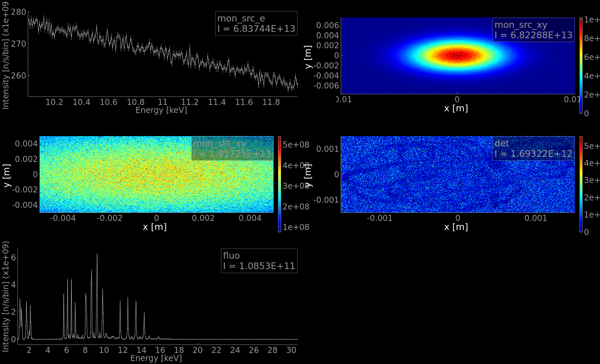

# McXtrace training: samples and virtual experiments: SAXS and tomography

In this session we shall simulate the output of simple models for:
- Small Angle X-ray Scattering (SAXS)
- Tomography (which is based on absorption), and diffraction

## Table of Contents
1. [Exercise A: Small angle scattering (SAXS)](#exercise-a-small-angle-scattering-saxs)
1. [Exercise B: Tomography](#exercise-b-tomograohy)

---

## Exercise A: Small angle scattering (SAXS)

The small-angle X-ray scattering beam-lines measure very small beam deviations around the incident direction, following the Bragg-law _n_&lambda; = 2 _d_ sin(&theta;) where the incident wavelength &lambda; is fixed and we can see that small angles &theta; corresponds with large typical scattering unit sizes _d_.


There is large variety of SAXS sample models. Most of them correspond with isotropic scattering units.

The most complete one is using [SaSView models](https://www.sasview.org/docs/user/qtgui/Perspectives/Fitting/models/index.html) from which about [60 have been ported](http://mcxtrace.org/download/components/3.1/samples/SasView_model.html) into McXtrace. These include isotropic and anisotropic models.

In the following, we shall start from the [TestSAXS](http://mcxtrace.org/download/components/3.1/examples/TestSAXS.html) example instrument (from the _Tests_). It models a toy SAXS beam-line with a set of possible sample models via the input parameter `SAMPLE` (some sample models have been inactivated or are buggy). It also has a PSD and a |Q| monitor (with radial integration).

To run this model, you will need a PDB files accessible at https://www.rcsb.org/structure/6LYZ. Connect to the site and retrieve the PDB file (top right -> Download File -> PDB).

#### Step A.1: simulate the scattering from a set of samples

Load the [TestSAXS](http://mcxtrace.org/download/components/3.1/examples/TestSAXS.html) beam-line model and open the 3D view (run in Trace mode).
Accumulate the photon rays (click on 'keep rays') and start to visualize the scattering pattern.


Now re-run in Simulation mode, with SAMPLE=0, 1, 4, and 11. Use MPI (recompile) with e.g. 4 cores and 1e6 rays. 
These correspond with:
- 0=SAXSSpheres
- 1=SAXSShells
- 4=SAXSLiposomes
- 11=SAXSPDBFast (can use PDB files to compute I(q))

Plot the results, and visualize the scattering curve of all samples.

 
 

:question: what can you say about the scattering units in the sample ? Do they compare/differ ?

#### Step A.2: simulate more complex samples

We now use the [TemplateSasView](http://www.mcxtrace.org/download/components/3.1/examples/templateSasView.html) in _Templates_.

As can be see, the default model index is number 10.

:question: 
- Identify which structure is being used by looking at the table [SasView_model](http://mcxtrace.org/download/components/3.1/samples/SasView_model.html). :warning: links are broken. You should follow the [SasView documentation](https://www.sasview.org/docs/user/qtgui/Perspectives/Fitting/models/index.html). 
- Are we using the default SasView Cylinder model parameters ?

🏃 Run the simulation and plot the results.

A |q| detector would probably be a good idea. Add and instance of the `SAXSQMonitor` at 3.13 m away from the sample, with its `RadiusDetector=0.3`, the `DistanceFromSample=3.13`, `LambdaMin` and `Lambda0` set the nominal wavelength of the source, i.e. `lambda`.

🏃 Run the simulation again and plot the results, in Log-scale.


Now change the structure to a bcc-paracrystal, using the default parameter values extracted from the [SasView documentation](https://www.sasview.org/docs/user/qtgui/Perspectives/Fitting/models/index.html).

:runner: Run the simulation with the [bcc_paracrystal](https://www.sasview.org/docs/user/models/bcc_paracrystal.html) which is `SasView_model(index=4)`.

---


## Exercise B: Tomography

In this practical session we shall simulate a very simple model of a tomography beam-line. We shall use a sample with an "any shape" complex volume, which we can rotate to simulate a sinogram.

Full field tomography is usually achieved by measuring the transmitted beam intensity across a sample on a PSD. Each image corresponds with a projection. The sample is rotated, and a set of images is acquired. Laboratory CT sources provide a cone beam, while synchrotron sources use a more parallel beam. It is also possible to perform tomography pixel-per-pixel with a narrow focused beam, still with sample rotation.

The tomography reconstruction is performed by estimating the initial sample shape and internal structures from the multiple projections (e.g. with ASTRA, PyHST2, UFO, Nabu, etc).

## Sample geometry (reminder from Samples/diffraction)

Sample components should be given a geometrical shape. The sample coordinate frame is usually (when not rotated) *X* on the left, *Y* vertical, and *Z* is 'forward'.

The geometry can be specified as:
- a sphere `radius=<value>`
- a cylinder `radius=<value>, yheight=<value>`
- box `xwidth=<value>, yheight=<value>, zdepth=<value>`
- any shape defined with a `geometry=<file>` with a [PLY](http://en.wikipedia.org/wiki/PLY_%28file_format%29)/[OFF](http://www.geomview.org/docs/html/OFF.html) file (vertices and polygons similar to STL). We provide example geometry files in the [data](http://mcxtrace.org/download/components/3.1/data/) directory (e.g. locally at `/usr/share/mcxtrace/x.y/data`). You may also use e.g. [Meshlab](https://www.meshlab.net/) or other geometry editors/modellers to create such files (rather simple text format). Not all samples support this geometry.

Some samples can be made hollow by specifying a `thickness` parameter. This is especially useful for containers (e.g. capillary) and sample environments.

Moreover, some samples support a `concentric` mode, which allows to insert a component within an other. We shall not consider this topic during this session.

Using the ROTATED keyword, you may orient this geometry in any direction.

### Heating up: Absorption data files

There are curently four sample models that take into account the material absorption. Only the XAS edge is currently handled (no EXFAS, nor XANES structure).

- [Absorption_sample](http://www.mcxtrace.org/download/components/3.1/samples/Absorption_sample.html) a 1 or 2 absorbing materials as a box or cylinder.
- [Abs_objects](http://www.mcxtrace.org/download/components/3.1/samples/Abs_objects.html) a set of absorbing objects which geometry is set from OFF/PLY files.
- [Filter](http://www.mcxtrace.org/download/components/3.1/optics/Filter.html) which can handle absorption and refraction, as a block or any OFF/PLY geometry.
- [Fluorescence](http://www.mcxtrace.org/download/components/3.1/samples/Fluorescence.html) which can handle absorption, fluorescence, Compton and Rayleigh scattering, as a block, sohere, cylinder or any OFF/PLY geometry.

The `Fluorescence` component is the most versatile. It takes as input argument a chemical formulae to describe materials. The three other absorption components (`Absorption_sample`, `Abs_objects`, and `Filter`) use 'absorption' data files which must be prepared before.

There is a dedicated documentation and tool to get absorption data files. 
- [HOWTO: McXtrace absorption files (materials)](https://github.com/McStasMcXtrace/McCode/wiki/HOWTO%3A-McXtrace-absorption-files-%28materials%29)

Usual materials are already available in the [data](http://mcxtrace.org/download/components/3.1/data/) directory.

:warning: These absorption data files only handle monoatomic elements.

### A simple absorption/tomography station

Let's assemble a simple tomography station.

A typical beam-line should look like:
- a photon source
- some optics/slits to shape the beam
- a rotating stage carrying a sample
- a detector


This procedure is iterative. To make sure everything keep under control, we suggest that you compile the model after each step (menu _Simulation_, _Compile instrument_ item).

1. Start a new beam-line, and set its input parameters as `E0`, `dE`, and `theta`. For instance `DEFINE INSTRUMENT SOLEIL_Tomo(E0=11, dE=1, theta=0)`

2. Insert a `Bending_magnet` component, as the one seen in session 4 "Sources". We use the input arguments `E0` and `dE` to be able to change/scan the energy range. Indeed, for this exercise, we shall not use any monochromator. In the real world, one may use a Wiggler/Undulator as source, and a double monochromator setting.
``` c
Bending_magnet(
   E0 = E0, dE = dE, Ee = 2.75,
   Ie = 0.5, B = 1.72, sigey=9.3e-6, sigex=215.7e-6)
```

3. Insert an energy and PSD monitor at 10 m from the source.

4. Insert a simple slit (2x2 mm) at e.g. 20 m away.

5. Insert an `Arm` component, as sample holder, at 0.5 m from the slit.

6. Add a `Fluorescence` sample on that `Arm`, and rotate it by `theta` along its vertical axis `Y` in order to be able to perform a tomography scan. Define its `material` as e.g. `GeGaZnCu` to get many close fluorescence lines. Use a simple sample plate, e.g. 3x3x0.5 mm3. You may as well define the `geometry="wire.ply"` to get a complex geometry inserted inside the plate.

7. Add a PSD detector at e.g. 10 cm after the sample, relative to the sample holder so that it does not also rotate with `theta`. Add as well an energy monitor (to catch the fluorescence), rotated by 45 deg wrt the incoming position.

:runner: Start a computation of the tomogram with 10e6 photon events, better with MPI (recompile). Plot it.



### Sample rotation: simulate a sinogram
 
:runner: Now, do a rotation of the sample around the vertical axis with `theta=0,180` in 10 steps. Use 1e6 photon events, and MPI. Computation should last e.g. ~15 minutes (with 4 cores). Plot the results.

:runner: To visualize the individual images, use Ctrl-click on the `psd2_I` monitor. 

----


