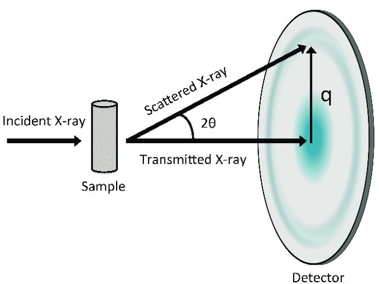
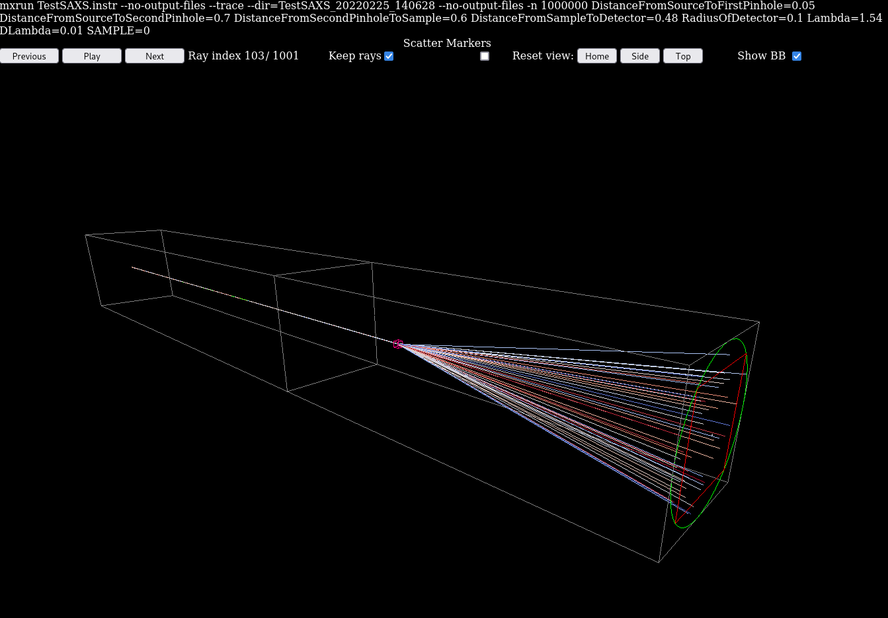
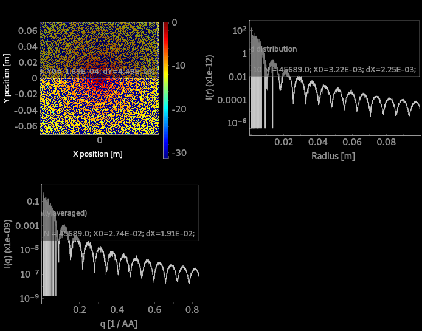
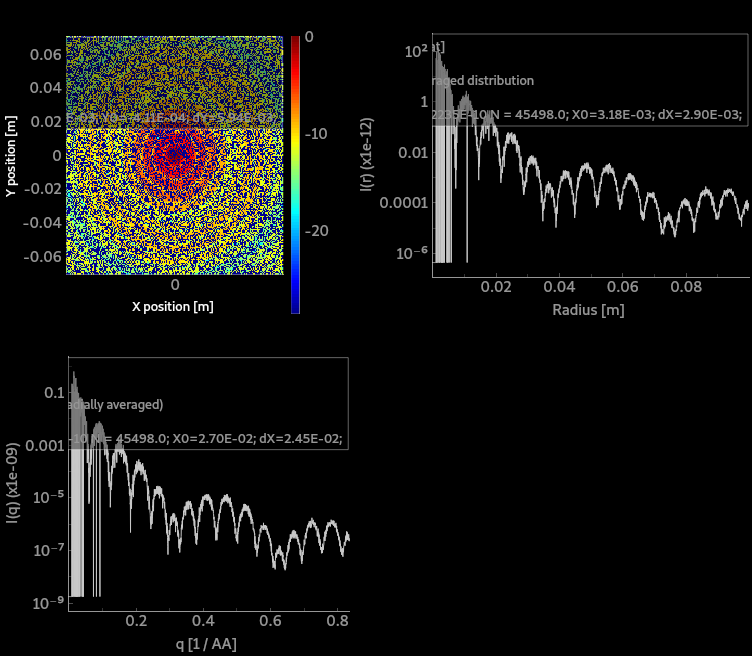
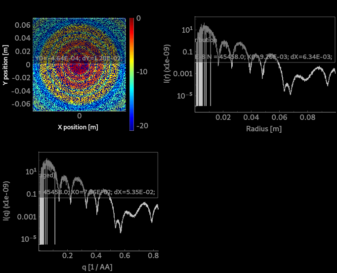
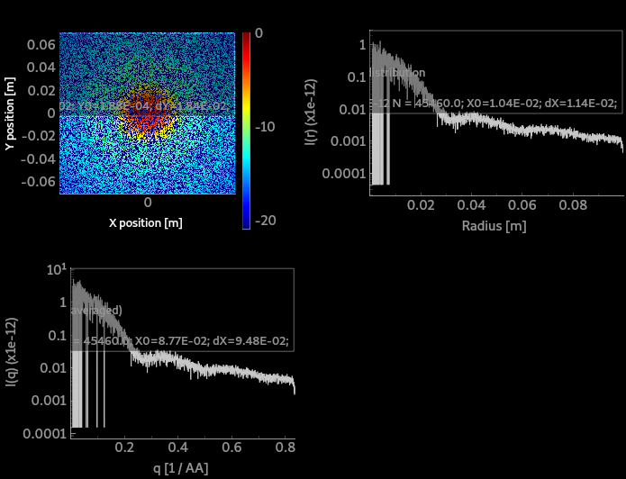
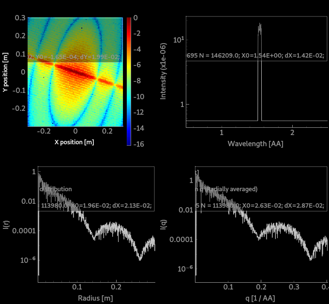

# McXtrace training: samples and virtual experiments: SAXS and tomography

In this session we shall simulate the output of simple models for:
- Small Angle X-ray Scattering (SAXS)
- Tomography (which is based on absorption), and diffraction

## Table of Contents
1. [Exercise A: Small angle scattering (SAXS)](#exercise-a-small-angle-scattering-saxs)
1. [Exercise B: Tomography](#exercise-b-tomograohy)

---

## Sample geometry (reminder from Samples/diffraction)

Sample components should be given a geometrical shape. The sample coordinate frame is usually (when not rotated) *X* on the left, *Y* vertical, and *Z* is 'forward'.

The geometry can be specified as:
- a sphere `radius=<value>`
- a cylinder `radius=<value>, yheight=<value>`
- box `xwidth=<value>, yheight=<value>, zdepth=<value>`
- any shape defined with a `geometry=<file>` with a [PLY](http://en.wikipedia.org/wiki/PLY_%28file_format%29)/[OFF](http://www.geomview.org/docs/html/OFF.html) file (vertices and polygons similar to STL). We provide example geometry files in the [data](http://mcxtrace.org/download/components/3.1/data/) directory (e.g. locally at `/usr/share/mcxtrace/x.y/data`). You may also use e.g. [Meshlab](https://www.meshlab.net/) or other geometry editors/modellers to create such files (rather simple text format). Not all samples support this geometry.

Some samples can be made hollow by specifying a `thickness` parameter. This is especially useful for containers (e.g. capillary) and sample environments.

Moreover, some samples support a `concentric` mode, which allows to insert a component within an other. We shall not consider this topic during this session.

Using the ROTATED keyword, you may orient this geometry in any direction.

---

## Exercise A: Small angle scattering (SAXS)

The small-angle X-ray scattering beam-lines measure very small beam deviations around the incident direction, following the Bragg-law _n_&lambda; = 2 _d_ sin(&theta;) where the incident wavelength &lambda; is fixed and we can see that small angles &theta; corresponds with large typical scattering unit sizes _d_.

There is large variety of SAXS sample models. Most of them correspond with isotropic scattering units.

The most complete one is using [SaSView models](https://www.sasview.org/docs/user/qtgui/Perspectives/Fitting/models/index.html) from which about [60 have been ported](http://mcxtrace.org/download/components/3.1/samples/SasView_model.html) into McXtrace. These include isotropic and anisotropic models.

In the following, we shall start from the [TestSAXS](http://mcxtrace.org/download/components/3.1/examples/TestSAXS.html) example instrument (from the _Tests_). It models a toy SAXS beam-line with a set of possible sample models via the input parameter `SAMPLE` (some sample models have been inactivated or are buggy). It also has a PSD and a |Q| monitor (with radial integration).

To run this model, you will need a PDB files accessible at https://www.rcsb.org/structure/6LYZ. Connect to the site and retrieve the PDB file (top right -> Download File -> PDB).

#### Step A.1: simulate the scattering from a set of samples

Load the [TestSAXS](http://mcxtrace.org/download/components/3.1/examples/TestSAXS.html) beam-line model and open the 3D view (run in Trace mode).
Accumulate the photon rays (click on 'keep rays') and start to visualize the scattering pattern.

Now re-run in Simulation mode, with SAMPLE=0, 1, 4, and 11. Use MPI (recompile) with e.g. 4 cores and 1e6 rays. 
These correspond with:
- 0=SAXSSpheres
- 1=SAXSShells
- 4=SAXSLiposomes
- 11=SAXSPDBFast (can use PDB files to compute I(q))

Plot the results, and visualize the scattering curve of all samples.

 
 

:question: what can you say about the scattering units in the sample ? Do they compare/differ ?

#### Step A.2: simulate more complex samples

We now use the [TemplateSasView](http://www.mcxtrace.org/download/components/3.1/examples/templateSasView.html) in _Templates_.

As can be see, the default model index is number 10.

:question: 
- Identify which structure is being used by looking at the table [SasView_model](http://mcxtrace.org/download/components/3.1/samples/SasView_model.html). :warning: links are broken. You should follow the [SasView documentation](https://www.sasview.org/docs/user/qtgui/Perspectives/Fitting/models/index.html). 
- Are we using the default SasView Cylinder model parameters ?

🏃 Run the simulation and plot the results.

A |q| detector would probably be a good idea. Add and instance of the `SAXSQMonitor` at 3.13 m away from the sample, with its `RadiusDetector=0.3`, the `DistanceFromSample=3.13`, `LambdaMin` and `Lambda0` set the nominal wavelength of the source, i.e. `lambda`.

🏃 Run the simulation again and plot the results, in Log-scale.

Now change the structure to a bcc-paracrystal, using the default parameter values extracted from the [SasView documentation](https://www.sasview.org/docs/user/qtgui/Perspectives/Fitting/models/index.html).

:runner: Run the simulation with the [bcc_paracrystal](https://www.sasview.org/docs/user/models/bcc_paracrystal.html) which is `SasView_model(index=4)`.

---

## Exercise B: Tomography

In this practical session we shall simulate a very simple model of an absorption spectroscopy beam-line. We shall use a sample with an "any shape" complex volume, which we can rotate to simulate a sinogram. We shall also simulate a (very small) hyper-spectral data set.

### Heating up: Absorption data files
There is a dedicated documentation and tool to get absorption data files. 
- [HOWTO: McXtrace absorption files (materials)](https://github.com/McStasMcXtrace/McCode/wiki/HOWTO%3A-McXtrace-absorption-files-%28materials%29)

Usual materials are already available in the [data](http://mcxtrace.org/download/components/3.1/data/) directory.
:warning: However, we currently only treat monoatomic elements, without handling the structure (i.e. no EXAFS).

### A simple absorption/tomography station

There are a few absorption sample components that can be used:
- [Absorption_sample](http://www.mcxtrace.org/download/components/3.1/samples/Absorption_sample.html) a 1 or 2 absorbing materials as a box or cylinder.
- [Abs_objects](http://www.mcxtrace.org/download/components/3.1/samples/Abs_objects.html) a set of absorbing objects which geometry is set from OFF/PLY files.
- [Filter](http://www.mcxtrace.org/download/components/3.1/optics/Filter.html) which can handle absorption and refraction, as a block or any OFF/PLY geometry.

A typical beam-line should look like:
- a photon source
- some optics/slits to shape the beam
- a rotating stage carrying a sample
- a detector

A good start is to search for examples that already use an absorption sample. We find the [`Airport_scannerII.instr`](http://mcxtrace.org/download/components/3.1/examples/Airport_scannerII.html) in group DTU, the [`NBI_Lab_TOMO`](http://mcxtrace.org/download/components/3.1/examples/NBI_Lab_TOMO.html) and the [`SOLEIL_ROCK`](http://mcxtrace.org/download/components/3.1/examples/SOLEIL_ROCK.html) beam-line. 

Lets start with the [`Airport_scannerII.instr`](http://mcxtrace.org/download/components/3.1/examples/Airport_scannerII.html) in which we substitute the `sample_scan` component with a `Filter` one (the `Abs_objects` seems broken). Let's use a geometry file `wire.ply` made of Mn. 

| :warning: If you use McXtrace 3.1, please copy the [3.x/Filter.comp](3.x/Filter.comp) fixed component |
|----|

:runner: Start a computation with 1e6 photon events, possibly with MPI. Plot it.

### tomogram
 
:runner: Now, do a rotation of the sample around the vertical axis with `ANGLE=0,180` in 10 steps. Use 1e6 photon events, and MPI. Computation should last e.g. 1-3 minutes. Plot the results.

:runner: To visualize the individual images, use Ctrl-click on the `psd2_I` monitor. 

### SOLEIL PSICHE beam-line

Layout:
https://www.synchrotron-soleil.fr/fr/file/8068/download?token=UHm6fASX

- 15-100 keV Wiggler 2.1 T lu=50 mm  38 periods
- primary mirror (c1/c2), ignored here
- DCM Ge111, we use Si111 as it has been modelled previously
- KB mirrors for a focused beam 100x100 um (ignored here as we work in white beam)
- sample area 16.8x5.9 mm2

----

