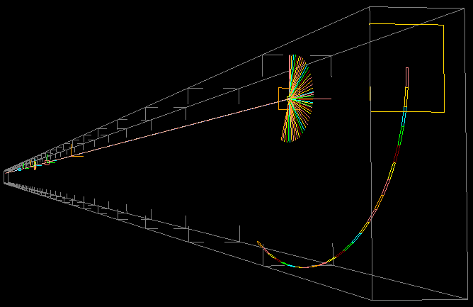

# McXtrace training: modelling synchrotron beamlines and samples


You will learn: Modelling beam-lines with [McXtrace](http://www.mcxtrace.org/), adding samples, coupling with other software, etc...



## Description

| Date | May 9-12, 2023 |
| --------|-------------------|
|Location |  	[Synchrotron SOLEIL](https://www.synchrotron-soleil.fr/fr) |
| Topic | synchrotron beam-line modelling with samples |
| Language | English |

This tutorial aims at presenting the [McXtrace](http://www.mcxtrace.org) software to scientific and technical staff at [SOLEIL](https://www.synchrotron-soleil.fr/fr).

McXtrace allows to describe X-ray (synchrotron and X-FEL) beam-lines with sources, optics, monitors/detectors, samples and more. 
Typical samples that can be simulated include:
- absorption spectroscopy (XAS)
- fluorescence spectroscopy (XRF)
- inelastic scattering (IXS)
- small-angle scattering (SAXS)
- powder diffraction and single-crystal (XRD)
- macromolecular diffraction (MX, with proteins)
- tomography and imaging (via e.g. absorption/fluorescence/diffraction)

McXtrace is interfaced with other software such as:
- Spectra (R) <http://spectrax.org/spectra/> for X-ray synchrotrons
- Simplex (R) <http://spectrax.org/simplex/index.html > for XFELs
- Genesis (R) <http://genesis.web.psi.ch/> for XFELs
- Shadow (RW) <https://github.com/oasys-kit/shadow3> for X-ray synchrotrons
- MCPL (GEANT4, PHITS, MCNP, SRW) (RW) <https://mctools.github.io/mcpl/>

The newly released McXtrace-3.1 allows execution on NVIDIA GPU's.

## Programme

The training is mostly focused at hands-on topical sessions, each with a few introductory slides, and guided exercises. The event will take place at the Training room in the Synchrotron SOLEIL T5 building (20 seats). See the registration information below.

|       |  Tues, May 9th 2023 | Wed, May 10th 2023 | Thur, May 11th 2023 | Fri, May 12th 2023 |
|-------|-------------------|----------------------------|----------------------------|-----------------------|
| 09:00-10:30 | |  Lesson/Practical: [Components](https://github.com/McStasMcXtrace/Schools/tree/master/2023/SOLEIL_May_2023/Day2_Wednesday_May_10th/3_Components) | Pratical: [Sample and Virtual Experiments (SAXS, tomo)](https://github.com/McStasMcXtrace/Schools/tree/master/2023/SOLEIL_May_2023/Day3_Thursday_May_11th/9_Practical_Virtual_Exp_tomo) | Lesson: [Advanced Tricks](https://github.com/McStasMcXtrace/Schools/tree/master/2023/SOLEIL_May_2023/Day4_Friday_May_12th/11_Advanced_Tricks) | 
| 10:30-10:45 | |	Coffee break | Coffee break | Coffee break |
| 10:45-12:00 | | Practical: [Photon sources/external software](https://github.com/McStasMcXtrace/Schools/tree/master/2023/SOLEIL_May_2023/Day2_Wednesday_May_10th/4_Sources) | Lesson: [Samples](https://github.com/McStasMcXtrace/Schools/tree/master/2023/SOLEIL_May_2023/Day3_Thursday_May_11th/7_Samples) | Practical: [We help you to start your beam-line model](https://github.com/McStasMcXtrace/Schools/tree/master/2023/SOLEIL_May_2023/Day3_Thursday_May_11th/10_Starting_your_own_beam_line) (2) |
| 12:00-14:00 |	Lunch / **Start of School** |	Lunch | Lunch | Lunch / **End of School** |
| 14:00-16:00 |Lesson: [Introduction to McXtrace](https://github.com/McStasMcXtrace/Schools/tree/master/2023/SOLEIL_May_2023/Day1_Tuesday_May_9th/1_Introduction)  | Practical: [Optics](https://github.com/McStasMcXtrace/Schools/tree/master/2023/SOLEIL_May_2023/Day2_Wednesday_May_10th/5_Optics) | Practical: [Samples and Virtual Experiments / absorption spectroscopy (and fluorescence), inelastic](https://github.com/McStasMcXtrace/Schools/tree/master/2023/SOLEIL_May_2023/Day3_Thursday_May_11th/8_Practical_Virtual_Exp_spectroscopy) | |
| 16:00-16:15 |	Coffee break |	Coffee break |	Coffee break |	 |
| 16:15-18:00 |Practical: [your first McXtrace beam-line](https://github.com/McStasMcXtrace/Schools/tree/master/2023/SOLEIL_May_2023/Day1_Tuesday_May_9th/2_1st_Beamline) | Practical: [Samples and Virtual Experiments / diffraction (XRD,MX)](https://github.com/McStasMcXtrace/Schools/tree/master/2023/SOLEIL_May_2023/Day2_Wednesday_May_10th/6_Practical_Virtual_Exp_diffraction)  | Practical: [We help you to start your beam-line model](https://github.com/McStasMcXtrace/Schools/tree/master/2023/SOLEIL_May_2023/Day3_Friday_May_11th/10_Starting_your_own_beam_line) (1) | |
| 19:30-21:00 | | | Evening lunch | |

## Installation

You will access McXtrace via a browser on your laptop. No software installation is required.

- **For SOLEIL staff (wifi, on-site)**: start the Data Analysis virtual machine from <https://re-grades-01.exp.synchrotron-soleil.fr/desktop/> or <https://re-grades-02.exp.synchrotron-soleil.fr/desktop/>. :+1: This option provides optimal computing power. You can save your data onto the Ruche, or via external clouds/emails.
- **For all**: access a prepared McXtrace simulation environment from <https://mybinder.org/v2/gh/McStasMcXtrace/mcxtrace-binder/master?urlpath=lab>. The JupyterLab is displayed with a __Desktop__ icon on the right panel. Drag-n-drop files on the left panel to communicate with your simulation environment. :warning: This option provides a limited computing power.

### Exectution on local hardware
The above environment is also available on dockerhub and may be run on your own PC, provided [Docker Desktop](https://www.docker.com/products/docker-desktop).

The McXtrace docker can be spawned via the command
```
docker run -p 8888:8888 docker.io/mccode/mcxtrace-1.7-3.0:1.0
```
Afterwards, please connect to the URL communicated by the docker after which the JupyterLab environment appears:

### Manual installation of software stack
In case you wish to install the software yourself, refer to the [McXtrace installation](http://mcxtrace.org/download/) page. Version 1.7 is the legacy one. Version 3 is the 'next-generation' one with an improved performance, GPU support at the cost of a slightly modified syntax/grammar. Both versions are installed on the resources above.

## Registration and contacts

The school is organised by:

- [Emmanuel Farhi](mailto:emmanuel.farhi@synchrotron-soleil.fr), Synchrotron SOLEIL, FR 
- [Peter Willendrup](https://www.fysik.dtu.dk/english/Research/NEXMAP/About-NEXMAP/Staff/Person?id=38697&tab=2&qt=dtupublicationquery), DTU, DK

[Registration here](https://indico.synchrotron-soleil.fr/e/mcxtrace2023) is free (**20 seats**). Deadline for registration is April 17th 2023. **For late registration**, send an email to [Emmanuel Farhi](mailto:emmanuel.farhi@synchrotron-soleil.fr).

This training is entirely funded by the Experiment Division at SOLEIL, with support from the Administrative Division.


## About McXtrace

[McXtrace](http://www.mcxtrace.org/) is a general Monte Carlo ray-tracing software for simulation X-ray beam-lines and experiments, distributed under the open source license of GPL.

It is a collaborative effort between DTU Physics, European Synchrotron Radiation Facility, Niels Bohr Institute, and now SOLEIL. Initial funding came from a grant under the NaBiIT program of the Danish Strategic Research Council DSF and from SAXSLAB ApS, in addition to the above parties.

It is built upon the code base of the proven and successful neutron ray-tracing package [McStas](http://mcstas.org/) and today McXtrace and McStas share a central code repository at https://github.com/McStasMcXtrace/McCode.

**References:**

1. McXtrace http://www.mcxtrace.org/
2. Downloads (version 3.1 from Dec 16th 2022) for Windows, Mac and Linux (CentOS, Fedora, Debian) at http://downloads.mcxtrace.org/mcxtrace-3.1/
3. E Bergbäck Knudsen, Andrea Prodi, Jana Baltser, Maria Thomsen, P Kjær Willendrup, M Sanchez del Rio, Claudio Ferrero, Emmanuel Farhi, Kristoffer Haldrup, Anette Vickery, et al. "Mcxtrace: a monte carlo software package for simulating x-ray optics, beamlines and experiments". _Journal of Applied Crystallography_, **46(3)**:679-696, 2013.
4. McXtrace/McStas Wiki https://github.com/McStasMcXtrace/McCode/wiki
5. McXtrace/McStas repository https://github.com/McStasMcXtrace/McCode

***
*McXtrace training - 2023*  
*Non-official corrections of some exercices [here](https://github.com/antoinepado/Corrections_School_March_2022)*  (2022)


