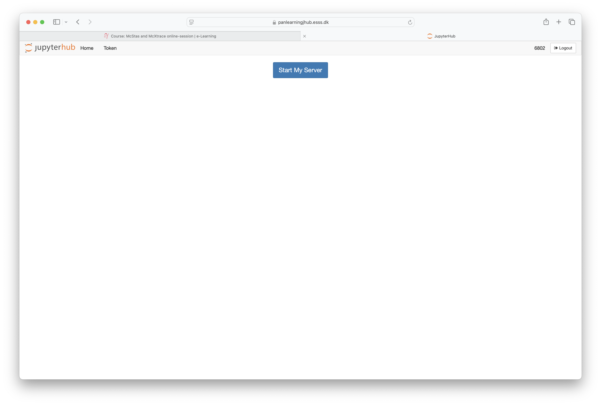
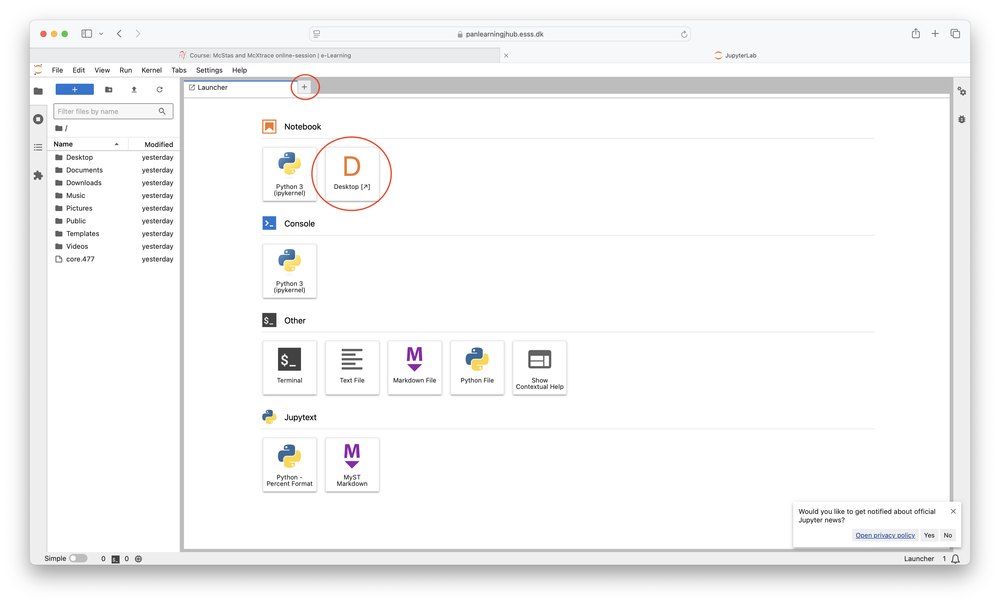

# Getting access to McStas + McXtrace
- Start by logging in at [The elearning site](https://e-learning.pan-training.eu/)
- 
- Use "My courses" and "McStas McXtrace online session"	 to find the course or click this [link](https://e-learning.pan-training.eu/course/view.php?id=104)
-  
- On the course front-page, click the "JupyterLab/Desktop" link
- 
- Once prompted, click to start your server
- 
- Once server is started, click the only option
- 
- Once Jupyter has started, click on the "Desktop" icon
- May always be found back later via the "+"
- 
- Once your Desktop is visible, click to start a terminal - and enter `mcgui` (optionally with an `&` added to start in the background
- 
- 
- McStas mcgui is now running. To start the McXtrace gui, write `mxgui` in a new terminal (optionally with an `&` added to start in the background
- 
- Finally, both the McStas (`mcgui`) and McXtrace (`mxgui`) tools are running
- 

- Also consult the [Tool overview](../README.md)