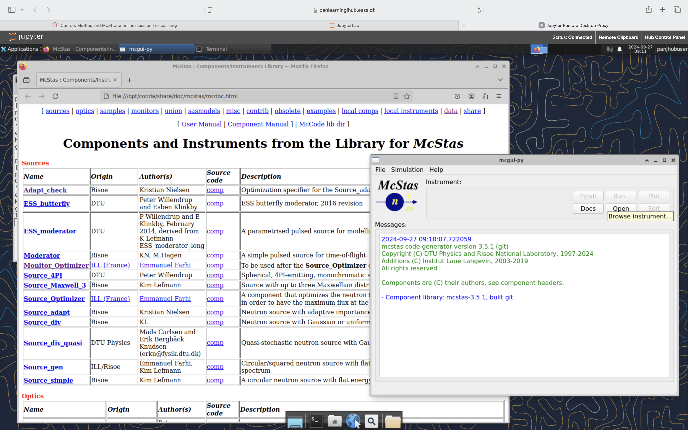

# Accessing documentation
- Please use the command `mcdoc` in a terminal - or click Docs in `mcgui`

- the McStas `mcdoc` (and `mxdoc`for McXtrace) provides the main entry-point to documentation - will come in handy later.

- This will provide documentation on components, example instruments and datafiles
- Includes links to website and PDF documentation (somewhat outdated)

# User tool information
- See [the tool info](../01_starting_the_guis/tools/README.md)

- Once you feel ready, please proceed with [your first McStas simulation](../03_a_first_simulation/README.md)
