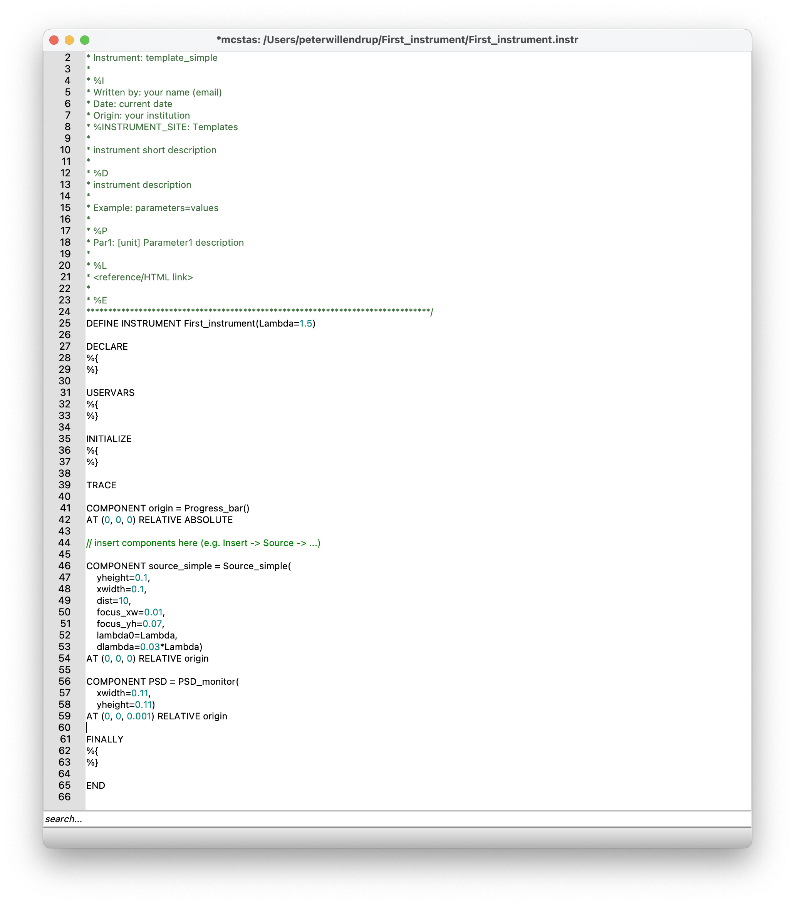
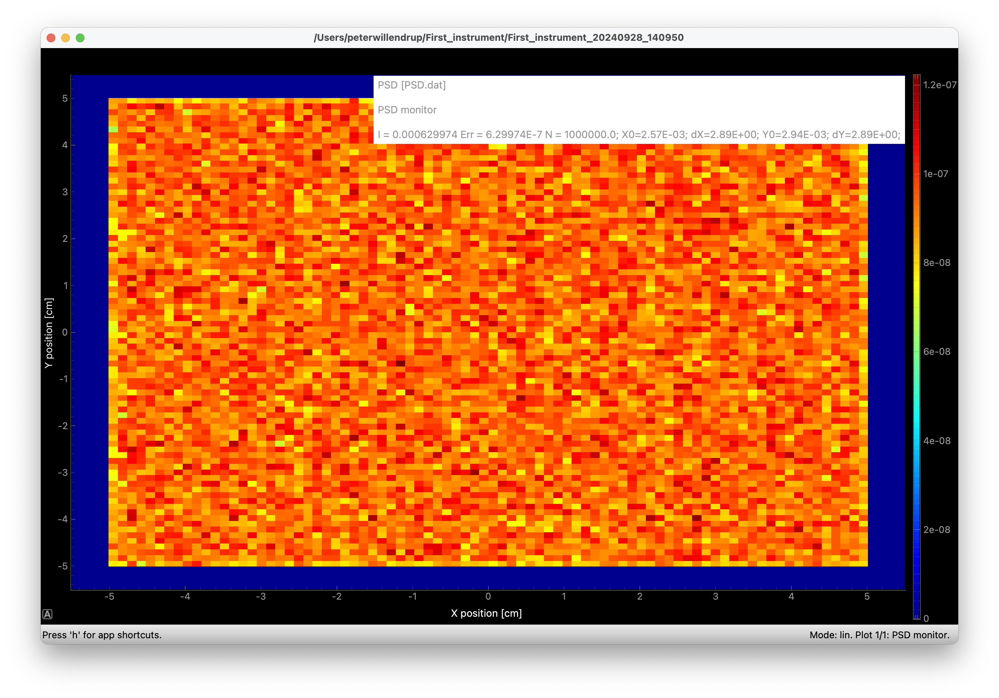

# Your first instrument, your first simulation!

## Open mcgui and use File->New

* Save your file with suitable name in a suitable place
* Edit the line `DEFINE INSTRUMENT template(Par1=1)` to match your
  chosen filename and exchange `Par1=1` for `Lambda=1.5`
  (This adds a runtime-input that we may later vary)
* Use `Insert->Source->Source_simple` to define the source of your new
  instrument
  * **Important:** The cursor should be whered you want to insert the component. Components are inserted in a list between 
  `TRACE` and `END`, and in our case after the `origin` component
  * Set the geometry to be a `0.1 m x 0.1 m` area (parameters `xwidth, yheight`
  * Use `Lambda` as input for the `lambda0` parameter
  * Use `0.03*Lambda` as input for the `dlambda` parameter
  * Define "phasespace" to simulate (aka. "focusing") by setting `dist=10`, `focus_xw=0.01`, `focus_yh=0.07`
  * place it `AT (0,0,0) RELATIVE origin`

* Use `Insert->Monitors->PSD_monitor` to measure the beam outgoingdefine the source of your new
  instrument
  * Use geometry `wxidth=0.11, yheight=0.11` and place `AT (0,0,0.001) RELATIVE origin`

* Run a first simulation and click `Plot`
* You should now have arrived at
  * Code looking like this:
  
  * Output looking like this:
  
*