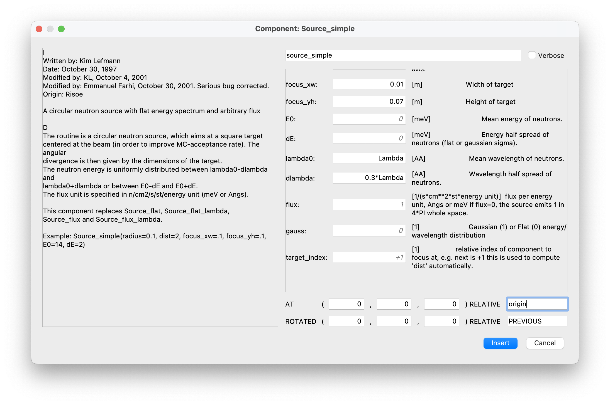
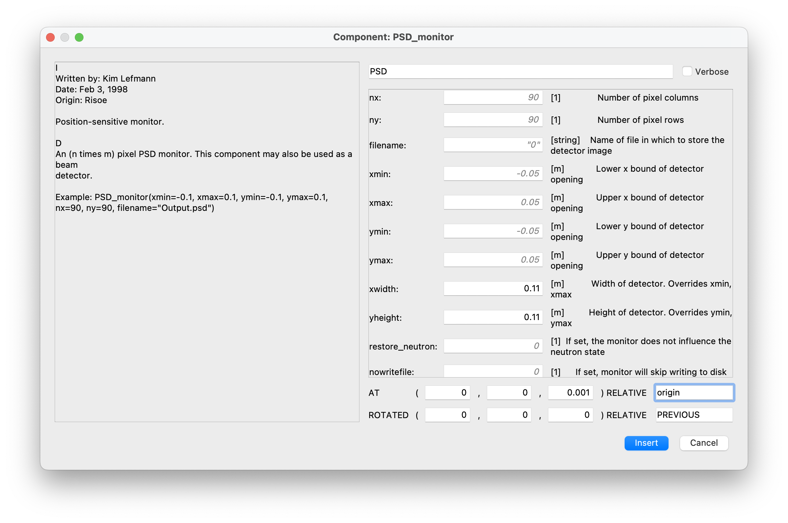
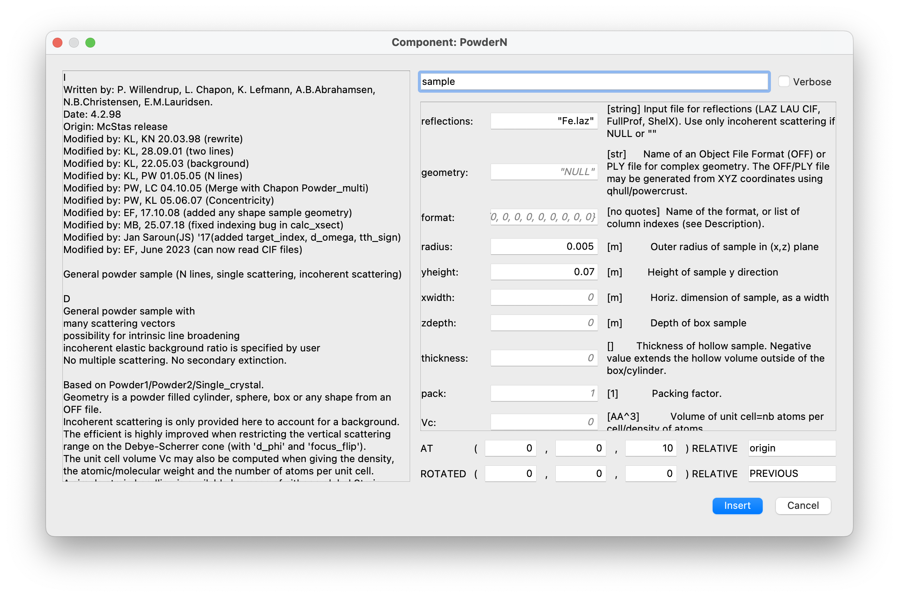
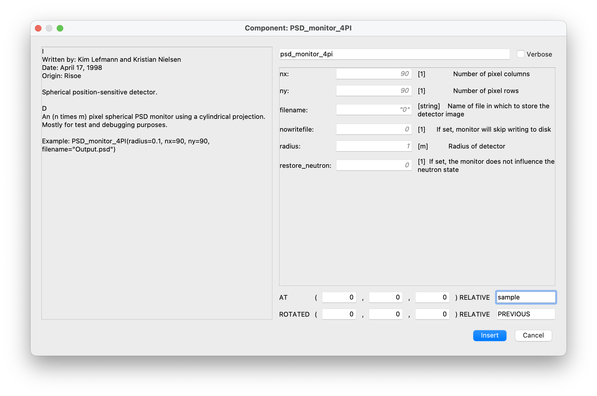
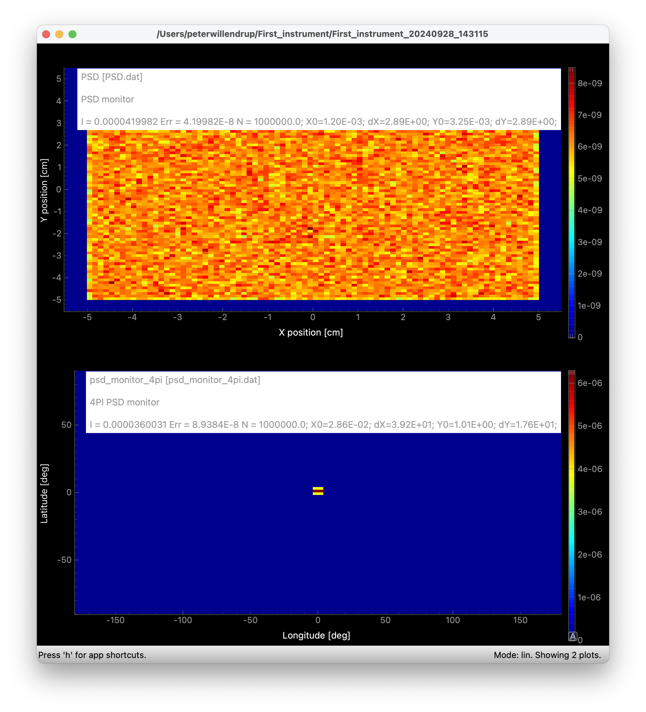
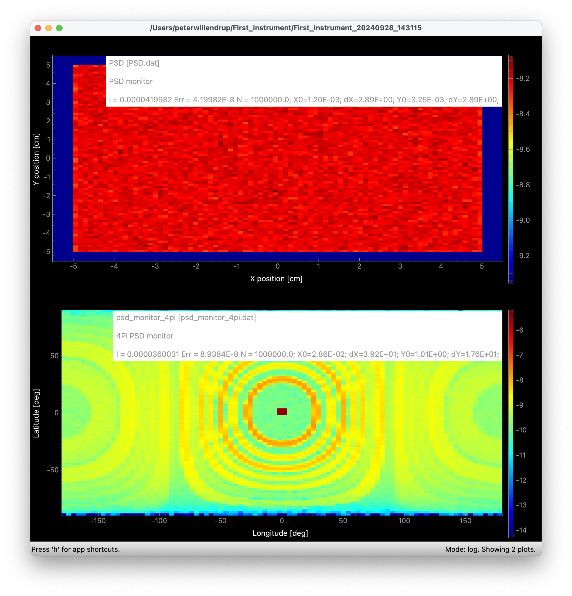
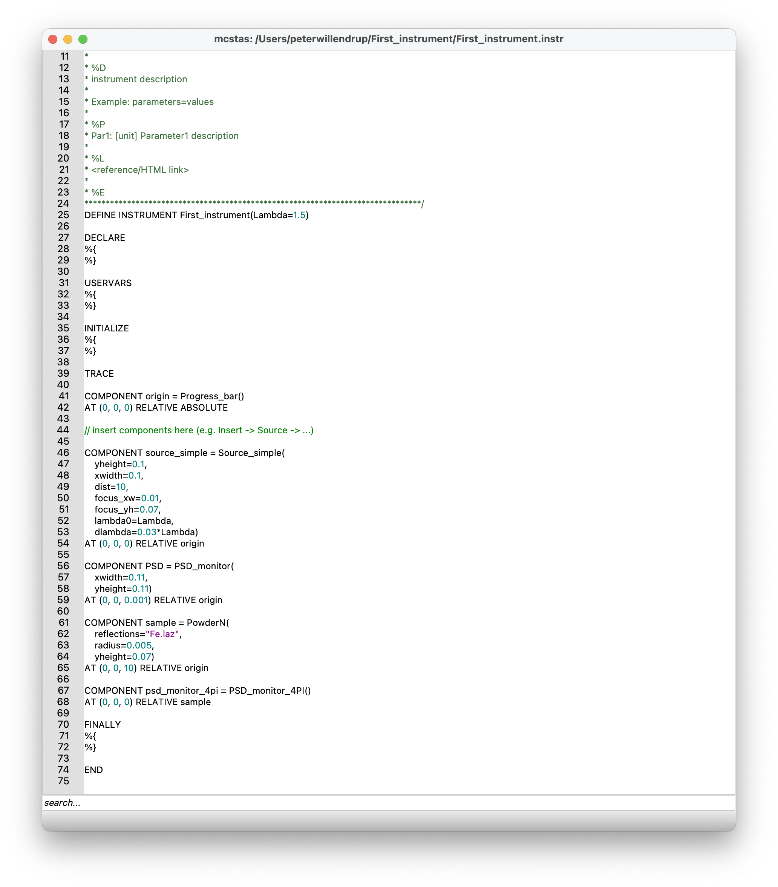

# Your first instrument, your first simulation!

## Open mcgui and use File->New

* Save your file with suitable name in a suitable place
* Good practice is to edit `DEFINE INSTRUMENT template(Par1=1)` 
  to match you chosen filename.
  * Please also exchange `Par1=1` for `Lambda=1.5` (This adds a runtime-input that we may later vary)
* Use `Insert->Source->Source_simple` to define the source of your new
  instrument
  * **Important:** The cursor should be whered you want to insert the component. Components are inserted in a list between 
  `TRACE` and `END`, and in our case after the `origin` component
  * Set the geometry to be a `0.1 m x 0.1 m` area (parameters `xwidth, yheight`
  * Use `Lambda` as input for the `lambda0` parameter
  * Use `0.03*Lambda` as input for the `dlambda` parameter
  * Define "phasespace" to simulate (aka. "focusing") by setting `dist=10`, `focus_xw=0.01`, `focus_yh=0.07`
  * place it `AT (0,0,0) RELATIVE origin`
  

* Use `Insert->Monitors->PSD_monitor` to measure the beam outgoingdefine the source of your new
  instrument
  * Use geometry `wxidth=0.11, yheight=0.11` and place `AT (0,0,0.001) RELATIVE origin`
  

* You should now have arrived at
  * Code looking like this:
  

* Run a first simulation and click `Plot`
  * Output should look something like this:
  

* Next, `Insert->Samples->PowderN`
  * Add a cylindrical sample via `radius=0.005`, `yheight=0.07`
  * Set `reflections="Fe.laz"` (note the quotes)
  * Place `AT (0,0,10) RELATIVE origin"`
  

* Finally, add Insert->Monitors->PSD_monitor_4PI`
  * place it `AT (0,0,0) RELATIVE sample`
  

* Run a simulation and click `Plot`
  * You sould arrive at something like
  
  * Not much to see....? Spot in the middle is direct beam, try pressing 'l' in the plotting 
  window to apply a logarithm  
  

* Your final instrument should look something like this:
  

* Congratulations, you have performed a first simulation!

* In [../04_output_data_(mcplot)](../04_output_data_\(mcplot\)/) we will take a closer look at the output data and the plotting utility `mcplot`
