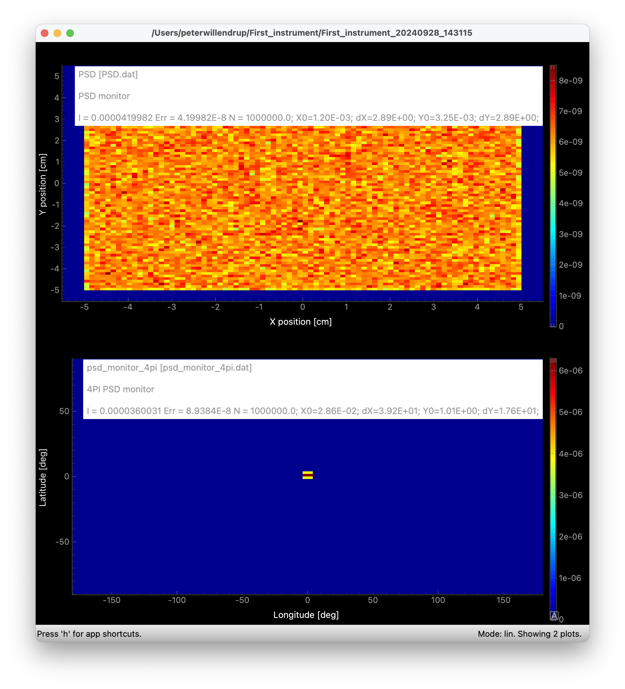
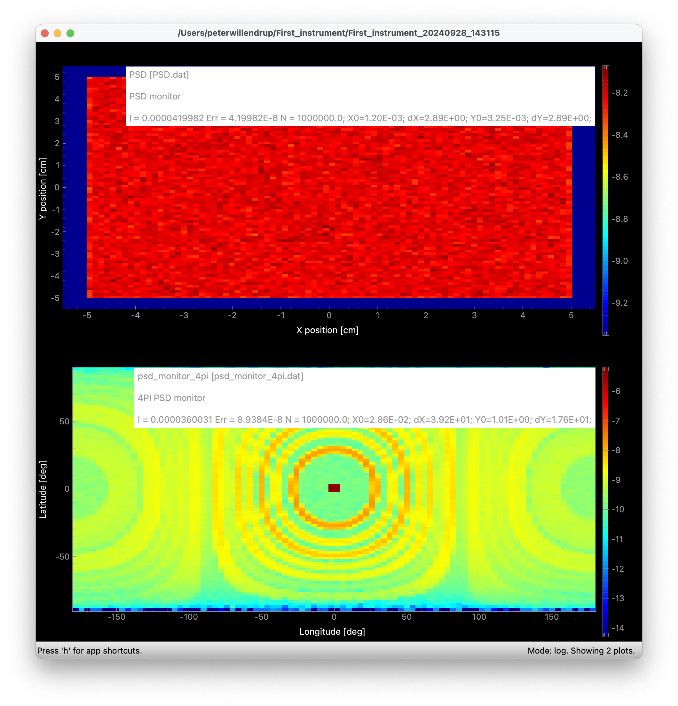
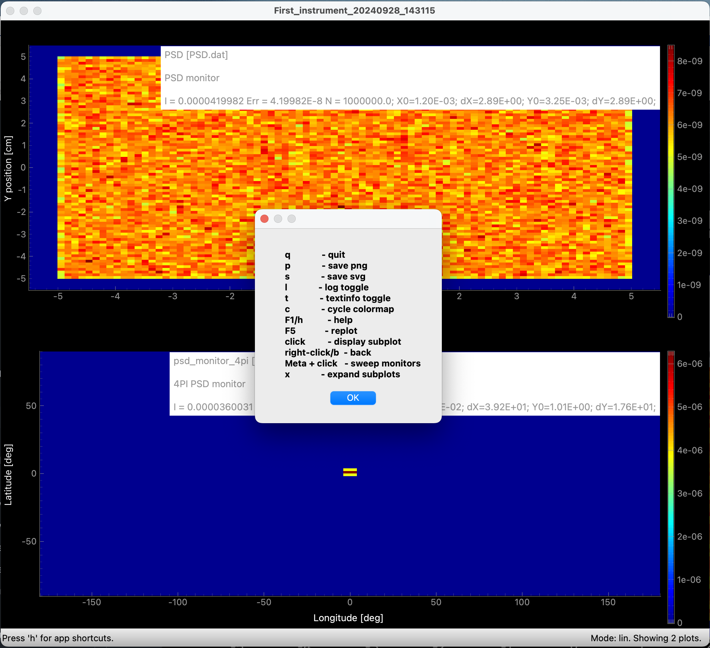

# A closer look at the plots
- To plot output data you may use either
  - The command `mcplot [foldername]` in a terminal
  - Click Plot in `mcgui` if you want to visualise the "current" instrument output
  - Use `Simulation -> Plot Other Results` to browse your way to an existing dataset

- We will dig into the meaning of the numbers in the plots later, but for now notice that each plot legend contains 3 numbers:
  - 1st from left **I (Intensity)** (most important information in the graph
  - 2nd from left **ERR (Error)** RMS-error on intensity
  - 3rd from left **N (Neutron ray count)**, remaining available statistics 
- As you noticed before, it is possible to apply a log scale by entering `l` in the window

- There are several other possiblitites, try pressing `h` for help and you will get a list

- We have a whole [family](https://github.com/McStasMcXtrace/McCode/wiki/mcplot-variants---table-overview) of `mcplot` tools.

- Once done here, we will have a look at [displaying the instrument geometry](../05_visualise_the_geometry_\(mcdisplay\)/)
