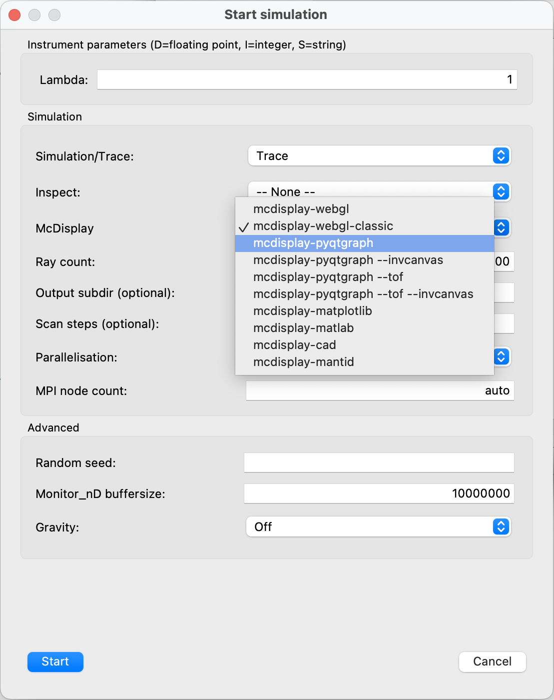

# Visualising the instrument
- As you may have noticed on the "run" dialogue there are multiple "simulation mode" possibilities:

- `Simulation` corresponds to running your instrument with the full `Ray count/ncount` statistics and producing histogram output
- `Trace` visualises the 3D geometry of the instrument - and we have a whole [family](https://github.com/McStasMcXtrace/McCode/wiki/mcdisplay-variants---table-overview) of tools for this purpose. 
- Here we will initially look at the `mcdisplay-webgl-classic` which renders the instrument in a web-browser, please choose it in the run dialogue:

- After pressing run you should get an output like this:

- The display is interactive, you may move, pan and zoom using your mouse in combination with clicking/right-clicking and/or scrooling. There are also various visualisation options available on the top menu of the browser.	
- When you need a measurement of positioning, `mcdisplay-pyqtgraph` is useful. It renders the instrument in 3 axis-parallel views (top, side, end). Please choose it in the run dialogue:

- After pressing run you should get an output like this:

- The display is interactive, you may move, pan and zoom using your mouse in combination with clicking/right-clicking and/or scrooling. Using `space` will render the neutron rays in the instrument one at a time.
