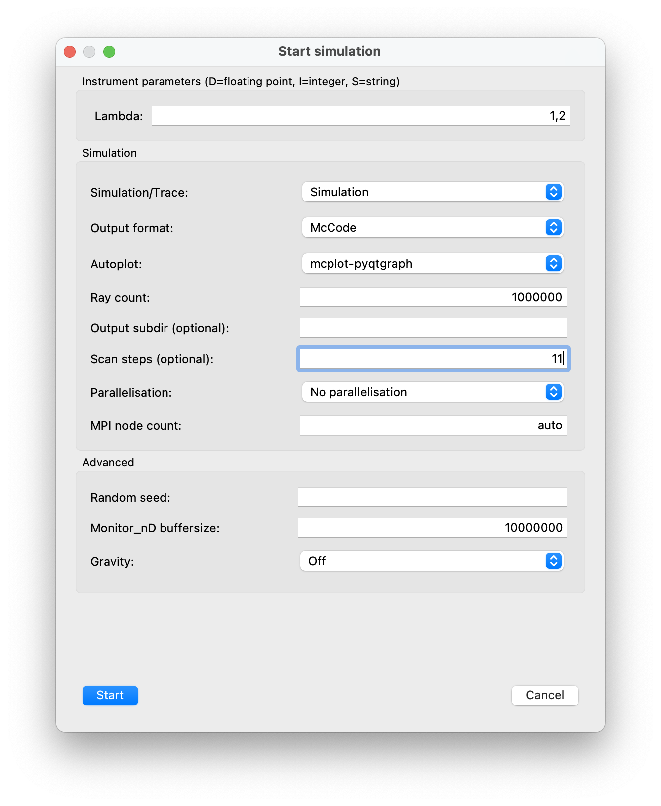
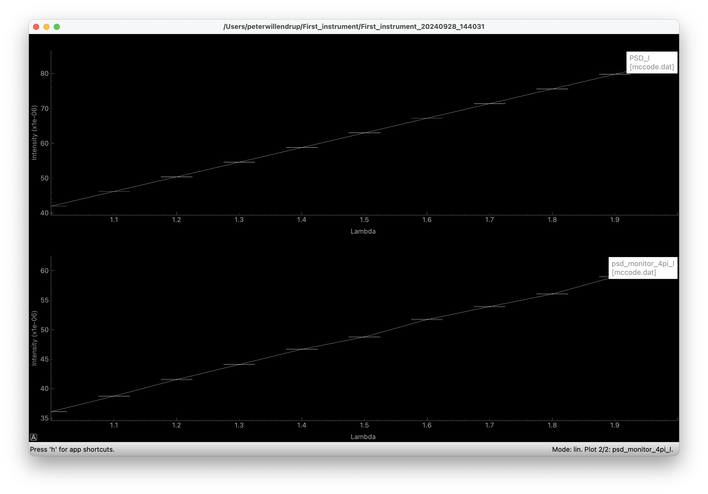
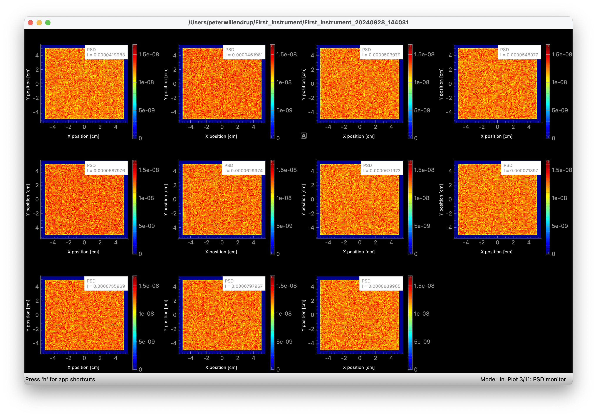
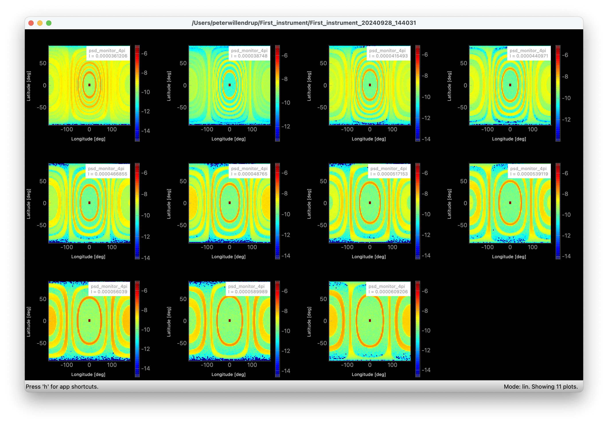

# Running a scan / series of simulations
- As you initially noticed, we added the instrument input parameter `Lambda`. This will now allow us to look at the wavelength-dependence of our diffraction pattern.
- As a start, find back the "run dialogue". 
- Entering `1,2` in the `Lambda` entry-field and `11` Scan steps will now perform 11 simulations over the `Lambda` interval:

- Pressing `Start` will run the series. Once finished you may `Plot`, which will initially show the *integrated intensity* as function of `Lambda` for our 2 monitors (Which is perhaps not so interesting. :-))

- `Ctrl+click` on the lower graph will show you the monitor output as function of the `Lambda` scan:

- Press `l` again to apply a logarithm:
