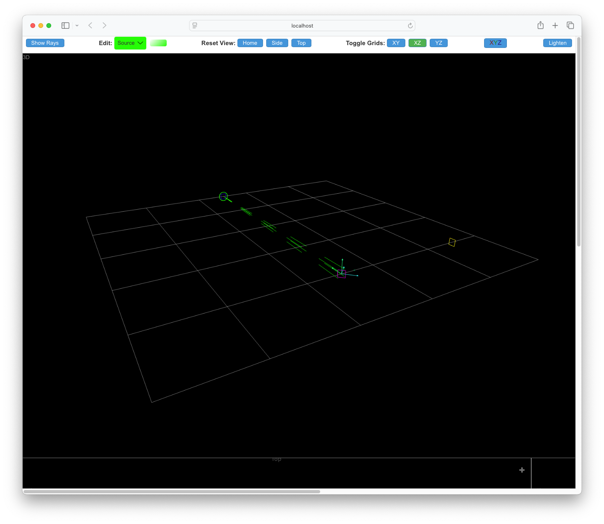
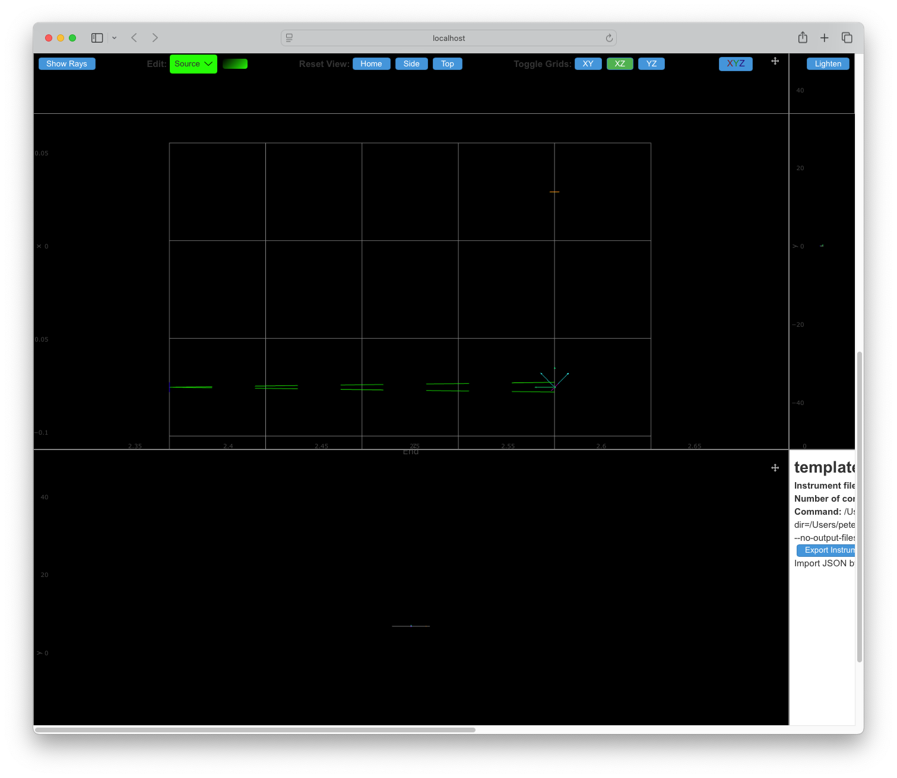
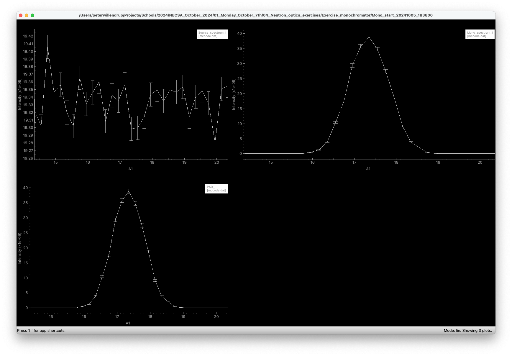
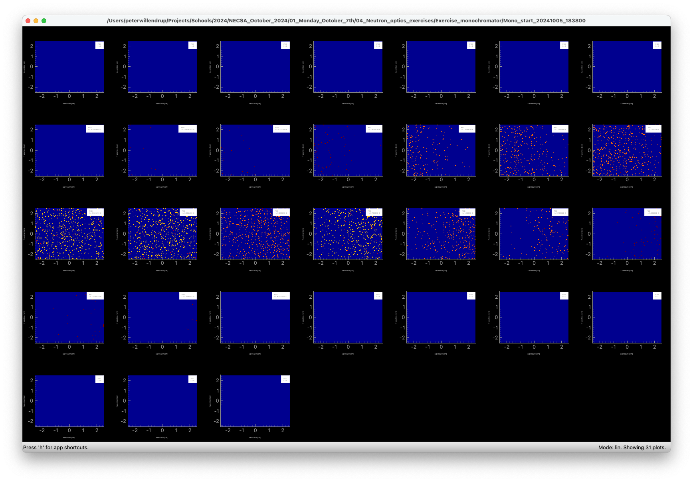

## Monochromator

First a briefing by Peter on McStas monochromator models:
[monochromator slides](Monochromators.pdf)

## TASKS

( If you get stuck along the way, there is a solution [here](solution/mono.instr) )


1. Create yourself a new instrument file and name to your liking

2. Add a `Source_gen` to your instrument, by copy-paste from:

```
COMPONENT  Source = Source_gen(
    radius = 0.0905, dist = 4, focus_xw = 0.1, focus_yh = 0.1,
    Lmin = source_lam_min, Lmax = source_lam_max, I1 = 0)
  AT (0, 0, 0) RELATIVE origin
```
3. Add corresponding instrument input paramters for your source: `source_lam_min=0.5, source_lam_max=6.5`,

4. Insert an `L_monitor` a short distance after the `Source` to measure the initial spectrum, dependent on the `source_lam*` parameters. Use e.g. 101 bins and `xwidth=0.2`, `yheight=0.2` to measure all stats from the circular source. Check out the meaning of the parameters via the component insertion dialogue.

5. Run a simulation to verify output on the monitor

6. Next we need to add two `Arm` components for the positioning of our Monochromator:
   * Instance `Mono_arm` with `AT (0,0,4) RELATIVE Source` and `ROTATED (0,A1,0) RELATIVE Source`
   * Instance `Mono_out` with `AT (0,0,4) RELATIVE Source` and `ROTATED (0,A2,0) RELATIVE Source`

7. Add input parameters `A1=0, A2=0` for control of the geometry of your instrument

8. Use the `mcdoc` utility (press `Docs` on `mcgui`) to read up on the component `Monochromator_flat`

9. Now insert a Monochromator_flat between `Mono_arm` and `Mono_out` using the (002) reflection of PG with `Q=1.8734` or `DM=2*PI/Q`. (This is what you will get if you assume all defaults)

10. Insert a small 10x10 cm `L_monitor` instance 2 m after the `Mono_out` instance to (once we are ready) measure the reflected beam from the monochromator. Use the same range of wavelength measurement as the earlier wavelength monitor.

11. Following 0.001 mm after the (10.) L_monitor, insert a 10x10 cm `PSD` to look at the reflected beam spot.

12. Verify that you have built something reasonable by means of a `TRACE` setting `A1=45` and `A2=90`, it should all togetherlook something like this:





13. Use Braggs law $n\lambda=2d\sin(\theta)$ to find calculate (pen and paper / caclulator for now) the correct `A1,A2` values to reflect a 2Å beam. (Hints: Calculate for `n=1`, and that in reflection, `A2`=$2\theta$ and `A1`=`A2/2`

14. Using your result from 13, run a simulation to confirm.

15. Discuss with your neighbour, what are the other, lower-wavelength peaks?
**Optional bonus-task**: Try switching to to `Output format: NeXus -c` and fit the peaks using `NeXpy`

16. For still fixed `A2`, perform a so-called monochromator _rocking-curve_ by performing a scan of `A1` a few degrees plus/minus the nominal reflection value, you should get something like this for the overview-picture:



and be able to see the reflection sweeping by the monitor if crontol-cliking on the last monitor output:



17. Discuss with your neighbour how we might optimise the instrument to
   * Not loose as many virtual neutrons
   * What we might do to increase neutron intensity scattered from the monochromator

18. Add another `Arm` 2.1 m from `Mono_out` which will serve as sample position later. Save the file for further work in another exercise.

19. **Optional bonus-task**: Investigate the example instrument `Test_Monochromators` for a good overview of available monochromator models (Hint: find it via `Docs`)

20. A couple of instruments are left in the [solution](solution) folder. One (`mono.instr`) is the result of the above steps, the other (`mono_optims.instr`) is meant as an inspiration catalogue for a subset of many optimistaions possible. 

21. Also, remember to use the `examples` as inspiration! Several world-class diffractomer models are available, e.g. `ILL_D20` and `ILL_D2B`.