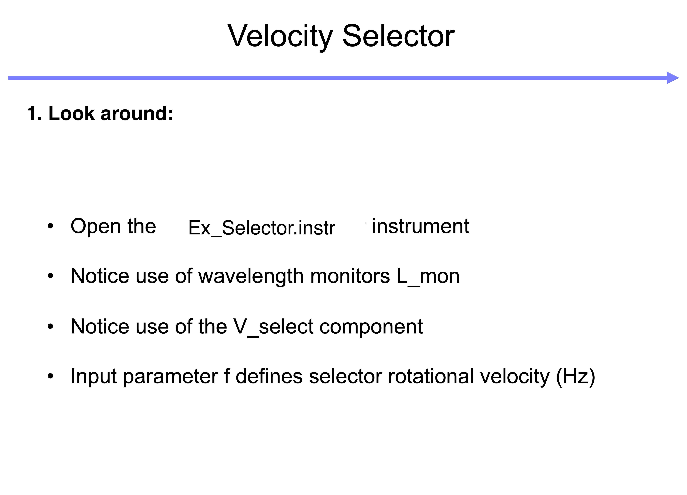
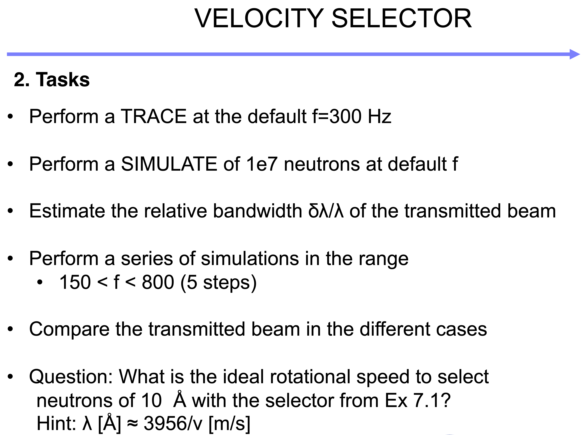
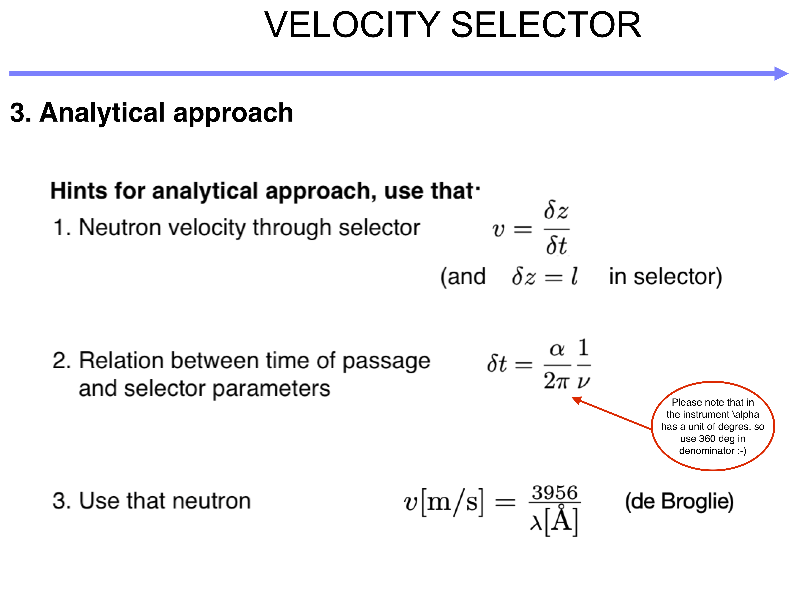
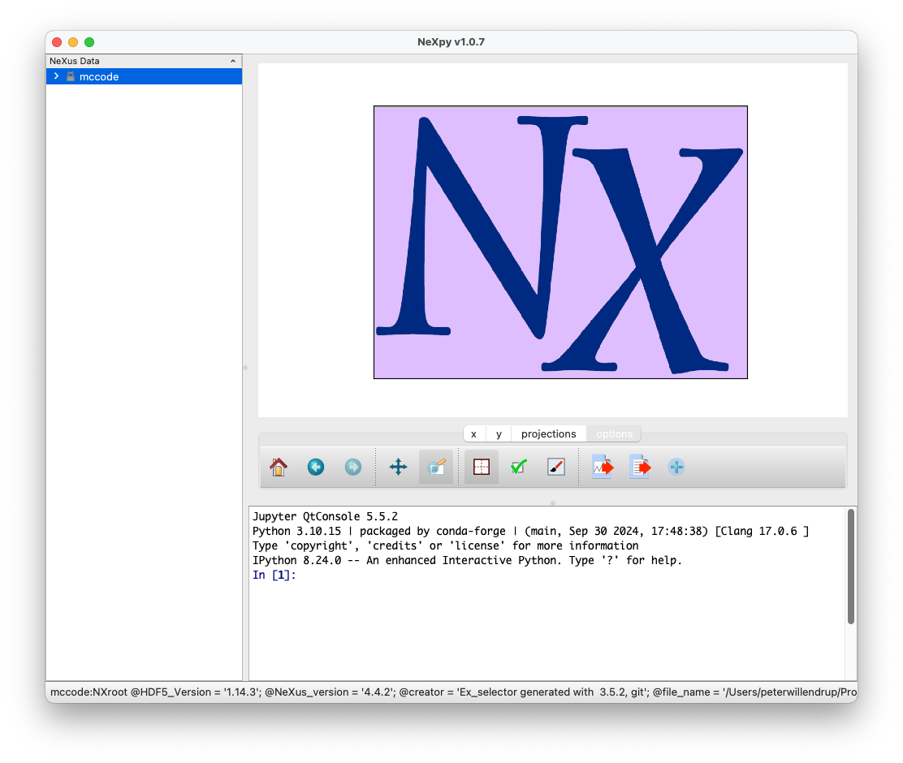
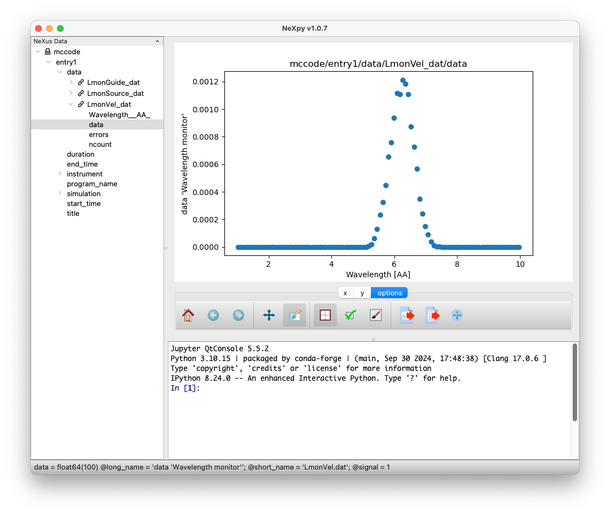
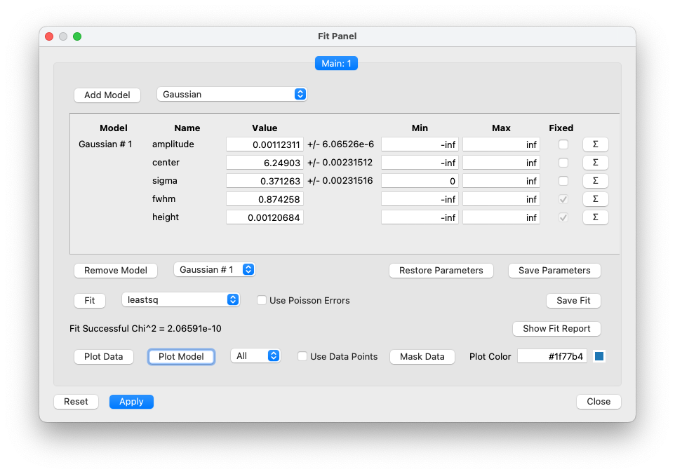
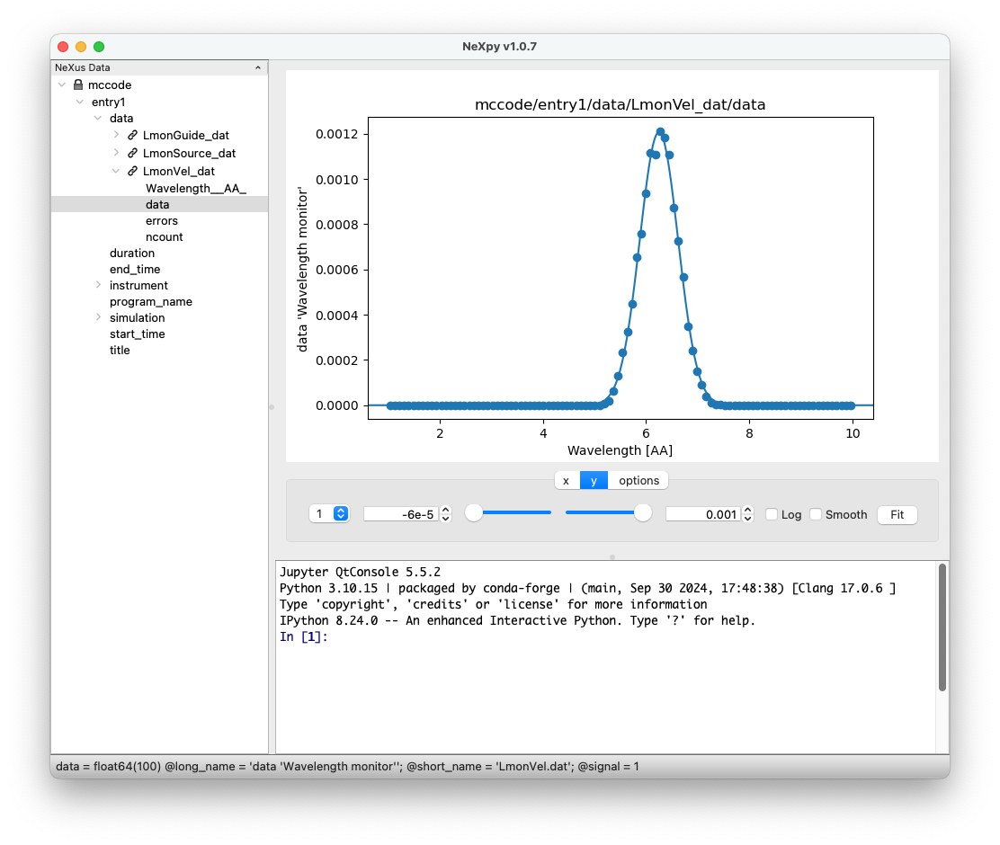
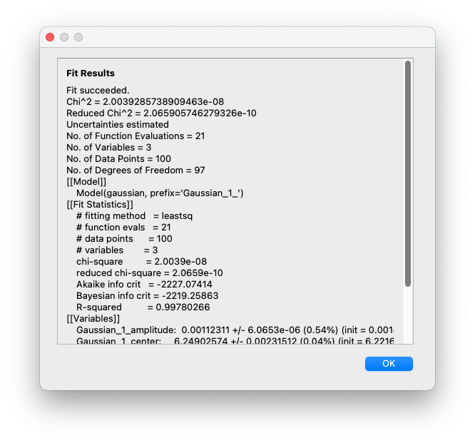

## TASK 1 simulating a neutron Velocity_selector:

Instrumentfile: [Ex_selector.instr](Ex_selector.instr)

## TASK 2 improve the instrument file:
### Given that:

### RESULT: Please form an expression of selector frequency as function of desired wavelength $f(\lambda)$ - may be used in Bonus task 4 below.

## Bonus task 3: Data analysis in NeXpy
* On the run dialogue in mcgui, select `Output format: NeXus -c` (-c means recompile to ensure format is supported) and run a simulation
* Plot and NeXpy should appear:

* Expand the tree structure `mccode->data->LmonVel_dat`
* Double-click `data` inside and select `Axis 0` to be Wavelength in Å, a plot should appear:

* Clicking the `y` tab will give access to the `Fit` button, and pressing will bring up a new small window:

* Add a Gaussian Model, `Fit`, `Plot Model` and `Show Fit Report`

**Hint:** If you `save` your fits or parameters, these will become available in the left pane of NeXpy and can be saved by using a right-click menu point

## Bonus task 4:
* Exchange the instrument input-parameter `f` for a `lambda` (add a default of e.g. 6Å)
* In the `DECLARE` section, uncomment the `//double f; ` -> `double f; `
* Add your equation in c-code under `INITIALIZE`

