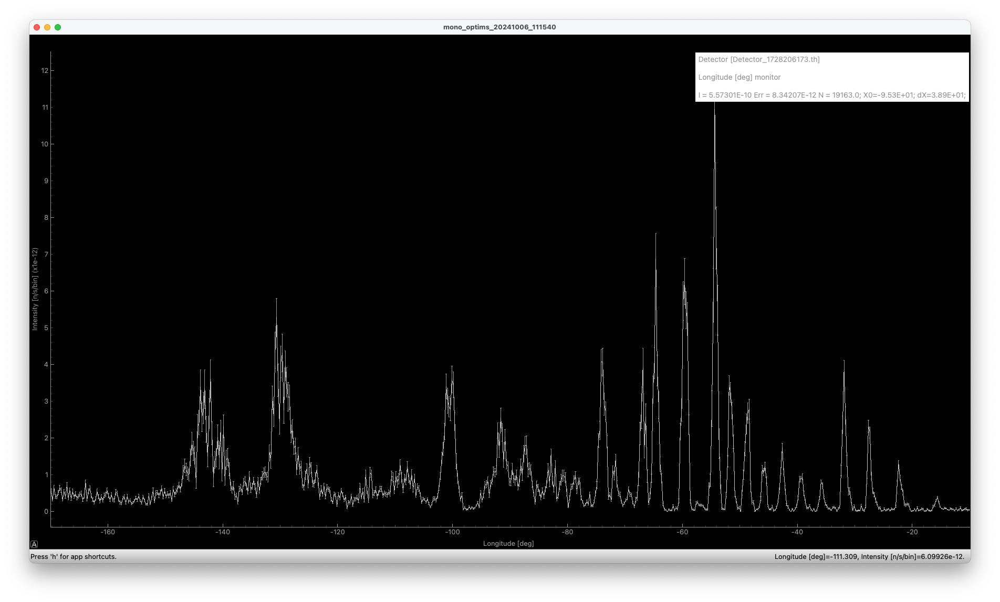

# A powder diffractometer

Based on the output of the earlier exercises, we will now assemble a
powder diffractometer.

## TASKS
1. Find back your solution to the [monochromator exercise](../../01_Monday_October_7th/04_Neutron_optics_exercises/Exercise_monochromator/) or take one one of those [provided](../../01_Monday_October_7th/04_Neutron_optics_exercises/Exercise_monochromator/solution)
2. Using mcdoc and the PDF information, add `PowderN` to the sample position. Sample geometry should be a cylindar of `radius=0.005` and `yheight=0.07`. Sample definition can be one of your choice, but a good candidate is `reflections=Na2Ca3Al2F14.laz`
3. Next, add a banana-shaped detector (cyllindrical cut) by using `Monitor_nD` of radius 1.2 m and height 30 cm, measuring a diffractogram using `options="banana theta bins=640 limits=[-170 -10]"` - positioned ` AT (0,0,0) RELATIVE ` your sample
4. Run a simulation with `1e7` neutron rays, hopefully you have arrived at something that resembles this as a diffraction pattern. In existance, but not too pretty...:

(produced using [this instrument](solution/step1.instr))
5. We should now optimise a bit:
   * Assign only a tiny fraction of stats to "direct beam", set `p_transmit=1e-6`
   * Assign just 3% to incoherent scattering `p_inc=0.03`
   * Let us use a `d_phi` limitation, corresponding to detector height / detector radius ~14 deg.
   * Let us only scatter to the negative side (detector only in place there) `tth_sign=-1`
   * Use a `SPLIT` of ~ 800, corresponding to the number of dspacings available in the reflection file
6. Rerun with `MPI` (auto will run on all available cores) and 1e7 rays, much better:

(produced using [this instrument](solution/step2.instr))
7. **Bonus task:** Use `mcdoc`to add a radial collimator in between sample and detector 
8. **Bonus task:** Add a flag (similar to e.g. `coll_in` to enable/disable your radial collimator
9. **Bonus task:** Use `NeXpy` and `NeXus` output to fit a selected peak. Do you see an improved resolution by adding the radial collimator?