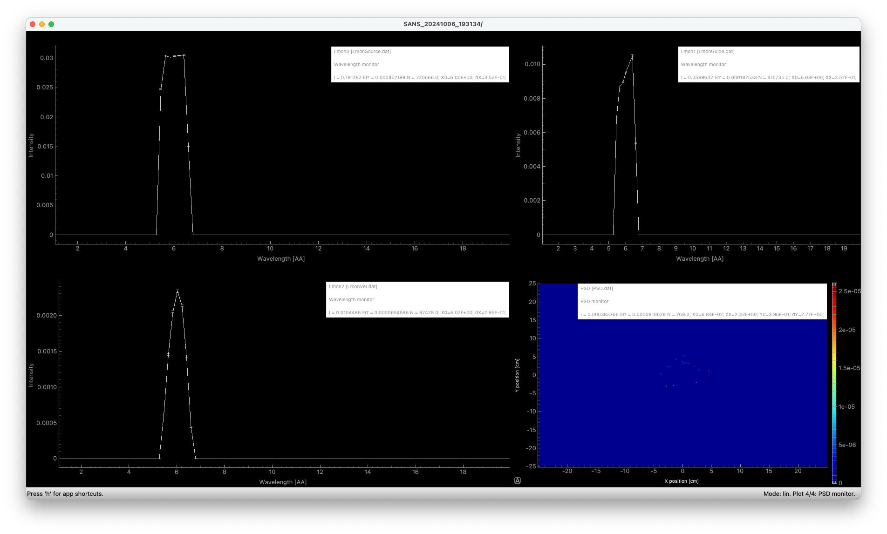

# A SANS Instrument

Based on the output of the earlier exercises, we will now assemble a SANS instrument. Here is a sketch of what we want to construct:


## TASKS
1. Find back your solution to the [velocity selector exercise](../../01_Monday_October_7th/04_Neutron_optics_exercises/Exercise_selector/) or use [the solution provided here](../../01_Monday_October_7th/04_Neutron_optics_exercises/Exercise_selector/solution/selector.instr)
2. As we learned earlier, the bandwidth of a v-selector is ~10%, so please
   * Remove the input-parameters `src_lam_min` and `src_lam_max`
   * Remove the related `if` statement in the `INITIALIZE` block
   * Change the `Source` parametrisation to use `lambda0 = lambda, dlambda = 0.1*lambda`
3. Next, add 4 input parameters, defining
   * Radius of first slit `slit1=0.02` unit: m 
   * Radius of second slit `slit2=0.02` unit: m  
   * Distance between the slits aka. collimation distance `LC=3` unit: m 
   * Distance from last slit to detector `LD=3` unit: m
   * Radius of "hard spheres in thin solution" `R=150` unit: Å
4. Position a first `Slit` component 1mm after the last component in your instrument, set its `radius=slit1`
5. Position a second `Slit` component `LD` after the first slit, set its `radius=slit2`
6. Add this type of sample definition - and use `mcdoc` to understand the parameter significance
```c
SPLIT 100 COMPONENT Sample = SANS_spheres2(xwidth=0.1,yheight=0.1,R=R)
  AT(0,0,0.1) RELATIVE slit2
```
7. Add a `Beamstop` of `radius=0.03` at distance `LD-0.1` from `slit2`
8. Add a `PSD_monitor` of dimension `xwidth=0.5,yheight=0.5` and pixellation `nx=512,ny=512`. Place it `AT(0,0,LD) RELATIVE slit2`
9. Run a simulation with default settings, output should look something like this, ie. not a lot

    
    

10. We now need to apply some variance reduction, we are wasting lots of statistics:
    * On the source, we will now select "region of interest" to be the second slit, set `focus_wx=slit2, focus_yh=slit2`
    * To automatically calculate the distance to the slit, set dist=0 and set `target_index=7` (7 should be the number of components to the slit, counted from the source - check your own file)
    * Further, let us use `SPLIT 100` on the sample to repeat any neutron making it through the pinhole 100 fold.
11. Rerun simulation with default settings, output should now instead look something like this, ie. much better!

    
    
