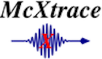
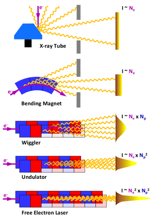
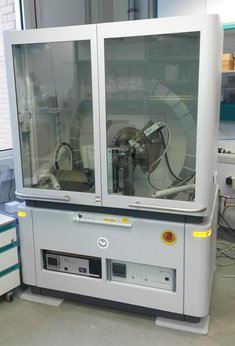
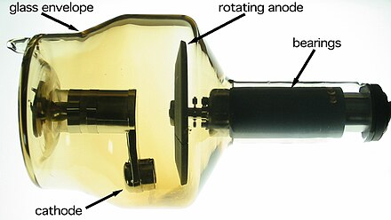
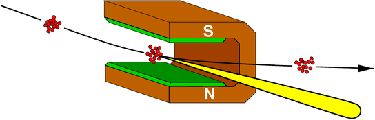
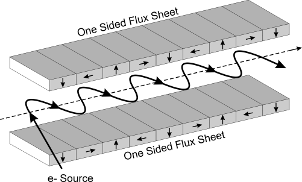
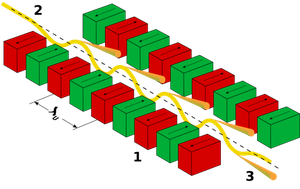

# Oct 9th 2024: Lesson 14: McXtrace Source modelling and Monitors.



You will learn: Modelling beam-lines with [McXtrace](http://www.mcxtrace.org/), adding samples, coupling with other software, etc... We shall focus on lab-scale instruments, rather than large-scale beam-lines.

In this lesson we shall present:

- X-ray sources in McXtrace and some possibilities for coupling McXtrace to other packages.
- An overview of common monitors (e.g. detectors), i.e. ways to *detect/measure* X-rays.


## Introduction

[**McXtrace**](https://mcxtrace.org/) is a Monte-Carlo X-ray ray-tracing modelling software derived from its neutron counterpart [**McStas**](https://mcstas.org/).

In short, a McXtrace model is a text-file (extension `.instr`) which describes a beam-line geometry as a sequence of so-called "components", just like in real life. The text-file is then assembled as an executable programme which takes as input the model parameters, and produces output data files. There are currently more than 200 such components describing for instance:

- photon sources (lab sources, bending magnets, undulators, etc)
- optics (monochromators, mirrors and KB, lenses and CRL, zone-plates, filters, slits, etc)
- samples (absorption/XAS, fluorescence, tomography, large-scale structures/SAXS, powder diffraction, MX / Single crystal diffraction)
- monitors/detectors (single point, 1D sensor, image, volumes/stack of images, etc)

In addition, McXtrace comes with dedicated GUI's to edit models, start simulations, and plot results.

McXtrace and McStas share the same basic concepts and tools. The computational part is programmed in C, the user interfaces are mostly in Python. The source code is hosted on [Github](https://github.com/McStasMcXtrace/McCode), and it runs on all architectures.

The typical McXtrace instrument/beam-line description file has the following structure (just as McStas):

```c
DEFINE name(parameter1=value, parameter2=value...)

DEFINE %{
// C-syntax, global variable definitions.
%}

USERVARS %{
// C-syntax, variables that are attached to each photon.
%}

INITIALIZE %{
// C-syntax, things to do at start. Can use parameter1, parameter2, ...
%}

TRACE // list of components
...

COMPONENT name = comp(parameters=values, ...) 
  WHEN (condition)
  AT (...) [RELATIVE [reference|PREVIOUS] | ABSOLUTE]
  {ROTATED {RELATIVE [reference|PREVIOUS] | ABSOLUTE} }
  EXTEND %{
    // C-syntax, things to do after, using e.g. if(SCATTERED) ...
  %}

...
END
```

Additional keywords have been presented on [day2/lesson 20 "Full grammar"](../../02_Tuesday_October_8th/20_Full_grammar) in a more detailed way.

--------------------------------------------------------------------------------

## 1. X-ray photon sources

The photon source components emit X-ray pseudo particles, which are modelled as vectors:

```c
(x,y,z,kx,ky,kz,phi,t,Ex,Ey,Ez,p)
```

where `x,y,z` are spatial coordinates (in m), `kx,ky,kz` are the photon momentum/wavevector 
(in 1/Angs), `phi` is a phase angle (for coherence, in degrees), `t` is propagation 
time (in seconds - very small), `Ex,Ey,Ez` is the electric field components, and `p`
is the statistical weight (which sum is the beam intensity).

The `Y` axis is usually set as "vertical", `Z` is forward, and in direct frame, `X` is left wise (when looking forward).

Compared with McStas, the velocity `v` is turned into a wavevector `k`, the spin `s` is turned into electrical field `E` (linear polarisation), and there is an additional phase `phi` to model coherent beams.



McStas provides a set of components to model all types of sources.

### 1.1 X-ray laboratory sources

McXtrace provides a number of 'simple' X-ray sources well suited to model typical [laboratory sources](https://en.wikipedia.org/wiki/X-ray_tube).




#### `Source_pt`: the simplest point source

This component models a source emitting photon from a single point, along `Z`. 
The target area (along `Z`) and spectrum profile can be tuned. 

This is probably the simplest source that you should use to e.g. quickly set-up
a model without spending time in the parameters. You should still know which 
energy will be needed for the simulations (set `E0` or `lambda0`).

A typical example would be (TRACE section):
```c
Source_pt(E0 = 5, dE = 1, flux = 1, focus_xw = 0.01, focus_yh = 0.01, dist = 1)
```

You shall find many other (12) usage examples for this component, among which:

- `NBI/NBI_Lab_TOMO.instr` (Mo, using a tabulated spectrum file)
- `DTU/Pump_probe.instr` (single sharp line)

#### `Source_flat`: flat surface emitting photons

This component is similar to the `Source_pt`, and models a flat surface that emits 
photons along `Z`. The target area and spectrum profile can be tuned. 

This is probably the most used photon source within McXtrace examples. The surface 
geometry (square or disk), the emission spectrum (energy line) and the target 
area should be defined. The divergence is defined by the source emission
surface and the target dimension.

A typical example would be (TRACE section):
```c
Source_flat(xwidth=1e-3, yheight=2e-3, E0 = 5, dE = 1, flux = 1, 
    focus_xw = 0.01, focus_yh = 0.01, dist = 1)
```

You shall find many (29) other usage examples for this component, among which:

- `Tests_sources/Test_Sources.instr`
- `Tests_samples/Test_Fluorescence.instr ` (to measure sample composition)
- `Tests_samples/Test_Saxs_spheres.instr` (to measure e.g. polymer structure)
- `Tests_samples/Test_PowderN.instr` (to measure powder structure and composition)

#### `Source_div`: flat surface emitting photons, with divergence

This source component is similar to the `Source_flat`, and defines specifically 
an emission divergence cone that is used for each location on the emission surface.
This component is useful when you wish to fully control the divergence, whereas 
the divergence from the `Source_flat` is a combination of the emission and target 
dimensions.

A typical example would be (TRACE section):
```c
Source_div(xwidth=1e-3, yheight=1e-3, E0=5, dE=1, 
    focus_aw=2e-3, focus_ah=0.5e-3, gauss_a=1)
```

You shall find many (28) other usage examples for this component, among which:

- `Tests_sources/Test_Sources.instr`
- `Tests_optics/Test_Mask.instr`

It is also highly used in the special 'astroX' satellite models.

####  `Source_lab`: stationary, rotating and liquid anode source

This component describes a usual laboratory source, such as a stationary, 
rotating and liquid anode sources.



A electron beam (e.g. emitted from a heated surface) is sent to a metallic target  
on a high voltage vacuum tube.

Typical materials for rotating anode are W/Re, Rh, Cu, Cr, Cu/Cr, Mo, Cu/Co. The
advantage is that the anode damage is distributed along a larger disk, so that
higher intensities can be applied still retaining a long life-time. The X-rays
are emitted perpendicularly (within a 10-15 deg cone) to the tube with 1%
efficiency (yes, this is low). But still this is amongst the best X-ray lab
sources.

The liquid and wire sources allow to reduce the emission surface, thus improving 
the spatial resolution.

The emission lines for each material (e.g. K, L, M) define sharp photon-energies 
on top of a 'pink' bremsstrahlung background.

We show below a set of common anode materials:

Anode | Kα (L->K) | Kβ (M->K)
------|----|-----
W  | 59 keV             | 67 keV 
Rh | 20 keV             | 22.7 keV
Cu | 1.54184 Å 8.04 keV | 1.39222 Å 8.9 keV
Mo | 0.71073 Å 17.9 keV | 0.63229 Å 19.5 keV
Co | 1.79 Å 6.92 keV    | 1.62 Å 7.65 keV
Cr | 2.29 Å 5.41 keV    | 2.08 Å 5.96 keV

and E(keV) = 12.4/lambda[Å]

To model such a source in McXtrace, one needs to add in the `TRACE` section
(usually just at the beginning):
```c
  COMPONENT Source_lab(material_datafile="Cu.txt",Emin=1, E0=80)
```

Tune the voltage `E0` in case the emission lines are not generated for the 
specified material.

You may find usage examples (5) for this component e.g. in:

- `NIST/DBD_IBM_Si_analyzer_BC.instr` (Mo)
- `Tests_sources/Test_source_lab.instr` (Cu)

--------------------------------------------------------------------------------

### 1.2 Synchrotron sources

Perhaps less relevant for NECSA people, but may be useful if you wish to perform 
experiments at a [synchrotron](https://en.wikipedia.org/wiki/Synchrotron), or plan to design a future synchrotron beam-line.

#### `Bending_magnet`: a dipole

A bending magnet is just a large U-shaped dipole, just like in books. 
Electrons are forced to deviate horizontally by the vertical magnetic field, and 
loose energy by emitting X-ray photons in the forward direction, on a large 
energy spectrum range. The emission spectrum is continuous, and the divergence 
is large (e.g. distributed along the whole magnetic curve).



Beamlines that require a large adjustable energy band selection, for e.g. 
absorption spectroscopy, often use such sources. Bending magnets are anyway
necessary in synchrotrons in order to deviate the beam after straight sections, 
so that the accelerator forms a ring.

A typical example would be (TRACE section):
```c
Bending_magnet(E0=15.918, dE = 0.1,
    Ee = 2.75, Ie = 0.5, B = 1.72, sigex=54.9e-6, sigey=20.2e-6)
```

You may find useful exmaples in e.g.: 

- `Tests_sources/Test_BM.instr`
- `SOLEIL/SOLEIL_ROCK.instr`
- a few SOLEIL absorption spectroscopy beam-lines

Reference: B.D. Patterson, Am. J. Phys. 79, 1046 (2011)

#### `Wiggler`: a series of alternating dipoles

A [wiggler](https://en.wikipedia.org/wiki/Wiggler_(synchrotron)) is composed of 
a set of alternating dipoles, so that the electron beam 
is forced to wiggle along the propagation direction. Each wiggle in the path produces 
an x-ray emission in the propagation direction. 

Wigglers are inserted inside synchrotron straight sections (insertion devices),
and the x-rays must be extracted on the sides of the electron beam axis. 

As the dipole arrays are well separated are with a rather 
large spatial period, each wiggle beam is emitted independently from the others,
so that the total emission spectra is continuous, but with a larger intensity 
as in bending magnets, and a narrower divergence.



The Wiggler is characterised by its strength parameter K:

<p style="text-align:center;">
K = Bλ<sub>u</sub> e/(2πmc)
</p>

where B is the magnetic field, λ<sub>u</sub> is the spatial period of the magnets, 
m and e are the electron rest mass and charge, and c is the speed of light. 
For a wiggler, K >> 1 implies that the electron oscillations are large, each one 
behaving as a bending magnet.

A typical usage example (in the TRACE section) is:
```c
Wiggler(E0 = 31, dE = 1, Ee = 2.4, Ie = 0.5, 
   B = 2.1, Nper=41, sigey=9.3e-6, sigex=215.7e-6, length=38*50e-3, K=10)
```

The Wiggler component can be used as a bending magnet when setting the number of 
poles `Nper` to 1.

A number of examples are provided with McXtrace, e.g.:

- `Tests_sources/Test_BM.instr`
- `SSRL/SSRL_bl_11_2_white_src.instr`
- `SOLEIL/SOLEIL_PSICHE.instr`

Reference: B.D. Patterson, Am. J. Phys. 79, 1046 (2011)

#### `Undulator`: a compact series of alternating dipoles

[Undulators](https://en.wikipedia.org/wiki/Undulator) result from an evolution of 
wiggler, using a compact layout. The spatial magnetic period λ<sub>u</sub> is 
usually smaller, and the magnetic field is high. The strength parameter K is 
smaller than 1, so that the electron beam oscillations overlap and the x-ray
generated spectrum shows interference (the undulator resonance orders), and
the intensity on these are amplified. The divergence is very narrow (beam is 
focused).



However, the ability to freely tune the energy for further use is affected. 
One must tune the optics so that the energy bandwidth matches a resonance to get 
a very high intensity.

Undulators are inserted inside synchrotron straight sections (insertion devices),
and the x-rays must be extracted on the sides of the electron beam axis. 

A typical usage example (in the TRACE section) is:
```c
Undulator( E0=17, dE=1, Ee=2.75, dEe=0.001, Ie=0.5, K=1.03118, Nper=140, lu=32e-3, 
  sigey=6.17e-6, sigex=0.29979e-3, sigepx=0.01226e-3, sigepy=1.1e-6, dist=50, E1st=12.400)
```

The Undulator component can be used as a wiggler when setting K to e.g. 5-10.

A number of examples are provided with McXtrace, e.g.:

- `Tests_sources/Test_undulator.instr`
- `MAXIV/MAXIV_Bloch.instr`
- `SOLEIL/SOLEIL_LUCIA.instr`


Reference: K.J. Kim, AIP, conf. proc., 184, 1989

### 1.3 Source interfaces with other simulation codes

Just as with McStas , McXtrace can interface with other simulation codes. We won't 
detail much this part, and simply list the current interfaces.

- Spectra (R) <http://spectrax.org/spectra/>
- Simplex (R) <http://spectrax.org/simplex/index.html>
- Genesis (R) <http://genesis.web.psi.ch/>
- Shadow (RW) <https://github.com/oasys-kit/shadow3>
- MCPL (GEANT4, PHITS, MCNP,SRW) (RW) <https://mctools.github.io/mcpl/>
- SRW (R) <https://github.com/ochubar/SRW> Our converter generates an MCPL exchange file from SRW. You may also look at [OASYS](https://www.aps.anl.gov/Science/Scientific-Software/OASYS) to export interchange formats.

In practice, we recommend to make use of the MCPL exchange file format.

--------------------------------------------------------------------------------

## 2 Monitors

After having positioned a source, e.g. `AT(0,0,0)`, it is desirable to actually 
detect something. Monitors are, in most cases, perfect detectors that count 
statistics and generate data files.

The McXtrace monitors work exactly the same as with McStas, and are often the same.

Here is a short description of the monitors currently available:

Monitor             | Description               | Example
--------------------|---------------------------|-------------------------
`DivE_monitor`      | Divergence/Energy monitor | `DivE_monitor(nE=20, nh=20, filename="Output.div",xwidth=0.1, yheight=0.1,maxdiv_h=2, Emin=2, Emax=10)`
`Divergence_monitor`| Divergence monitor        | `Divergence_monitor(nh=20, nv=20, filename="Output.pos", xwidth=0.1, yheight=0.1,maxdiv_h=2, maxdiv_v=2)`
`DivPos_monitor`    | Divergence/position monitor (acceptance diagram) | `DivPos_monitor(nh=20, ndiv=20, filename="Output.dip",xwidth=0.1, yheight=0.1, maxdiv_h=2)`
`E_monitor`         | Energy-sensitive monitor  | `E_monitor(xwidth=0.1, yheight=0.1,Emin=1, Emax=50, nE=20, filename="Output.nrj")`
`EPSD_monitor`      | Position-energy-sensitive monitor | `EPSD_monitor(xwidth=0.1, yheight=0.1,nE=10,nx=90, ny=90, filename="Output.psd")`
`Flex_monitor_1D`   | Flexible monitor, 1D      | `Flex_monitor_1D(nU=20, filename="Output", ustring="x", Umin=-.1, Umax=.1)`
`Flex_monitor_2D`   | Flexible monitor, 2D      | `Flex_monitor_2D(nU1=20, nU2=20, filename="Output", ustring1="x", ustring2="y", Umin1=-.1, Umax1=.1, Umin2=-.1, Umax2=.1)`
`Flex_monitor_3D`   | Flexible monitor, 3D      | `Flex_monitor_3D(nU1=20, nU2=20, nU3=20, filename="Output", ustring1="x", ustring2="y", ustring1="z", Umin1=-.1, Umax1=.1, Umin2=-.1, Umax2=.1, Umin3=-.1, Umax3=.1)`
`L_monitor`         | Wavelength-sensitive monitor | `L_monitor(xmin=-0.1, xwidth=0.1, yheight=0.1,nL=20, filename="Output.L", Lmin=0.1, Lmax=1)`
`Monitor`           | Simple monitor            | `Monitor(xwidth=0.1, yheight=0.1)`
`Monitor_nD`        | French army knife monitor | `Monitor_nD(xwidth = 0.1, yheight = 0.1, zdepth = 0,options = "banana, theta limits=[10,130], bins=120, y")`
`PSD_monitor`       | Position-sensitive monitor| `PSD_monitor(xwidth=0.1, yheight=0.1,nx=90, ny=90, filename="Output.psd")`
`PSD_monitor_4PI`   | Spherical position-sensitive detector | `PSD_monitor_4PI(radius=0.1,nx=90, ny=90, filename="Output.psd")`
`PSD_monitor_coh`   | Position-sensitive monitor with phase integration (coherence) | `PSD_monitor_coh(xwidth=0.1, yheight=0.1,nx=90, ny=90, filename="Output.psd")`
`W_psd_monitor`     | Position-sensitive wattage monitor | `W_psd_monitor(xwidth=0.1, yheight=0.1,nx=90, ny=90, filename="Output.psd")`

It is possible to add as many monitors as needed in a beam-line/instrument model. 
Monitors may even overlap, but then require to set `restore_xray=1` to avoid
cross shielding.

It is rather convenient to position monitors after the previous component using the syntax
```c
COMPONENT blah=Monitor(...)
AT (0,0,0.1) RELATIVE PREVIOUS
```

where the third `AT` coordinate along `Z` corresponds with the propagation axis (here 10 cm).

#### Data format

Most monitors will generate files, which default format is text-based, and human 
readable. It is also possible to switch to HDF5 "NeXus", which is a
binary format that can be opened with e.g. [Silx](http://www.silx.org/doc/silx/latest/overview.html)
and [NexPy](https://github.com/nexpy/nexpy).

A typical 1D monitor (vector) text file looks like:
```python
# Format: McCode with text headers
# URL: http://www.mccode.org
# Creator: McXtrace 3.4-20240304 - mars. 05, 2024
# Instrument: Test_Fluorescence.instr
# Ncount: 250000
# Trace: no
# Gravitation: no
# Seed: 1709631302248251
# Directory: /home/experiences/grades/farhie/dev/Schools/2024/SOLEIL_Hercules_March_2024/simulations/Test_Fluorescence/Test_Fluorescence_20240305_103458
# Nodes: 4
# Param: material=LaB6
# Param: E0=39
# Param: dE=0.06
# Date: Tue Mar  5 10:35:15 2024 (1709631315)
# type: array_1d(2001)
# Source: Test_Fluorescence (Test_Fluorescence.instr)
# component: emon_fluo
# position: 0 0 3.3
# title: Energy monitor
# Ncount: 1000000
# filename: Fluorescence.dat
# statistics: X0=27.1593; dX=13.3875;
# signal: Min=0; Max=6.94828e-15; Mean=1.83245e-17;
# values: 3.66672e-14 1.50524e-16 61375
# xvar: E
# yvar: (I,I_err)
# xlabel: Energy [keV]
# ylabel: Intensity
# xlimits: 0 46.8
# variables: E I I_err N
0.01169415292 0 0 0 
0.03508245877 0 0 0 
...
```

where the data block has 4 columns standing for an axis (e.g. energy `E`), 
the intensity in the bin `I`, the uncertainty on the intensity `I_err`, and
the number of pseudo particle/rays, which is a pure computational quantity
that e.g. indicates if there is enough statistics in the bin.

Monitors with 2D data contain a similar text header. The axes are given in the 
`xylimits: XMIN XMAX YMIN YMAX ...` header line, and the matrix dimension is in 
the `type: array_dd(N,M)`. So the 1st axis spans from `XMIN` to `XMAX` in `N` bins.
The monitor data (tally) is stored as a matrix after a `Data [...] I:` tag,
the uncertainty matrix follows the `# Errors [...] I_err:` tag.


