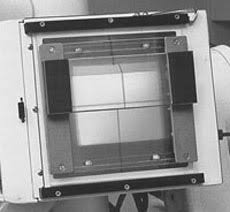

# X-ray Optics components

In this lesson, we shall review common optics components found on X-ray beam-lines.

## `Mirror` (flat), `Mirror_curved`, `Multilayer_elliptic`, `TwinKB_ML` (multi-layer)

Mirrors are reflecting surfaces, e.g. coated with Rh, Ir, Pd, Pt. There are a number of geometry variants.


Syntax is:
```c
Mirror(xwidth=5e-2, zdepth=2e-1, R0=1, coating="B4C.dat")
```

Most beam-lines use mirrors of all kinds.

Refer to e.g. `Tests_optics/Test_Mirrors` for examples.

## `Slit` `Beamstop` `Mask`

The slits are very useful to shape the beam, that is absorb some of it, outside, to leave a given section.


```c
Slit(xmin=-0.01, xmax=0.01, ymin=-0.01, ymax=0.01)
```

You will find these in all X-ray set-ups.

The Beam stop is the opposite of the Slit. It absorbs all in a given area. The Mask is a matrix of absorbing material dots which are specified via a simple text file.

## `Bragg_crystal` (monochromator, incl. `Bragg_crystal_bent`)

This is a crystalline material, e.g. Si, that may be lying on a flat or bent surface. 
In practice the Bragg law: 

$n \lambda = 2 d sin (\theta)$

is responsible for a beam 2-$theta$ deviation in angle wrt the monochromator normal.
A pair of similar blades can be used so that the outgoing beam is parallel to the incoming one.


The syntax for such optics is
```c
Bragg_crystal(length=0.05, width=0.02, V=160.1826, h=1, k=1, l=1, alpha=0)
```

You will find examples in `Tests_optics/Test_Mono`, `Tests_optics/Template_DCM` (double monochromator) and many `SOLEIL` beam-lines.

## `Capillary`

This is a thin tube (glass, quartz) in which samples (e.g a small single crystal, a powder, a liquid) can be inserted.


A typical usage is:
```c
Capillary(radius=1e-4,length=0.1, R0=0, coating="Rh.txt")
```

You will find an example use in `Tests_optics/Test_capillary`.

## `Filter` (absorption and refraction)

This is a block/slab of attenuating material. 
The transmission changes as a function of the energy, so that a range in the spectra can be shielded.
This component can advantageously be replaced with the `Fluorescence` sample (to model any material) except for refraction. 



The syntax for such optics is
```c
Filter(material_datafile="Ge.txt", geometry="wire.ply",xwidth=0.02,yheight=0,zdepth=0)
```

You may find usage examples in `NBI/NBI_Lab_TOMO`, `SOLEIL/SOLEIL_ANATOMIX` and `Tests_optics/Test_Filter`.

## `Lens_simple`

This is a block of material with high refractive index, shaped in cylindrical, spherical or parabolic geometry. It is used as a focusing device, to reduce the beam waist (e.g. focus at the sample).


A syntax example is
```c
Lens_simple(xwidth=1e-5, yheight=1e-5, material_datafile="Be.txt",N=100,r=0.3e-3)
```

You may find other variants of lenses in specific geometries, including a compound refractive lens (CRL) to enhance the focusing power, as more lenses focus closer. The `ZonePlate` is a set of concentric rings, very thin, that operate just as a Lens.

Some full usage examples are found in `Tests_optics/Test_CRL`, `Tests/Be_BM_beamline` and `Templates/Focal_pt_monitor`.


## `Grating_reflect` (lamellar, blazed) `Grating_trans`

The gratings are periodic structures engraved on a material. They act as optical gratings, i.e. scatter the beam into quasi-monochromatic beams, each at different angle, following a rule similar to the Bragg law. They can also be used for phase retrieval at imaging/tomography stations to improve contrast.


```c
Grating_reflect(d_phi=1,order=0,rho_l=100,zdepth=102e-3,xwidth=102e-3) 
```

There are usage examples e.g in `Tests_optics/Test_grating_trans`, ` Tests_optics/Test_grating_reflect`.
