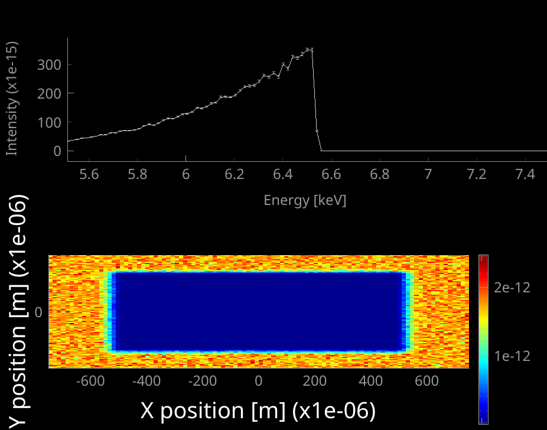
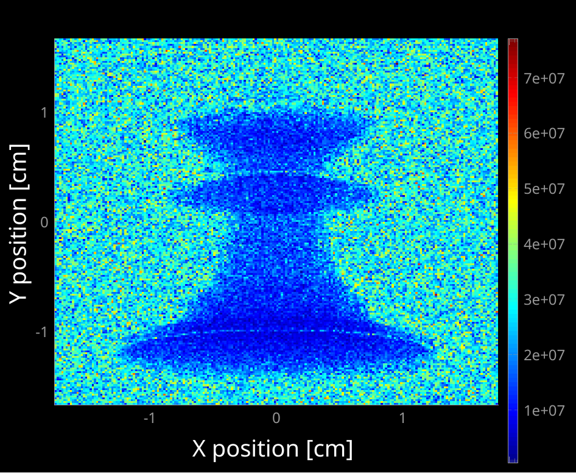
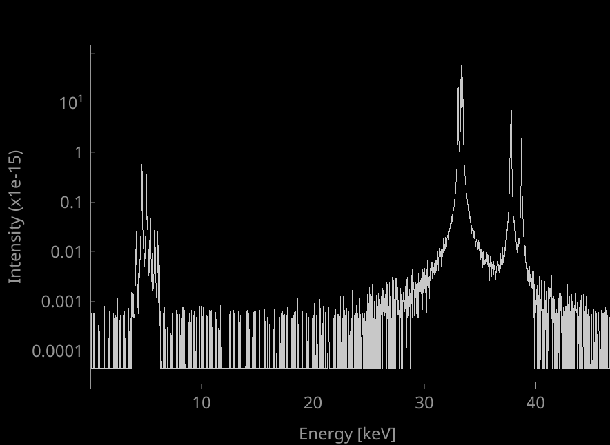
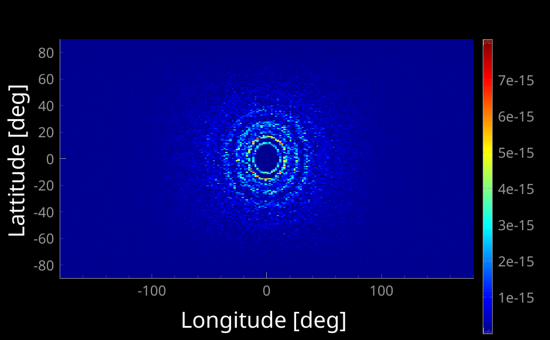
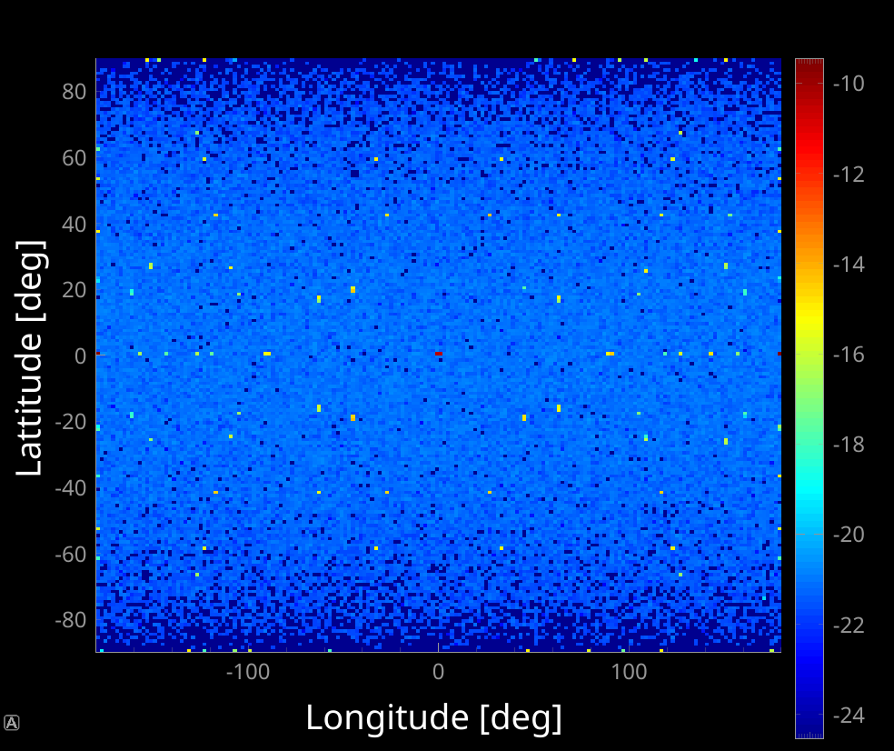
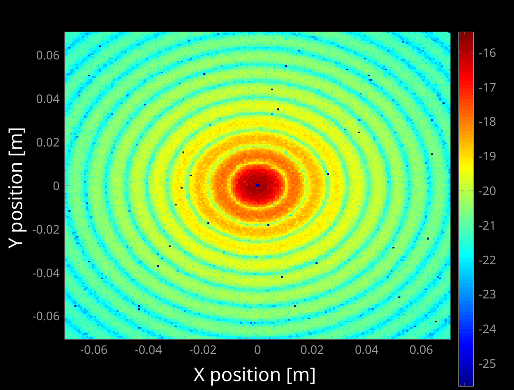

# McXtrace Samples

Samples are essential to build so-called virtual beam-lines, and reproduce data that look like real experiments. There are dedicated sessions on this topic.

To have an overview of existing sample, have a lokk at the [official samples](https://github.com/McStasMcXtrace/McCode/tree/main/mcxtrace-comps/samples) and [contributed samples](https://github.com/McStasMcXtrace/McCode/tree/main/mcxtrace-comps/contrib).

## Overview

Here is a list of the main components you may use:

Small angle scattering (large molecules/structures, polymers, colloids, ...)

- [SaSView models](https://github.com/McStasMcXtrace/McCode/tree/main/mcxtrace-comps/sasmodels): 96 models from SasView, PDB, Nanodiscs, Liposomes, I(q), ... [Saxs_sphere](https://github.com/McStasMcXtrace/McCode/blob/main/mcxtrace-comps/samples/Saxs_spheres.comp), [SAXSCylinders](https://github.com/McStasMcXtrace/McCode/blob/main/mcxtrace-comps/contrib/SAXSCylinders.comp), [SAXSPDB](https://github.com/McStasMcXtrace/McCode/blob/main/mcxtrace-comps/contrib/SAXSPDB.comp) and many more for SAXS.

Diffraction (ordered crystals, including proteins)

- [Powder](https://github.com/McStasMcXtrace/McCode/blob/main/mcxtrace-comps/samples/PowderN.comp): diffraction. Can read CIF files via `cif2hkl`. One of the most efficient and versatile sample.
- [Polycrystal](https://github.com/McStasMcXtrace/McCode/blob/main/mcxtrace-comps/samples/Polycrystal.comp): diffraction (quite complex to use).
- [Single crystal](https://github.com/McStasMcXtrace/McCode/blob/main/mcxtrace-comps/samples/Single_crystal.comp): diffraction, also for MX. Can read CIF files via `cif2hkl`. Very efficient, can also model powders and some textures.

Spectroscopy (scattering depends on energy)

- [Fluorescence](https://github.com/McStasMcXtrace/McCode/blob/mccode-3/mcxtrace-comps/samples/Fluorescence.comp) handles absorption, fluorescence, Compton and Rayleigh scattering, for any chemical formulae (incl CIF files). Handles OFF/PLY anyshape geometry. This component is based on [XRayLib](https://github.com/tschoonj/xraylib/wiki).
- [Pump-probe](https://github.com/McStasMcXtrace/McCode/blob/main/mcxtrace-comps/samples/Molecule_2state.comp) (2 states) molecule to simulate a laser-probe decay (time resolved).
- [Absorption_sample](https://github.com/McStasMcXtrace/McCode/blob/main/mcxtrace-comps/samples/Absorption_sample.comp) a 1 or 2 absorbing materials as a box or cylinder; [Filter](https://github.com/McStasMcXtrace/McCode/blob/main/mcxtrace-comps/optics/Filter.comp) which can handle absorption and refraction, as a block or any geometry; [Abs_objects](https://github.com/McStasMcXtrace/McCode/blob/main/mcxtrace-comps/samples/Abs_objects.comp) a set of absorbing objects which geometry is set from OFF/PLY files. The `Fluorescence` sample has the same capabilities for any material, and may be a very handy alternative.
- [Isotropic_Sqw](https://github.com/McStasMcXtrace/McCode/blob/main/mcxtrace-comps/samples/Isotropic_Sqw.comp) an coherent inelastic scattering sample for isotropic density materials (e.g. amorphous, liquids, powders) that models Thompson scattering from a dynamic structure factor S(q,w) (IXS). Handles both elastic and inelastic contributions. Handles OFF/PLY any shape geometry. This is an *experimental* sample.

All samples can have simple geometric shapes (some incl. hollow shapes).
`PowderN`, `Single_crystal`, `Filter`, `Abs_objects`, `Isotropic_Sqw` and `Fluorescence` can have any shape (PLY/OFF).
Powder sample supports multiple concentric geometries (e.g. for cryostat, containers, ...).
McXtrace comes with a [material data base](https://github.com/McStasMcXtrace/McCode/tree/main/mcxtrace-comps/data), and can use e.g. NIST files.

It is best to first search for existing beam-line models that make use of these samples, to learn how to configure and insert the sample in a model.

## Absorption (spectroscopy and tomography)

The absorption spectroscopy is a very simple measurement technique. The idea is to send an X-ray beam (white, pink or monochromatic), and illuminate a sample. The incident X-ray photons then traverse the sample volume. The absorption fraction depends on the incident energy and the material. Indeed, above a given energy for each atom (the threshold), the X-rays eject inner electrons (e.g. from the K-edge, photo-emission). The energy levels are perfectly tabulated and specific to each atom. These X-rays are then 'absorbed' which means that the transmitted beam is decreased.
The transmission follows the classical Beer's exponential attenuation law:

$I/I_0 = exp^{-d \mu(E)}$

where $I_0$ is the incoming intensity, $I$ is the transmitted intensity, $d$ is the propagation distance into the material, and $\mu(E)$ is the absorption coefficient. In practice, the data is normalised, and we rather show $1-T$. The $\mu(E)$ is usually obtained from tabulated values per atom, or computed from e.g. XRayLib.

So, by just changing the incident energy, across absorption edges, it is possible to identify the material composition (XAS), as well as its oxidation state (XANES) and even local neighbours (EXAFS). This is the absorption spectroscopy.

See a very nice lesson from [B. Ravel at NSLS-2 about XAS](https://www.bnl.gov/nsls2/userguide/lectures/lecture-4-ravel.pdf).

#### Absorption samples

McXtrace provides a set of components to model material absorption. 

Component           | Description | Syntax
--------------------|-------------|------------------
`Absorption_sample` | 1 or 2 absorbing materials  | `Absorption_sample( material_datafile_o="Mn.txt", xwidth_o = 0.5, yheight_o = 0.5, zdepth_o = 0.0001, rho_o=7.15 )`
`Filter`            | absorption and refraction   | `Filter(material_datafile="Ge.txt",geometry="wire.ply",xwidth=0.02,yheight=0,zdepth=0)`
`Abs_objects`       | series of objects (OFF/PLY) | `Abs_objects(objects="input_abs_objects_template.dat")`
`Fluorescence`      | any material (formulae/CIF), abs+fluo+Rayleigh+Compton | `Fluorescence(material="LaB6", xwidth=0.001,yheight=0.001,zdepth=0.0001, p_interact=0.99, target_index=1, focus_xw=0.0005, focus_yh=0.0005)`

All components support "any-shape" geometry via 3D OFF/PLY files (similar to STL).
The `Fluorescence` sample also handles concentric geometries (e.g. sample holders, cryostats, etc). The `Tests_samples/Test_Absorption` allows to compare the usage/syntax and output of each.

Limitations: 

- The absorption is modelled "ideally", i.e. only the absorption threshold/edge. No XANES, no EXAFS.
- All components, except `Fluorescence` require to have prepared some material data files, which are e.g. mono-atomic. This is why I personally use `Fluorescence` (but it is slower to compute).
- Phase contrast imaging remains experimental.

The following image has been obtained with the `Test_Absorption` model, which goes through a block of manganese Mn. A polychromatic beam goes through the sample. The energy-sensitive detector shows the absorption spectra without the need to scan (one of the many advantages of simulations).

The top curve shows intensity as a function of the energy. There is a drop after the Mn K-edge (1s) $E_K=6539$ keV. The image bellow shows the shadow of the block. The absorbed X-rays are converted into e.g. fluorescence and Auger electrons (not modelled here).

#### Tomography

Illuminating a volumetric sample, and placing an image detector after the sample, a transmitted projection is obtained. The images are 'semi-transparent' as a function of the X-ray energy and material. By rotating the sample, and taking many images, it is possible to reconstruct the 3D volume (with the object internals) from the projections. At Synchrotron SOLEIL, we use codes such as PyHST2, Nabu, TomoPy, Astra, and UFO. This is the tomography.

In practice, to model a tomography set-up, one needs to use any of the absorption samples, with a geometric shape (e.g. OFF/PLY), and use a 2D detector in transmission to record projections.

The OFF/PLY files can be generated from tools such as MeshLab, FreeCAD, Admesh, ...

A laboratory tomograph is given as an example as the `NBI/NBI_Lab_TOMO` model. A point source (Mo) is used to illuminate a chess king.

Computation is rather long, and could most probably be improved in efficiency.

## Fluorescence

The fluorescence is a secondary process triggered by absorption. The ejected electron creates a hole, which is then filled by "re-ordering" the existing electronic states. Then many transitions between the atom energy levels are involved (e.g. Kα = M->K, Kβ = L->K, Lα = M->L, etc), and secondary photons are emitted with energies corresponding to the level differences. The spectrum is thus specific to each atom, and the intensity depends on the material composition fractions and self shielding. 

The fluorescence detectors can be of many types, including portable ones. In practice, fluorescence detectors equip many X-ray instruments as this is a "cheap" method that provides a lot of information.

The first part of the fluorescence computation starts with an absorption, as explained above, i.e. an exponential decay for which the attenuation $\mu$ is the sum for all atom types in the material (computed with XRayLib). This determines the decay, and a random number on this exponential is chosen to mimic the penetration ratio. Then, an outgoing direction is chosen randomly (as fluorescence is isotropic), as well as an energy amongst the possible transitions, with given strength (yield). Then the photon is re-emitted with given direction and energy. Further cascade fluorescence may be triggered until the light gets out. A geometric shielding is taken into account, that is photons may escape the surface, but will most probably be absorbed again in the bulk.

In practice, fluorescence is often considered as a background, so that some detectors on beam-lines are tuned (gains/thresholds) to remove photons below a given energy.

Running the `Test_Fluorescence` example produces the above spectrum. Scattering is shielded at 90 degrees, and maximal forward and backwards. The material can be specified as a file, or a chemical formulae.

## Powder diffraction

Powder diffraction is produced by a periodic atom structure, i.e. a crystallographic lattice.

See a nice lecture from NSLS-2 about [diffraction](https://www.bnl.gov/nsls2/userguide/lectures/lecture-3-dooryhee.pdf).

You can get an extensive list of many measured/calculated crystal structures at:
- https://next-gen.materialsproject.org/
- https://www.crystallography.net/

## Single crystal diffraction

## Small angle-scattering (diffraction)

## Imaging

Transmission imaging is based on absorption. However, it is also possible to record images with a focused incoming X-ray beam while (X,Y) scanning the object and record e.g. 

- diffraction pattern
- fluorescence
- absorption spectrum (scanning the incident energy)
- small angle scattering

See the nice presentations from [NSLS-II](https://www.bnl.gov/nsls2/userguide/lectures/lecture-11-qshen.pdf) and [NSLS-II](https://www.bnl.gov/nsls2/userguide/lectures/lecture-9-wklee.pdf).

So, in short, just refer to the other sample models, and combine measurement strategies...
