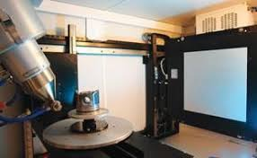
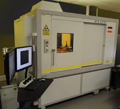
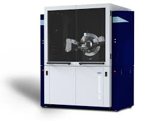
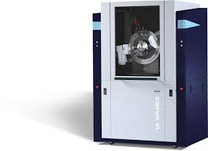

# Oct 11th 2024: Lesson 20: NECSA X-ray machines

In this session, we shall collect information about the existing NECSA X-ray instruments.

## Global methodology

1. Assemble a succinct list of elements that compose your beam-line. As a start, focus on the main components.
2. Identify which [McXtrace components](http://mcxtrace.org/download/components/) best match your beam-line elements. Prefer simple components when there are many possibilities.
3. Search for existing models that use these components. They are often in the 'Tests' category, but you may as well find a model which is pretty close in spirit to your beam-line. These examples will demonstrate how to actually use the components (syntax, parameters, etc) you envisage. Get inspiration here.
4. For each identified [McXtrace component](http://mcxtrace.org/download/components/), look at their main properties (parameters, geometry) and search for these in real life. This means you will need to estimate plausible values, and potentially refer to some documentation. As a start, use approximate values to avoid loosing time in details.
5. Position these elements in space w.r.t. the other elements. :bulb: A special note on mirrors and monochromators: the positioning/orientation of these can be tricky. It is usually a good advice to search for examples that contain them, and copy/paste/adapt the corresponding code in your own model. You will save a lot of time scratching your head this way.
6. Once done, you may optionally identify which values/parameters could be tunable in the beam-line model in order for instance to further scan or optimize their values. This can be an initial energy, a slit aperture size, a sample tilt, etc. These can then be moved to the `DEFINE INSTRUMENT` line as a variable, and transferred where appropriate in the `INITIALIZE` and `TRACE` sections. Set default values for these parameters.
7. Complete the header at the beginning of the `.instr` file to reflect your institution (NECSA), the beam-line, yourself as author, a description of the beam-line, a description of the model parameters (those from the step above).
7. Send us your beam-line, even basic/incomplete, so that we can further help you and enrich the gallery of X-ray beam-lines given as examples. By gathering beam-line models and distributing them with McXtrace releases, we are all happy to find examples to start with. 

## Beam-line model structure

The structure of a beam line should have:

1. A photon source
2. Some optics (e.g. slits, monochromators, mirrors, lenses, ...)
3. A sample model as it provides a result which goes beyond a simple photon beam. Using even a simple sample component makes the model much more convincing scientifically, and it also allows to estimate the photon counts at the detector. The `PowderN` `Single-crystal`, `Saxs_spheres.comp`, `Fluorescence` and `Absorption_sample` are good bets.
4. Monitors (you may position as many as required, not only at the end). The `Monitor_nD` is extremely versatile, but often you will start with e.g. `E_monitor` or `PSD_monitor`.

## Compilation errors

Of course, your model will hardly compile initially. Read the compilation output to decode the cryptic messages and identify where errors could be. An other strategy is to comment (use `/* ... */`) most of the components and leave only the source. Then compile and iteratively un-comment components one-by-one with intermediate compilation checks.

---

## Micro-focus X-ray Radiography and Tomography (MIXRAD)

Characteristics:
- <https://www.ndt.net/article/wcndt2012/papers/37_wcndtfinal00037.pdf>. [Local copy](pics/37_wcndtfinal00037.pdf)

This is a Nikon XTH 225 ST micro-focus X-ray tomography:

- The source voltage is 30-225 kV with a electron beam current of 1 mA.
- Anode material: Mo; Cu; W; Ag
- The source spot size is 1-3 um.
- The emission cone is 25 degrees.
- The detector is 400x400 mm, with a 200 um pixel size (2000x2000).
- The source-sample distance is at least 61 cm.

Full user manual [here](pics/xt_h_225.pdf)

## X-Ray Strain Scanner (D8 Discover)

This is a Bruker D8 Discover.

The source is Cu (1.54 Å), Co (1.79 Å), Cr (2.29 Å)
Monochromator: PG

- X-ray Tubes	Cu (1.54 Å), Co (1.79 Å), Cr (2.29 Å)
- Incident beam conditioning	PG incident beam monochromator
- Beam diameters	2.0, 0.8, 0.5, 0.3, 0.1, 0.05 mm
- Sample stage	¼ Cradle with integrated φ, χ, x, y, z
- Sample setup	Video laser system, accurate to 20 microns
- Detector	Vantec 500
- Two-theta range	10° ≤ 2θ ≤ 108° (front)
- x, y, z range	: +/- 75, +/- 75, -1:11

Full user manual [here](pics/d8_advance_discover_user_manual_vol._1_doc-m88-exx153_v6.pdf)

## X-Ray Powder Diffraction (D8 Advance)

This is a Bruker D8 Advance diffractometer.

- X-ray Tubes Cu (1.54 Å), Co (1.79 Å), Cr (2.29 Å)
- Beam sizes 0.1 x 15 mm2; 1 mm collimator
- Distance btw souurce and 1st slit: 332mm
- sample-detector distance: 435 mm
- Detector LynxEye 1D 192 pixels 14.4 x 16 mm

Full user manual [here](pics/d8_advance_discover_user_manual_vol._1_doc-m88-exx153_v6.pdf)

