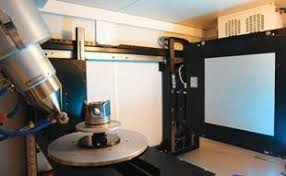
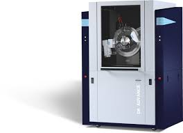

# Oct 11th 2024: Lesson 20: NECSA X-ray machines

In this session, we shall collect information about the existing SAFARI instruments.

## Micro-focus X-ray Radiography and Tomography (MIXRAD)

Characteristics:
- <https://www.ndt.net/article/wcndt2012/papers/37_wcndtfinal00037.pdf>. [Local copy](pics/37_wcndtfinal00037.pdf)

This is a Nikon XTH 225 ST micro-focus X-ray tomography:

- The source voltage is 30-225 kV with a electron beam current of 1 mA.
- Anode material: Mo; Cu; W; Ag
- The source spot size is 1-3 um.
- The emission cone is 25 degrees.
- The detector is 400x400 mm, with a 200 um pixel size (2000x2000).
- The source-sample distance is at least 61 cm.

Full user manual [here](pics/xt_h_225.pdf)

## X-Ray Strain Scanner (D8 Discover)

This is a Bruker D8 Discover.

The source is Cu (1.54 Å), Co (1.79 Å), Cr (2.29 Å)
Monochromator: PG

- X-ray Tubes	Cu (1.54 Å), Co (1.79 Å), Cr (2.29 Å)
- Incident beam conditioning	PG incident beam monochromator
- Beam diameters	2.0, 0.8, 0.5, 0.3, 0.1, 0.05 mm
- Sample stage	¼ Cradle with integrated φ, χ, x, y, z
- Sample setup	Video laser system, accurate to 20 microns
- Detector	Vantec 500
- Two-theta range	10° ≤ 2θ ≤ 108° (front)
- x, y, z range	: +/- 75, +/- 75, -1:11

Full user manual [here](pics/d8_advance_discover_user_manual_vol._1_doc-m88-exx153_v6.pdf)

## X-Ray Powder Diffraction (D8 Advance)

This is a Bruker D8 Advance diffractometer.

- X-ray Tubes Cu (1.54 Å), Co (1.79 Å), Cr (2.29 Å)
- Beam sizes 0.1 x 15 mm2; 1 mm collimator
- Distance btw souurce and 1st slit: 332mm
- sample-detector distance: 435 mm
- Detector LynxEye 1D 192 pixels 14.4 x 16 mm

Full user manual [here](pics/d8_advance_discover_user_manual_vol._1_doc-m88-exx153_v6.pdf)

