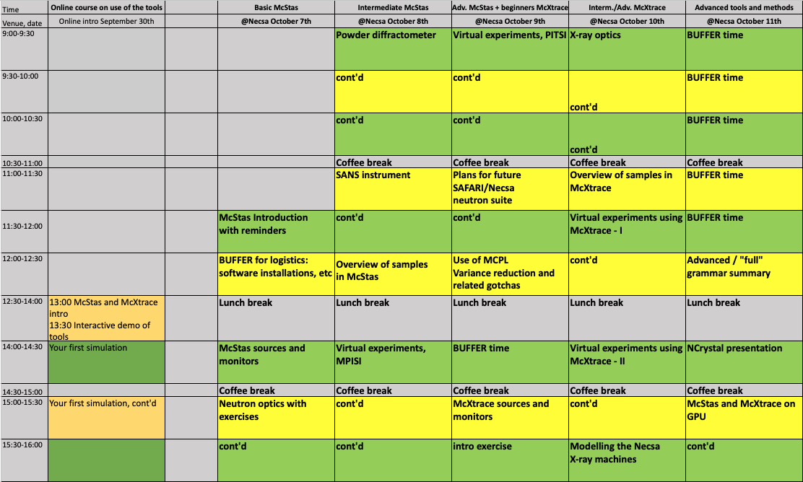
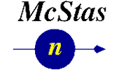

# Welcome to the October 2024 McStas-McXtrace Workshop at NECSA

| Date      | Oct 7-11th, 2024 |
|-----------|-------------------|
|Location   | [NECSA](https://www.necsa.co.za/)      |
| Topic     | Neutron and X-ray beam-line modelling with samples |
| Language  | English                                |

## Workshop programme

Here is a detailed programme with links to all lessons and practicals.

| Time                | [Online intro September 30th](00_Preschool_Monday_September_30th/) | Basic McStas [@Necsa Monday October 7th](01_Monday_October_7th/) | Intermediate McStas [@Necsa Tuesday October 8th](02_Tuesday_October_8th/) | Adv. McStas + beginners McXtrace [@Necsa Wednesday October 9th](03_Wednesday_October_9th/) | Interm./Adv. McXtrace [@Necsa Thursday October 10th](04_Thursday_October_10th/) | Advanced tools and methods [@Necsa Friday October 11th](05_Friday_October_11th/) |
|---------------------|------------------------------------|-------------------------------------|--------------------------------------------------------------------------------------------------------|------------------------------------------------------|-----------------------------------------|------------------------------------------------------------------------|
| 9:00-9:30           |                                    |                                     | [Overview of samples in McStas](02_Tuesday_October_8th/05_McStas_samples)                              | [Virtual experiments using McStas - II](03_Wednesday_October_9th/10_McStas_virtual_experiments_II) | [X-ray optics](04_Thursday_October_10th/15_Xray_optics) | **FREE**  |
| 9:30-10:00          |                                    |                                     | [Laue camera](02_Tuesday_October_8th/06_Laue_camera)                                | cont'd                                               | cont'd                                  | cont'd                                                                 |
| 10:00-10:30         |                                    |                                     | [Powder diffractometer](02_Tuesday_October_8th/07_Powder_diffractometer)                                                                                                 | cont'd                                               | cont'd                                  | cont'd                                                                 |
| *10:30-11:00*       |                                    |                                     | *Coffee break*                                                                                         | *Coffee break*                                       | *Coffee break*                          | *Coffee break*                                                         |
| 11:00-11:30         |           |                                     | cont'd                | [Modelling the future SAFARI instrument](03_Wednesday_October_9th/11_Future_SAFARI_instrument_suite)                                               | [Overview of samples in McXtrace](04_Thursday_October_10th/16_McXtrace_samples) | **TO-(RE)MOVE ? Video ?** [Writing your own component](05_Friday_October_11th/21_Write_your_own_component) |
| 11:30-12:00         |  | [McStas Introduction with reminders](01_Monday_October_7th/01_McStas_intro)  | [SANS instrument](02_Tuesday_October_8th/08_SANS_instrument)  | cont'd | [Full McXtrace instruments](04_Thursday_October_10th/17_McXtrace_virtual_experiments_I) | cont'd |
| 12:00-12:30         |  | logistics: software installations, etc | [MCPL, variance reduction](03_Wednesday_October_9th/12_MCPL_variance_reduction)                           | cont'd                                               | [Virtual experiments using McXtrace](04_Thursday_October_10th/18_McXtrace_virtual_experiments_II)  | **TO-(RE)MOVE ?** [McStasScript intro](05_Friday_October_11th/22_McStasscript)  |
| **12:30-14:00**     | 13:00 [McStas and McXtrace intro](00_Preschool_Monday_September_30th/00_intro_slides)  13:30 Interactive demo of the main tools                                 | **Lunch break**                     | **Lunch break**                                                                                        | **Lunch break**                                      | **Lunch break**                         | **Lunch break**                                                        |
| 14:00-14:30         |  [Your first simulation](00_Preschool_Monday_September_30th/03_a_first_simulation)   | [McStas sources and monitors](01_Monday_October_7th/02_McStas_sources_and_monitors) | [Virtual experiments using McStas - I](02_Tuesday_October_8th/09_McStas_virtual_experiments_I) | BUFFER                                  | cont'd                                  | **TO-(RE)MOVE ?** [McStasScript exercise](05_Friday_October_11th/22_McStasscript)       |
| *14:30-15:00*       |                                    | *Coffee break*                      | *Coffee break*                                                                                         | *Coffee break*                                       | *Coffee break*                          | *Coffee break*                                                         |
| 15:00-15:30         | Your first simulation, cont'd                                     | [Neutron optics](01_Monday_October_7th/03_Neutron_optics) | cont'd | [McXtrace sources and monitors](03_Wednesday_October_9th/13_McXtrace_sources_and_monitors) | [Modelling the Necsa X-ray machines](04_Friday_October_10th/19_NECSA_Xray_machines) | **TO-(RE)MOVE ?** [McStas and McXtrace on GPU](05_Friday_October_11th/23_McStas_and_McXtrace_on_GPU) |
| 15:30-16:00         |                                    | [Neutron optics excercises](01_Monday_October_7th/04_Neutron_optics_exercises) | cont'd                                                      | [McXtrace intro exercise](03_Wednesday_October_9th/14_McXtrace_intro_exercise) | cont'd        | cont'd                                                                 |

## Prerequisites

Local installations of

  - [McStas 3.5.1](https://github.com/McStasMcXtrace/McCode/tree/main/INSTALL-McStas)
  - [McXtrace 3.5.1](https://github.com/McStasMcXtrace/McCode/tree/main/INSTALL-McXtrace)

Account at [pan-training](https://e-learning.pan-training.eu).

## Credits

This training is funded by the IAEA under programme TN-SAF1007-EVT2300649, 
and hosted at the [NECSA SAFARI](https://www.necsa.co.za/) research reactor in South Africa.

(c) 2024 Teachers are Peter Willendrup and Emmanuel Farhi. Hosts are Andrew Venter and Deon Marais.

---

) - 
 - 
 - 
 - 
 - 

