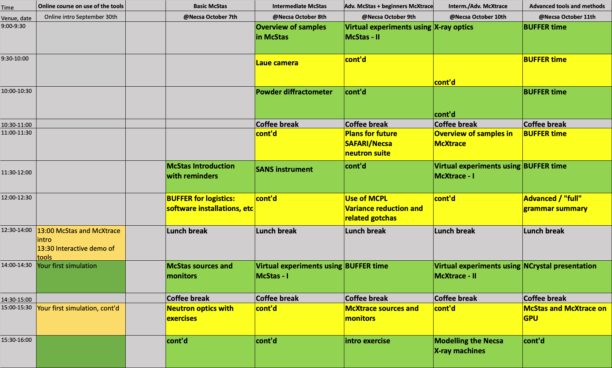

# Welcome to the October 2024 McStas-McXtrace Workshop at NECSA

## Workshop programme:

## Prerequisites
- Local installations of
  - [McStas 3.5.1](https://github.com/McStasMcXtrace/McCode/tree/main/INSTALL-McStas)
  - [McXtrace 3.5.1](https://github.com/McStasMcXtrace/McCode/tree/main/INSTALL-McXtrace)
- Account at [pan-training](https://e-learning.pan-training.eu)

