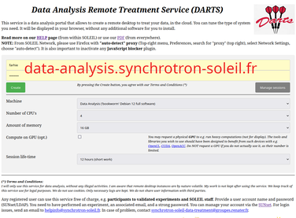
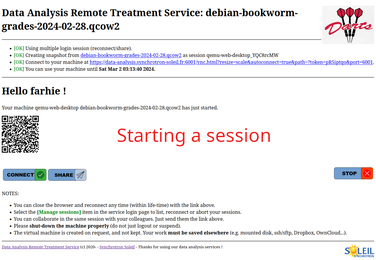
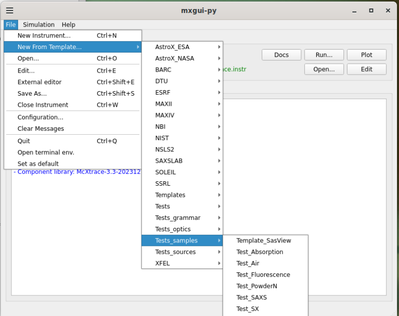
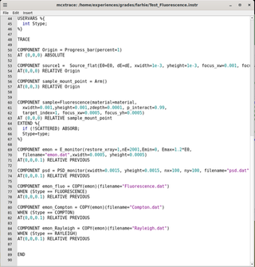
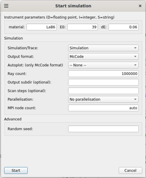

# Welcome to the HERCULES 2024 McXtrace Practicals at synchrotron SOLEIL

This practical session "Beamline modelling" is part of the [HERCULES](https://hercules-school.eu) school. 
It will take place at [Synchrotron SOLEIL](https://www.synchrotron-soleil.fr/fr) near Paris, France. The HERCULES programme at SOLEIL is available [here](doc/Planning_HERCULES_SOLEIL_2024.pdf).

## Objectives

During these practicals, you shall simulate sample models within simple X-ray beam-line models, to demonstrate what can be done with the [McXtrace](https://mcxtrace.org/) software.

As the planned duration of this session is short (1:30), we shall only demonstrate basic concepts. In practice, McXtrace has a much wider set of functionalities to create models for most X-ray beam-lines. You are welcome to dig in the [extensive McXtrace](https://mcxtrace.org/documentation/) documentation, as well as refer to other workshop materials at:

- [McXtrace/SOLEIL 2019](https://github.com/McStasMcXtrace/Schools/tree/master/2019/SOLEIL_December_2019)
- [McXtrace/SOLEIL 2022](https://github.com/McStasMcXtrace/Schools/tree/master/2022/SOLEIL_March_2022)
- [McXtrace/SOLEIL 2023](https://github.com/McStasMcXtrace/Schools/tree/master/2023/SOLEIL_May_2023)

There has been a large number of [similar workshops](https://github.com/McStasMcXtrace/Schools) for the neutron side project [McStas](https://mcstas.org/) (which works about the same, except we have neutrons instead of photons).

## Prerequisites

#### Prerequisite: DARTS sessions

In order to avoid a painful installation of the software, and access our powerful computing resources at SOLEIL, you are invited to login to the Data Analysis Remote Treatment Service (DARTS) at:

- [https://data-analysis.synchrotron-soleil.fr/qemu-web-desktop/](https://data-analysis.synchrotron-soleil.fr/qemu-web-desktop/)

This service is available from within SOLEIL, but also from outside our facility. It requires an active [SUNset](https://sun.synchrotron-soleil.fr/sunset/bridge/sunset/) login with a "strong" password. Please make sure you can connect before the practical session.

Navigate to the DARTS landing page (when on-site, select the **desktop** entry in the list of services).

Then click on the green **[Create]** button on the left, with default settings ("Data Analysis", 4 cores, 16 GB mem). To access an existing previous session of your own, click on **[Manage sessions]**.

After e.g. 15-30s you will see an information page that indicates that your session is ready. Simply click on the **[Connect]** button.

A Desktop is displayed shortly after the connection.

#### Prerequisite: Your own installation

You may of course install the software yourself on your computer. In this case, be sure to get a fully functional installation before the practicals. See installation instructions at:

- [https://github.com/McStasMcXtrace/McCode/tree/mccode-legacy/INSTALL-McXtrace-3.x](https://github.com/McStasMcXtrace/McCode/tree/mccode-legacy/INSTALL-McXtrace-3.x)

#### Prerequisite: When all fails

If you can not access DARTS, you may still simulate powder diffractograms and fluorescence spectra from:

- [https://data-analysis.synchrotron-soleil.fr/computing/fluo_diffraction.html](https://data-analysis.synchrotron-soleil.fr/computing/fluo_diffraction.html)

McXtrace is running under the hood. You still need a SUNset account, but the security level for this targeted service is lower. Entering a CIF file will trigger a diffraction+fluorescence simulation, whereas entering a mere chemical formula only generates the fluorescence.

--------------------------------------------------------------------------------

## Presentation of McXtrace

[**McXtrace**](https://mcxtrace.org/) is a Monte-Carlo X-ray ray-tracing modelling software derived from its neutron counterpart [**McStas**](https://mcstas.org/).

In short, a McXtrace model is a text-file (extension `.instr`) which describes a beam-line geometry as a sequence of so-called "components", just like in real life. The text-file is then assembled as an executable programme which takes as input the model parameters, and produces output data files. There are currently more than 200 such components describing for instance:

- photon sources (lab sources, bending magnets, undulators, etc)
- optics (monochromators, mirrors and KB, lenses and CRL, zone-plates, filters, slits, etc)
- samples (absorption/XAS, fluorescence, tomography, large-scale structures/SAXS, powder diffraction, MX / Single crystal diffraction)
- monitors/detectors (single point, 1D sensor, image, volumes/stack of images, etc)

In addition, McXtrace comes with dedicated GUI's to edit models, start simulations, and plot results.

McXtrace and McStas share the same basic concepts and tools. The computational part is programmed in C, the user interfaces are mostly in Python. The source code is hosted on [Github](https://github.com/McStasMcXtrace/McCode), and it runs on all architectures.

## Get in touch: starting with simple examples

In this part of the tutorial, you are invited to start the McXtrace GUI. Open a Terminal and enter the `mxgui` command. The project documentation, including manuals, lists of components and examples, is available from the **Help** menu.

#### Fluorescence

From the _File_ menu, select **"New From Template... > Test\_samples > Test\_Fluorescence"**, then save the `Test_Fluorescence.instr` file in your home account (press Enter key).

From the main interface, click on the **[Edit]** button on the top right. The description of the model is displayed. As you may see, there is a special syntax to describe component arrangements.

The most important parts are the `DEFINE INSTRUMENT Test_Fluorescence`, followed by the input parameters that you can later tune/scan/optimise, and the `TRACE` section which contains a list of `COMPONENT` lines with references to known components and their properties.

If you now click on the **[Run]** button, a dialogue window will appear. As you can see, the input parameters `material` `E0` and `dE` appear on the top, preset with their default values. You may change these, without the need to rebuild the model. 

Click on the **[Start]** button in the bottom of the dialogue window. The console (text in green in the main user interface) indicates that a calculation has started. It should take ~70 seconds to complete. There are ways to speed-up the computation by using all the available CPU's (requires to recompile with MPI - in the _Parallelisation_ drop-down menu on the Run dialogue).

Now click on the **[Plot]** button of the main interface.

## Going further: realistic X-ray beam-line models with samples

---
  
 
