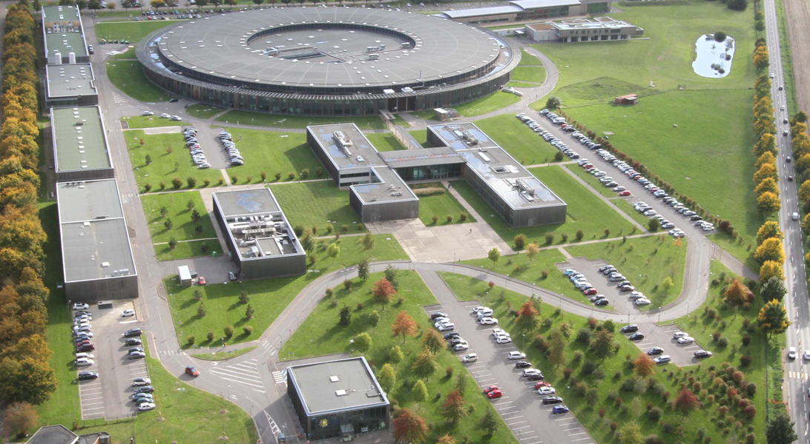
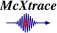

# Welcome to the HERCULES 2024 McXtrace Practicals at synchrotron SOLEIL

This practical session "Beamline modeling" is part of the [HERCULES](https://hercules-school.eu) school. 
It will take place at [Synchrotron SOLEIL](https://www.synchrotron-soleil.fr/fr) near Paris, France. The HERCULES programme at SOLEIL is available [here](doc/Planning_HERCULES_SOLEIL_2024.pdf).

## Objectives

During these practicals, you shall simulate sample models within simple beam-line models, to demonstrate what can be done with the McXtrace software.

- Absorption (XAS)
- Tomography
- SAXS
- powder diffraction
- MX / Single crystal diffraction
- Fluorescence

## Prerequisites

In order to avoid a painful installation of the software, and access our powerful computing resources at SOLEIL, you are invited to login to the Data Analysis Remote Treatment Service (DARTS) at:

- https://data-analysis.synchrotron-soleil.fr/qemu-web-desktop/

This service is available from within SOLEIL, but also from outside our facility. It requires a [SUNset](https://sun.synchrotron-soleil.fr/sunset/bridge/sunset/) active login with a "strong" password. Please make sure you can connect before the practical session.

You may of course install the software yourself on your computer. In this case, be sure to get a fully functional installation before the practicals. See installation instructions at:

- https://github.com/McStasMcXtrace/McCode/tree/mccode-legacy/INSTALL-McXtrace-3.x

---

