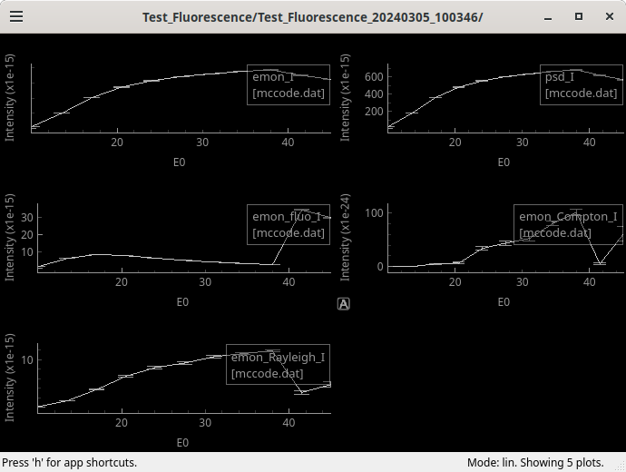

# Welcome to the HERCULES 2024 McXtrace Practicals at synchrotron SOLEIL

This practical session "Beamline modelling" is part of the [HERCULES](https://hercules-school.eu) school. 
It will take place at [Synchrotron SOLEIL](https://www.synchrotron-soleil.fr/fr) near Paris, France. The HERCULES programme at SOLEIL is available [here](doc/Planning_HERCULES_SOLEIL_2024.pdf).

## Objectives

During these practicals, you shall simulate sample models within simple X-ray beam-line models, to demonstrate what can be done with the [McXtrace](https://mcxtrace.org/) software.

As the planned duration of this session is short (1:30), we shall only demonstrate basic concepts. In practice, McXtrace has a much wider set of functionalities to create models for most X-ray beam-lines. You are welcome to dig in the [extensive McXtrace](https://mcxtrace.org/documentation/) documentation, as well as refer to other workshop materials at:

- [McXtrace/SOLEIL 2019](https://github.com/McStasMcXtrace/Schools/tree/master/2019/SOLEIL_December_2019)
- [McXtrace/SOLEIL 2022](https://github.com/McStasMcXtrace/Schools/tree/master/2022/SOLEIL_March_2022)
- [McXtrace/SOLEIL 2023](https://github.com/McStasMcXtrace/Schools/tree/master/2023/SOLEIL_May_2023)

There has been a large number of [similar workshops](https://github.com/McStasMcXtrace/Schools) for the neutron side project [McStas](https://mcstas.org/) (which works about the same, except we have neutrons instead of photons).

## Prerequisites

#### Prerequisite: DARTS sessions

In order to avoid a painful installation of the software, and access our powerful computing resources at SOLEIL, you are invited to login to the Data Analysis Remote Treatment Service (DARTS) at:

- [https://data-analysis.synchrotron-soleil.fr/qemu-web-desktop/](https://data-analysis.synchrotron-soleil.fr/qemu-web-desktop/)

This service is available from within SOLEIL, but also from outside our facility. It requires an active [SUNset](https://sun.synchrotron-soleil.fr/sunset/bridge/sunset/) login with a "strong" password. Please make sure you can connect before the practical session.

Navigate to the DARTS landing page (when on-site, select the **desktop** entry in the list of services).

Then click on the green **[Create]** button on the left, with default settings ("Data Analysis", 4 cores, 16 GB mem). To access an existing previous session of your own, click on **[Manage sessions]**.

After e.g. 15-30s you should see an information page that indicates that your session is ready. Simply click on the **[Connect]** button.

A Desktop is displayed shortly after the connection.

#### Prerequisite: Your own installation

You may of course install the software yourself on your computer. In this case, be sure to get a fully functional installation before the practicals. See installation instructions at:

- [https://github.com/McStasMcXtrace/McCode/tree/mccode-legacy/INSTALL-McXtrace-3.x](https://github.com/McStasMcXtrace/McCode/tree/mccode-legacy/INSTALL-McXtrace-3.x)

#### Prerequisite: When all fails

If you can not access DARTS, you may still simulate powder diffractograms and fluorescence spectra from:

- [https://data-analysis.synchrotron-soleil.fr/computing/fluo_diffraction.html](https://data-analysis.synchrotron-soleil.fr/computing/fluo_diffraction.html)

McXtrace is running under the hood. You still need a SUNset account, but the security level for this targeted service is lower. Entering a CIF file will trigger a diffraction+fluorescence simulation, whereas entering a mere chemical formula only generates the fluorescence.

--------------------------------------------------------------------------------

## Presentation of McXtrace

[**McXtrace**](https://mcxtrace.org/) is a Monte-Carlo X-ray ray-tracing modelling software derived from its neutron counterpart [**McStas**](https://mcstas.org/).

In short, a McXtrace model is a text-file (extension `.instr`) which describes a beam-line geometry as a sequence of so-called "components", just like in real life. The text-file is then assembled as an executable programme which takes as input the model parameters, and produces output data files. There are currently more than 200 such components describing for instance:

- photon sources (lab sources, bending magnets, undulators, etc)
- optics (monochromators, mirrors and KB, lenses and CRL, zone-plates, filters, slits, etc)
- samples (absorption/XAS, fluorescence, tomography, large-scale structures/SAXS, powder diffraction, MX / Single crystal diffraction)
- monitors/detectors (single point, 1D sensor, image, volumes/stack of images, etc)

In addition, McXtrace comes with dedicated GUI's to edit models, start simulations, and plot results.

McXtrace and McStas share the same basic concepts and tools. The computational part is programmed in C, the user interfaces are mostly in Python. The source code is hosted on [Github](https://github.com/McStasMcXtrace/McCode), and it runs on all architectures.

## Get in touch: starting with a simple Fluorescence beam-line

In this part of the tutorial, you are invited to start the McXtrace GUI. Open a Terminal and enter the `mxgui` command. The project documentation, including manuals, lists of components and examples, is available from the **Help** menu.

We shall start with a fluorescence sample to achieve XRF estimates.

#### Fluorescence

From the _File_ menu, select **New From Template... > Test\_samples > Test\_Fluorescence**, then save the `Test_Fluorescence.instr` file in your home account (press Enter key).

From the main interface, click on the **[Edit]** button on the top right. The description of the model is displayed. As you may see, there is a special syntax to describe component arrangements. The "Help > mxdoc current instrument" menu item presents the documentation for the loaded model.

The most important parts are the `DEFINE INSTRUMENT Test_Fluorescence`, followed by the input parameters that you can later tune/scan/optimise, and the `TRACE` section which contains a list of `COMPONENT` lines with references to known components and their properties.

If you now click on the **[Run]** button, a dialogue window will appear. As you can see, the input parameters `material` `E0` and `dE` appear on the top, preset with their default values. You may change these, without the need to rebuild the model. 

Click on the **[Start]** button in the bottom of the dialogue window. The console (text in green in the main user interface) indicates that a calculation has started. It should take ~70 seconds to complete. There are ways to speed-up the computation by using all the available CPU's (requires to recompile with MPI - in the _Parallelisation_ drop-down menu on the Run dialogue).

Now click on the **[Plot]** button of the main interface. All simulation results are displayed. You may hit the **"L"** key to toggle the log-scale display. other key shortcuts can be displayed with the "H" key. All data files are text based, and stored in a directory also containing a copy of the model. There is also a possibility to save data in the HDF5/NeXus format.

On this plot, you can see the fluorescence spectrum of the LaB6 (default material), as well as the Rayleigh and Compton lines as detected on the monitor surface.

**Question**: What is the solid angle of these 3 detectors ?

#### Fluorescence: changing the incident beam energy

We shall now perform a scan of the incident energy. For this, reduce the number of "Ray count" to 10000 (remove a 0). You may as well re-compile with MPI to speed-up the calculation (in _Parallelisation_). Then specify _Scan steps_ as 11 and the energy range in the simulation parameter `E0` as `30,45` (i.e. between 30 and 45 with 11 points). Then press **[Start]**.

Then press the **[Plot]** button. The integrated intensity on each detector is displayed as a function of the incident energy.

**Question**: What is the signification of the "fluo" intensity as a function of E0 ? This is a rather common measuring method on X-ray beam-lines.

## Going further: realistic X-ray beam-line models with samples

We shall now use a model of the [DIFFABS](https://www.synchrotron-soleil.fr/fr/lignes-de-lumiere/diffabs) beam-line, which handles fluorescence (XRF as above) and diffraction (XRD).

#### The DIFFABS beam-line geometry

From the _File_ menu, select **New From Template... > SOLEIL > SOLEIL_DIFFABS**, and save the `SOLEIL_DIFFABS.instr` file in your home directory. Click on the **[Run]** button to assemble the model.

:warning: **NOTE** : you will probably have to enter the full path the LaB6 crystal structure e.g. `/usr/share/mcxtrace/3.4-20240304/data/LaB6_660b_AVID2.hkl`. In case of error, the path to that file will be displayed in the main interface output frame (green text).

Now, in the _Simulation/Trace_ drop-down of the "Start simulation" window, select "Trace", then press **[Start]**. A 3D representation of the beam-line geometry will be displayed in a browser. You may rotate/zoom/pan with the mouse, as well as control the particle tracking.

The last element is the detector cradle, which spans on a wide angle. 

**Question**: Where is the double monochromator located ? You may zoom in order to visualise the photon beam through it.

Edit the beam-line description. You may search for the double monochromator `DCM` which is made of two `Bragg_crystal` components. 

You shall notice that this model is definitively more complex than the previous Fluorescence example. To build a realistic beam-line model, you should e.g. start from the blue-prints, and specifications for each element along the beam. 

#### DIFFABS: Powder diffraction

In this model, we consider powder diffraction. We use, as before, the LaB6 sample.

Perform a single simulation with the LaB6 sample, just by reverting, in the Run dialogue, the _Simulation/Trace_ drop-down to "Simulation", and pressing **[Start]**.
When completed, press the **[Plot]** button and the **L** key to switch to log-scale. The last 3 monitors provide the fluorescence spectrum, the integrated diffractogram, and the 2D image on the detection surface.

**Question**: Identify the fluorescence background signal, and diffraction pattern. What is the origin of each diffraction peak shape ? What is the meaning of the 2D final image ?

#### The PSICHE tomography beam-line

Lets open the `SOLEIL_PSICHE` beam-line. As done for the other exercises above, you are first invited to look at the beam-line code (the Edit button) and the 3D geometry (Run dialogue, and set the "Simulation/Trace" to "Trace"). 

**Question**: What is the default beam-line configuration for this model ? Is it suited for tomography ?

Start a dry-run simulation after reverting to the "Simulation" mode. You may also use the "_Parallelisation_=MPI/recompile" option. The default sample is a silver wire ball (OFF or PLY geometry formats are accepted), which transmission through is measured on the final 2D image.

What is actually performed in a real experiment is a continuous rotation of the sample, which can be done here step by step by specifying the `sample_theta` parameter as `60` deg (for instance).

Open a data file, which location is indicate in the console, and when you press the Plot button.

To achieve a full rotation, you would set `sample_theta` parameter as e.g. `0,360` deg, in e.g. 360 steps. 
As all data files are text based, you may easily import the images in e.g. python, Matlab, etc and build a sinogram/volume.
The computation time will then be much too long for this practical session.

# Thanks for attending !

---
  
 
 
 (c) Synchrotron SOLEIL 2024.
