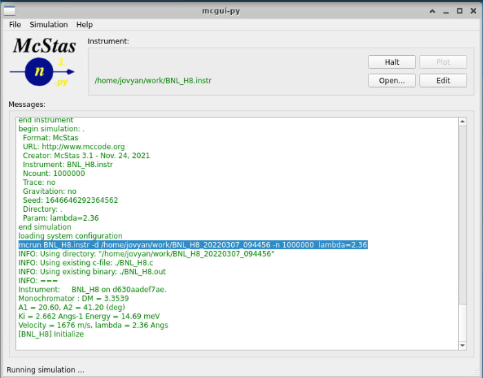

## Parallelisation, ESS cluster

As you may have seen when performing the earlier simulations, mcgui
makes use of the underlying ```mcrun``` tool, see below screenshot:



Among the output, you find this line
```mcrun BNL_H8.instr -d /home/jovyan/work/BNL_H8_20220307_094456 -n 1000000  lambda=2.36```

Our work in this exericise is mainly to get aqcuainted with using the 
mcrun utility that has many options relevant to parallelisation.

### Information resources
* Input parameters for the mcrun tool https://github.com/McStasMcXtrace/McCode/wiki/mcrun
* Confluence-based guide for running McStas on the DMSC cluster
  https://confluence.esss.lu.se/pages/viewpage.action?pageId=292160881
  (thanks Celine!)
* The ```mcstas_mcsub_slurm``` command can be used to write a slurm batchfile

### Tasks
* Pick an intersting instrument, either from
  * Your McStas installation example directory (File->New from template)
  * The ESS DMSC instrument repo at
    https://git.esss.dk/dam-group/ess-instrumentmodels (some of these
    may be McStas 2.x only)
  * A previous exercise

* Using the above information resources, please
  * Run the said instrument using the Docker and note the mcrun line
  * Use ```mcstas_mcsub_slurm``` on the cluster with the mcrun line to
    create a batch file (use the --help option first)
  * Use the cluster guides to do an MPI-based simulation
  * Use the cluster guides to do a GPU-based simulation (requires a
    McStas 3.x instrument)
