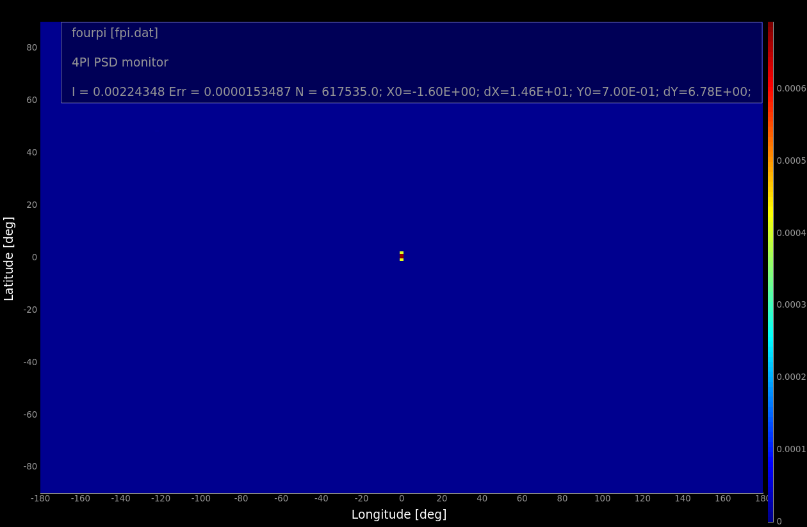
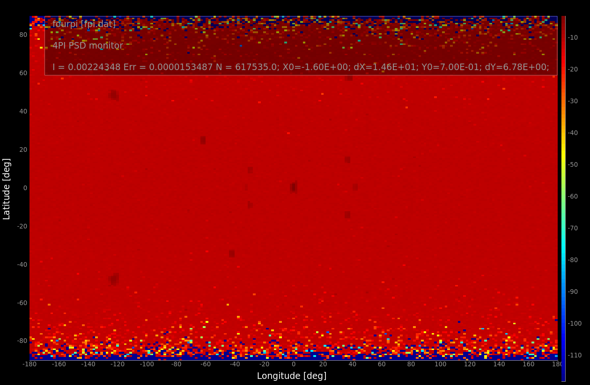

# Part 1. Single Crystal laue camera
In this exercise we will build a _very_ simple Laue camera and scatter neutrons on a single crystal in 4 steps.

## Step 1 Add a new file and add a source
Open a new template instrument file as you have done before. (In the GUI CTRL-N)

Insert a source component: Source_simple. I should have the following parameters (or similar):
- radius=0.05
- dist=5
- focus_xw=0.02
- focus_yh=0.05
- lambda0=2
- dlambda=1.9

Place the source component at the origin: AT(0,0,0) RELATIVE Origin

## Step 2. Add a guide
We will now add a 20 m long straight neutron guide, and place it 5m downstream of the source. It should have m=1 coatings and be just
big enough to capture the radiation from the source. I.e.
```w1=0.02, h1=0.05, w2=0.02, h2=0.05, l=20, m=1```

## Step 3. Add a sample
In this case the sample is a standard sample - namely a ruby single crystal:
<code>
COMPONENT single_crystal = Single_crystal(
  reflections="Al2O3_sapphire.lau",
  yheight=0.05, radius=0.01, mosaic=1, delta_d_d=1e-4,
  az=4.757, ay=0, az=0, bx=2.3785, by=0, bz=-3.364, cx=0, cy=12.9877, cz=0,
  p_transmit=0.1)
AT (0, 0, 0) RELATIVE PREVIOUS
</code>

As you now know the ax,ay, ...., cz - parameters specify the crystal's unit cell vector in the coordinate system defined by the crystal AT-position.

## Step 4. Add a monitor to see the scattering
Add the ideal Laue camera monitor covering 4 pi: PSD_monitor_4PI. Fpr instance set a radius of 1 m, and give it 200x200 pixels. Remember to also 
specify a filename - otherwise you will get no output data.

## Run your simulation
You may now try your Laue camera out - you ought to see something like the images below. It is probably a good idea to increase the statistics
of your run to something like 10^7 neutron rays (the ncount).

</img>

Remember that if you press L the monitor will be displayed on a log scale, to avoid being overwhelmed by the direct beam signal. 

</img>

An obvious way to avoid the direct beam is to include a beamstop by adding
<code>
COMPONENT beamstop = Beamstop(xwidth=0.025,yheight=0.055)
AT(0,0,0.1) RELATIVE PREVIOUS
</code>
immediately after the sample.

## Play around with the example instrument.
- Add an Arm-component before the sample to allow a rotation around the Y-axis and set the sample RELATIVE to that. Does that change your scattering 
pattern? If not you might want to check that your monitor does not rotate with the sample.
- Add more sample rotations to emulate an Eulerian cradle. (Y,X,Y) rotations.
- Change the crystal to for instance Al.
<code>
COMPONENT single_crystal = Single_crystal(
   reflections="Al.lau",
   yheight=0.05, radius=0.01, mosaic=1, delta_d_d=1e-4,
   az=4.0495, ay=0, ax=0, bx=4.0495, by=0, bz=0, cx=0, cy=4.0495, cz=0,
   p_transmit=0.1)
AT (0, 0, 0) RELATIVE PREVIOUS
</code>
- Replace the Single crystal with a Powder - and does that make sense?

# PART 2 - Powder scattering
Start a new instrument simulation, but this time start with the PSI_DMC instrument model that is included in the McStas distribution.
Look into the instrument file and find the sample.
Run a simulation with the default parameters and see if the result make sense.

Now try to modify the instrument to resolve the signal in the vertical direction. We will do this by increasing the height of the banana 
shaped detector: 'options="banana, theta y auto limits bins=20", yheight=0.3' in the appropriate place.

See if you can get a signal by replacing the Powder sample with the single crystal Al block you used before.


