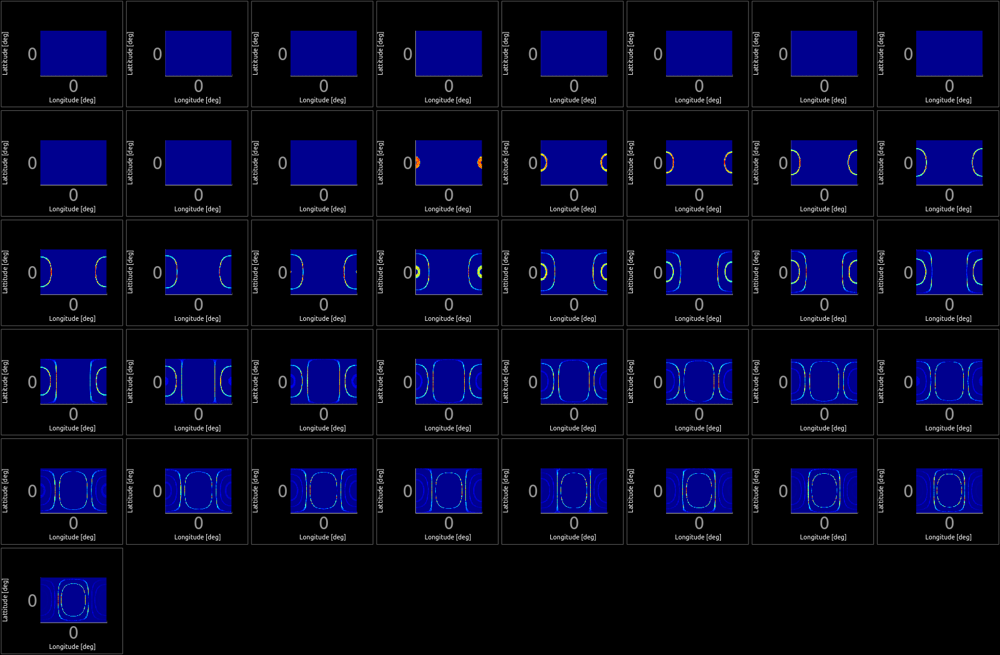
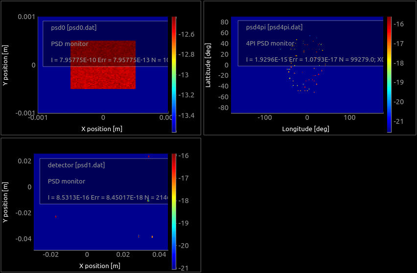

# McXtrace training: samples and virtual experiments: diffraction

In this training, we present a set of sample components to be inserted into beam-line models in order to build so-called virtual experiments.

Currently, [McXtrace](http://www.mcxtrace.org) supports a limited set of sample types, and mostly focuses on diffraction related studies. Other samples are planned, to model e.g. EXAFS, fluorescence, ARPES, ...). We hope you can contribute to this effort in the future. Also, these components are still under active development.

Inserting a sample component within a beam-line description constitutes a way to simulate a measurement. Such method is always limited by the amount of knowledge inserted both in the beam-line description, and the accuracy of the sample model.

## Table of Contents
1. [Sample geometry](#sample-geometry)
1. [Data files](#data-files)
1. [Exercise A: Powder diffraction (XRD)](#exercise-a-powder-diffraction-xrd)
1. [Exercise B: Macromolecular crystallography (MX)](#exercise-b-macromolecular-crystallography-mx)
1. [Exercise C: Small angle scattering (SAXS)](#exercise-c-small-angle-scattering-saxs)
1. [Exercise D: Max IV DanMAX (MX) optional](#exercise-d-max-iv-danmax-mx)

---

## Sample geometry

Sample components should be given a geometrical shape. The sample coordinate frame is usually (when not rotated) *X* on the left, *Y* vertical, and *Z* is 'forward'.

The geometry can be specified as:
- a sphere `radius=<value>`
- a cylinder `radius=<value>, yheight=<value>`
- box `xwidth=<value>, yheight=<value>, zdepth=<value>`
- any shape defined with a `geometry=<file>` with a [PLY](http://en.wikipedia.org/wiki/PLY_%28file_format%29)/[OFF](http://www.geomview.org/docs/html/OFF.html) file (vertices and polygons similar to STL). We provide example geometry files in the [data](http://mcxtrace.org/download/components/3.0/data/) directory (e.g. locally at `/usr/share/mcxtrace/x.y/data`). You may also use e.g. [Meshlab](https://www.meshlab.net/) or other geometry editors/modellers to create such files (rather simple text format). Not all samples support this geometry.

Some samples can be made hollow by specifying a `thickness` parameter. This is especially useful for containers (e.g. capillary) and sample environments.

Moreover, some samples support a `concentric` mode, which allows to insert a component within an other. We shall not consider this topic during this session.

Using the ROTATED keyword, you may orient this geometry in any direction.

## Data files

The sample components we use in this session are diffraction oriented.

They use additional data files e.g.:
- structure factors vs HKL or *d*-spacing. These are stored in `laz` (for Powders, with multiplicity) or `lau` (for single crystals and powders) F<sup>2</sup>(HKL) files. We generate such files from CIF data.
- material files from e.g. [NIST](https://physics.nist.gov/PhysRefData/FFast/html/form.html) which contain Form Factors, Attenuation (absorption) and Scattering Cross-sections.

The F<sup>2</sup>(HKL) reflection list is given as a text file such as the [Mo.lau](http://www.mcxtrace.org/download/components/3.0/data/Mo.lau) file. It may be computed from a [CIF](http://crystallography.net/) file using the [cif2hkl](http://www.mcstas.org/download/share/cif2hkl.F90) tool, which is provided with McXtrace (e.g. as `/usr/share/mcxtrace/3.0/bin/cif2hkl`). You may as well directly get HKL powder file from http://crystallography.net/cod/ which gives access to nearly 500000 structure (beg. 2022). The ICSD also provides similar data, but is usually not free.

To get a list of all material structures matching a given Hill formula (at the end of the query, elements separated by spaces), use for instance:
- `http://www.crystallography.net/cod/result.php?formula=O3 Sr Ti`

For powders (Bragg lines with multiplicity)
``` bash
cif2hkl --mode XRA  --lambda 1.0 Mo.cif 
```
For single crystals (all Bragg lines are given individually), the 'single crystal' mode is specified with the option `--xtal` as in (for amino acid L-glutamine COD=5000006):
``` bash
wget http://crystallography.net/cod/5000006.cif
cif2hkl --xtal --mode XRA  --lambda 1.0 5000006.cif 
```

:warning: `cif2hkl` does not work properly with *mmCIF* files. Also, the `sigma_` lines in the generated file should be adapted to X-rays or removed (they are there for neutrons), especially the `sigma_abs` entry. Last, `cif2hkl `may fail converting too large structures.

---

## Exercise A: Powder diffraction (XRD)

Many laboratories are equipped with e.g. rotating anode X-ray sources. Indeed, powder diffraction is an efficient yet simple technique for material structure characterisation. A diffractogram allows to determine the nature and arrangement of atoms in a material. It is a very robust technique.


In this exercise, we shall simulate a simple diffractometer with:
- the [PowderN](http://www.mcxtrace.org/download/components/3.0/samples/PowderN.html) sample component ;
- the [Test_Powder](http://www.mcxtrace.org/download/components/3.0/examples/Test_Powder.html) example (using PowderN).

We shall start the MxGUI interface, and load the *Test_PowderN* example (*File > New From Template... > Tests* menu item). You then save a copy of it in your home directory. Then click the **Edit** button to open the model description. You can also use any other Text editor (GEdit and MousePad provide a nice source code highlighting).

#### The PowderN component

The [PowderN](http://www.mcxtrace.org/download/components/3.0/samples/PowderN.html) component takes as input:
- some geometrical parameters (the sample shape) ;
- a list of F<sup>2</sup>(HKL) `reflections` which takes into account the crystal structure (space group, atom type and location, lattice parameters). We use the `lau` or `laz` extension, but this is arbitrary, and any other will work as long as the information is there ;
- an optional `material` file that provides absorption information.

A typical use for the PowderN is to model a powder material in the beam (can be e.g. a beryllium shell or a container).
``` c
COMPONENT sample = PowderN(
    reflections = "Fe_bcc229_lt13deg.dat", format=Crystallographica, material = "Fe.txt",
    radius = .5e-4, yheight = 1e-3, pack = 0.5, Vc = 123,
    p_inc = 0, p_transmit = 0.1, DW = 0)
```

The resulting scattered beam appears as so-called Debye-Scherrer cones which satisfy the equation:

n &lambda; = 2 _d_ sin &theta;

where  &lambda; = 2 &pi;/k is the incident wavelength, _d_ is a distance separating atomic planes in the material, and &theta; is the scattering angle (half take-off).

💡️The `d_phi` parameter to PowderN specifies an angular opening wrt the horizontal plane, to restrict the scattering from the powder and increase the statistics in this toroidal shape. It allows in practice to match a detector surface, and avoid sending rays outside of it. Remove it if you wish to scatter in 4&pi;.

#### Step A.1: incident photon energy parameter and single calculation

Have a look at the [Test_Powder](http://www.mcxtrace.org/download/components/3.0/examples/Test_Powder.html) header, and TRACE section. As you can see, this is an ideal, very simple model.

The energy spread in the `src` component instance should be set as proportional to `E0` in order to mimic the distribution out of e.g. a monochromator. Let's use `dE=E0/100` at the source (1% resolution).
The `d_phi` model parameter is forwarded to the PowderN sample component. Using a non-zero value restricts the scattering within a horizontal tore, which improve the simulation efficiency when the detecteor coverage is limited vertically (e.g. a PSD in the horizontal scattering plane). Using a value of 0 allows diffraction in 4&pi; to fully illuminate the `Sph_mon` 4&pi; monitor. 

Notice right after the sample component that the non scattered x-rays are absorbed (removed from the calculation) in an EXTEND block. 

:runner: Run the simulation with an iron sample, an incident energy of 15 keV, 10<sup>7</sup> rays, and MPI (recompile) with e.g. 4 cores. This can be done from the GUI, or from the command line with, e.g.:
``` bash
mxrun -c --mpi 4 Test_PowderN.instr reflections=Fe.lau E0=15 -n 1e7
```

The data files are stored in a directory which contains text files. You may have a look at these, to see how simple the data format is. There is usually a `sim` file which describes the simulation parameters, a copy of the used model `.instr`, and data files (here `Sphere.dat`).

:runner: Plot the results and look at the 4&pi; monitor. Switch to intensity 'log-scale' (press the *L* key on the plot). Comment. 

:question:
- Why is there no signal at small angle ? 
- Why do you get a kind of rectangle frame at 90 deg scattering angle ?

:runner: Re-run with `directbeam=1` to also simulate the transmitted beam. Plot results again.

:question:
- You can measure why a beam-stop is necessary, not only to protect the detector, but also to enhance the contrast.

You may as well simulate the scattering from the default LaB<sub>6</sub> sample.


#### Step A.2: use a component from the neutron world

Get the component [PSD_monitor_rad](http://mcstas.org/download/components/2.7.1/contrib/PSD_monitor_rad.comp) which is a PSD with a radial integration included. It originates from the McStas neutron-ray equivalent of McXtrace. To use it we need a few modifications.

Edit the `PSD_monitor_rad.comp` component with a text editor of your choice, e.g. gedit. 
- Change the occurences of `restore_neutron` into `restore_xray`.
- Change the occurence of `RESTORE_NEUTRON(INDEX_CURRENT_COMP, x, y, z, vx, vy, vz, t, sx, sy, sz, p);` into `RESTORE_XRAY(INDEX_CURRENT_COMP, x, y, z, kx, ky, kz, phi, t, Ex, Ey, Ez, p);`.
- Add this monitor to the XRD model at the same location as the `detector2`.

:runner: Re-run at E0=15 keV (make sure `directbeam=0` as it keeps the previous value). Plot results again. You should get a nice diffractogram.

:question:
- why do diffraction rings appear with a hat-shape ?

:bulb: You could simulate a slight off-axis detector misalignment by setting TTH to a non-zero value. This will affect the _I(r)_ from the newly added monitor.

#### Step A.3: perform an energy scan

It is rather simple to vary a model parameter. For this, specify an energy range `min,max`, and a number of *Sweep steps* (in the Run dialogue) or `-N` argument on the command line.

In our case, we shall vary the incident energy `E0` from 3 to 8 keV, with the iron sample (`Fe.lau`).

:runner: Perform an energy scan (e.g. 41 steps), and plot the results. The data goes in a scan directory, which itself contains *N* sub-directories (labelled as 0 to N-1). Plot the intensity vs E0.

``` bash
mxrun --mpi 8 -N 41 Test_PowderN.instr E0=3,8 -n 1e6
mxplot <output_dir>
```




:question:
- Why do you see steps vs energy ?
- Use Ctrl-click on the detector to see its response vs Energy. Does it properly explain these steps ?

---

## Exercise B: Macromolecular crystallography (MX)

The macromolecular crystallography beam-lines measure the diffraction from rotating monocrystals, in the attempt to catch as many diffraction spots as possible, reconstruct the reciprocal space, and obtain then the real space atom distribution.


In this exercise, we aim to demonstrate how an MX measurement can be simulated (in a simplified way). For this, we shall use:
- the [Single_crystal](http://www.mcxtrace.org/download/components/3.0/samples/Single_crystal.html) sample component ;
- the [Test_SX](http://www.mcxtrace.org/download/components/3.0/examples/Test_SX.html) example (using the Single_crystal).

We shall start the MxGUI interface, and load the *Test_SX* example (*File > New From Template... > Tests* menu item). You then save a copy of it in your home directory. Then click the **Edit** button to open the model description. You can also use any other Text editor (GEdit and MousePad provide a nice source code highlighting).

#### The Single_crystal component

To date, the [Single_crystal](http://www.mcxtrace.org/download/components/3.0/samples/Single_crystal.html) is one of our most complex McXtrace component. It takes as input:
- some geometrical parameters (the sample shape) ;
- a list of F<sup>2</sup>(HKL) `reflections` which takes into account the crystal structure (space group, atom type and location, lattice parameters). We use the `lau` extension, but this is arbitrary, and any other will work as long as the information is there ;
- an optional `material` file that provides absorption information.

A typical use for the Single_crystal is to model any crystalline material in the beam (can be e.g. a sapphire container, filter), and of course any crystalline sample. Use a rather large mosaic to enlarge the Bragg spots.

``` c
COMPONENT sample = Single_crystal(reflections="Mo.lau", 
  radius = .5e-4, yheight = 1e-3, p_transmit = 0, mosaic=5)
```
and if you have an absorption data file, you may add the parameter `..., material="Mo.txt"`.

#### Step B.1: Add a Progress_bar and clean-up some components

In order to monitor the execution of the simulation, and get an estimate of the computation time, we can add a [Progress_bar](http://www.mcxtrace.org/download/components/3.0/misc/Progress_bar.html) component. Position the cursor right after the `TRACE` keyword in the [Test_SX](http://www.mcxtrace.org/download/components/3.0/examples/Test_SX.html) example, and add the component, with no parameter, on the Origin (ABSOLUTE positioning).

Remove the `ttarm` and `detector2` components, that we won't use here. Extend the remaining detector pixel size by a factor 10 on each axis (e.g. 2k x 2k) so that it matches better a real detector binning.

Replace the `TTH` input parameter (on the `DEFINE` line), with:
- an `E0` photon energy (default: 15 keV), 
- a `sample` parameter (of type `string` and "4mea.lau" default value) to specify the sample structure factors
- two `rotX` and `rotY` angles (default: 0 deg)

Think about mirroring these changes in the file header, so that the documentation keeps in sync.

Then, indicate to the `src` component that its energy parameter `E0` is the `E0` parameter from the beam-line description (we have chosen the same name to ease understanding). Do a similar operation to set the reflection list to the `sample` input argument. You may remove the `material` parameter if it is present, which is used to compute the absorption, but we do not have this data file for the "4mea.lau" sample structure below.

Get the [4mea F2(HKL)](4mea.lau) structure file which has been created from the PDB entry https://www.rcsb.org/structure/4mea "*epoxide hydrolase from Acinetobacter nosocomialis*" (don't eat it, it's probably toxic). The RCSB service allows to save the structure information as PDB, but also as CIF, which we use and send to `cif2hkl --xtal --mode XRA`.

:runner: Save the beam-line description, and visualize its geometry with the Trace mode in the Run dialogue. Check that everything sits at the right place. This can also be achieved at command line prompt:
``` bash
mxdisplay-webgl Test_SX.instr E0=15 -n 1e7
```


:runner: Actually, run it with e.g. 10<sup>6</sup> rays, using all the available CPU cores (MPI - recompile).

Plot the results. 

:question:
- Comment on the Bragg spot distribution, and their size. 
- What's wrong here ?

#### Step B.2: making model slightly more realistic

The diffraction pattern is rather symmetric (even though incomplete). This is usually not the case because the sample is not oriented along its principal lattice axes in experiments. This is why a normal experiment captures diffraction patterns while rotating the sample, to catch many reflections and reconstruct a larger reciprocal space area.

Specify rotations `rotX` and `rotY` along axis X and Y of the sample component. Modify the following components ROTATED statements so that they do not rotate as well.

We can remove the central beam spot in three different ways:
1. use an EXTEND block and remove all non scattered events immediately (perfect beam-stop)
2. use a [Beamstop](http://www.mcxtrace.org/download/components/3.0/optics/Beamstop.html) component 
3. use a variable of our own to record when a ray has scattered or not, and make use of it with EXTEND and WHEN keywords afterwards.

The first solution is extremely simple. Right after the sample component block, add an EXTEND block (with `%{` and `%}` delimiters), and write a C statement that implements:
- "*if the ray has not scattered, absorb it*".

The `SCATTERED` and `ABSORB` keywords should be used (don't panic, the solution is extremely simple).

:runner: Run the simulation again, and use a few degrees rotation on the sample (1-2 deg). 

:question:
- Comment on the results.


You may repeat the calculation with the L-glutamine from http://crystallography.net/cod/5000006.html. Use the [Lglutamine long F2(HKL)](Lglutamine-full.lau) file, or for a faster computation, the [Lglutamine F2(HKL)](Lglutamine.lau) file. For more contrasted detector images, it is recommended to use bigger pixels (e.g. 300 x 300).



:question:
- Does it look more realistic now ?
- Comment on the missing contributions.

## Exercise C: Small angle scattering (SAXS)

The small-angle X-ray scattering beam-lines measure very small beam deviations around the incident direction, following the Bragg-law _n_&lambda; = 2 _d_ sin(&theta;) where the incident wavelength &lambda; is fixed and we can see that small angles &theta; corresponds with large typical scattering unit sizes _d_.


There is large variety of SAXS sample models. Most of them correspond with isotropic scattering units.

The most complete one is using [SaSView models](https://www.sasview.org/docs/user/qtgui/Perspectives/Fitting/models/index.html) from which about [60 have been ported](http://mcxtrace.org/download/components/3.0/samples/SasView_model.html) into McXtrace. These include isotropic and anisotropic models.

In the following, we shall start from the [TestSAXS](http://mcxtrace.org/download/components/3.0/examples/TestSAXS.html) example instrument (from the _Tests_). It models a toy SAXS beam-line with a set of possible sample models via the input parameter `SAMPLE=1-9,11` (the sample 10 has been inactivated). It also has a PSD and a |Q| monitor (with radial integration).

#### Step C.1: simulate the scattering from a set of samples

Load the [TestSAXS](http://mcxtrace.org/download/components/3.0/examples/TestSAXS.html) beam-line model and open the 3D view (run in Trace mode).

Scan SAMPLE=1,11 with 11 steps.

Plot the results, and visualize the scattering curve of all samples.

:question: what can you say about the scattering units in the sample ?

#### Step C.2: simulate more complex samples

We now use the [TemplateSasView](http://www.mcxtrace.org/download/components/3.0/examples/TemplateSasView.html) in _Templates_.

The model index is 10

:question: identify which structure is being used.

Now change the structure to a bcc-paracrystal, using the default parameter values extracted from the [SasView documentation](https://www.sasview.org/docs/user/qtgui/Perspectives/Fitting/models/index.html).

----

The following exercises are optional. Consider them as home-work.

## Exercise D: Max IV DanMAX (MX)

The idea here is to model the [DanMAX](https://www.maxiv.lu.se/accelerators-beamlines/beamlines/danmax/) beam-line at MaxIV with a powder and a single crystal.

Start by selecting the DanMAX example in its 2D version (*File > New from template > Max IV*). 

#### Step D.1: getting to know each other

To get an overview of the beam-line, run it in Trace 3D mode, with default parameter values. A 3D view will show up. Accumulate rays in the 3D view so that you can visualise the beam (_Keep rays_).

Look at its code, and navigate to its end to identify the double monochromator, the different slits and filters, the sample, and the detector. 

Notice the use of `SPLIT 100` at the sample location. It is there to enhance the scattering contribution, even when few rays actually pass the monochromator/multi-layer/slits.

🏃‍♂️️Zoom the 3D view to look at the double monochromator.

📢️ Admittedly, this rendering is not adapted to very long beam-lines (except if you are a Quake/Doom expert gamer).

🆘️Trace mode, mouse buttons:
- :arrow_upper_left: left: rotate
- :arrow_up: middle: zoom
- :arrow_upper_right: right: translate


Then, launch a simulation with e.g. 1e6 rays (MPI, recompile). Plot the results, especially the 2 last detector images (use _L_ key for log-scale intensity).

:question:
- Comment on the energy profile of the beam reaching the sample. 
- What is the origin of the energy tails ?
- Does the scattered signal look like a powder ?


#### Step D.2: then it becomes crystal clear

For the following, we wish to convert the LaB<sub>6</sub> powder sample into a single crystal one, but the provided data file [LaB6_660b_AVID2.hkl](https://github.com/McStasMcXtrace/McCode/blob/master/mcxtrace-comps/data/LaB6_660b_AVID2.hkl) only contains positive HKL Miller indices.

Search the LaB<sub>6</sub> crystal at http://crystallography.net/ and download its CIF file (for instance COD entry [1000055](http://crystallography.net/cod/1000055.html)).

Use `cif2hkl` to generate a single crystal file of F2(hkl) reflections in single crystal and x-ray mode.
``` bash
cif2hkl -x -m XRA 1000055.cif
```

:runner: Just to make sure, run the simulation with this new F2(HKL) file and still the powder sample. 

❓️
- are there any differences ? What is their origin ?

We recommend that you now remove the `sigma_` lines in the  F2(HKL) file so that the model only computes the coherent diffraction scattering, without any surrounding background.

Copy/paste the powder sample block, and modify the sample component into a Single_crystal one with same geometry, using the newly generated F2(HKL) list. 

Remove the `material` parameter to [lab6.abs](https://github.com/McStasMcXtrace/McCode/blob/master/mcxtrace-comps/data/lab6.abs) as it may hide the Bragg scattering (creates lots of background around). 

Comment the PowderN block with `/* ... */` in order to only use the SX. For simplicity, you may also add a `string sample` parameter in the DEFINE line, with default value `"LaB6_660b_AVID2.hkl"`.

``` c
DEFINE INSTRUMENT ...(..., string sample="LaB6_660b_AVID2.hkl")
...
SPLIT 100 COMPONENT sx = Single_crystal(
    reflections=sample,
    radius=sample_radius, mosaic=5, 
    yheight=10e-3, p_transmit = 0)
```

The scattering may occur at large angle, meaning we may miss it. In order to be sure to catch it, add a 4&pi; PSD monitor (500x500 pixels, 15 cm radius) right before the Pilatus2M, centred onto the sample location, with option `restore_xray = 1`.

:runner: Run the simulation again with `sample="1000055.cif.hkl"`.

:question:
- What is the typical scattering angle for this crystal illuminated with `E0=35` keV ?
- Is the current Pilatus detector location appropriate ?
- What solutions can be envisaged ?

#### Step D.3: feeling concentric ?

In this exercise, we wish to superpose the single crystal contribution with a model for a sample container. 

🤫️To date, this is an experimental feature. We are on the bleeding edge !

🔆️The idea here is to model a Polyamide powder container kind of _around_ the LaB6 crystal. For this exercise, we shall consider that the container is made of poly-crystalline polyamide. We suggest you search for a polyamide structure (for instance COD entry [1504080](http://crystallography.net/cod/1504080.html)), then get its CIF and generate the F2(HKL) reflection list. We also recommend that you remove the `sigma_` lines in the  F2(HKL) file so that the model only computes the coherent diffraction scattering, without any surrounding background.

Add a PowderN component right after the sample, with the same geometry, but a 1 &mu;m polyamide layer _outside_ the cylinder (use a negative `thickness` parameter to extend the geometry outside the inner crystal shape). The contribution from the container is too strong compared with the single crystal. We thus suggest to reduce it artificially by lowering its packing factor (density) using `pack = 0.006`.

As an example (but your solution may be different), you may have modified at the beginning:
``` c
DEFINE INSTRUMENT MAXIV_DanMAX_pxrd2d( ...
        string sample="LaB6_660b_AVID2.hkl", 
        string container="NULL")
```
and in the TRACE section (at the sample location):
``` c
TRACE
...
SPLIT 100 COMPONENT sx = Single_crystal(
    reflections=sample,
    radius=sample_radius, mosaic=5, 
    yheight=10e-3, p_transmit = 0)
AT (0, 0, 0) RELATIVE pxrd_2d_pt
ROTATED (0,0,90) RELATIVE pxrd_2d_pt

COMPONENT powdern = PowderN(
    reflections=container,
    radius=sample_radius, thickness=-1e-6,
    yheight=10e-3, d_phi = 90, p_transmit=0.99,
    pack = 0.006, Vc=71.830, density = 4.72)
AT (0, 0, 0) RELATIVE sx
...
COMPONENT psd4pi = PSD_monitor_4PI(radius=0.15,
            nx=500, ny=500, filename="psd4pi.psd", restore_xray=1)
AT(0,0,0) RELATIVE pxrd_2d_pt
```

🏃‍♂️️Run the simulation with MPI and 10<sup>5</sup> xray events, and `sample=1000055.cif.hkl container=1504080.cif.hkl`. Plot the results and look at the 4 &pi; monitor. Identify the crystal contribution. Switch to log scale (_L_ key).

❓️
- Identify the scattering Bragg spots from the crystal.
- Identify the scattering from the container. Does it look like a powder ?

#### Step D.4: better than real life

Let's now separate the contributions from the sample and the container. In the `DECLARE` section of the beam-line description, add two variables such as:
``` c
char flag_sample, flag_container;
```

These flags must be set when the xray interacts with either the container or the sample. This is done with `EXTEND` blocks, located just after AT/ROTATED lines. We make use of the `SCATTERED` keyword, which is 0 when nothing happens, or set to the number of interactions. Add such EXTEND blocks as:
``` c
COMPONENT sx ...
AT ...
ROTATED ...
EXTEND %{
  flag_sample = SCATTERED; // or "if (SCATTERED) flag_sample=1;
%}
```
and a similar block for the powder with `flag_container`.

Add a new monitor, which is a copy of the 4&pi; monitor, but sensitive to sample-only events (remember to update the output file name). This is achieved with a line such as:

``` c
COMPONENT psd4pi_sample = COPY(psd4pi)(filename="psd4pi_sample.psd")
WHEN flag_sample && !flag_container
AT(0,0,0) RELATIVE pxrd_2d_pt
```

🏃‍♂️️Run the simulation again with MPI and 1e5 events.

❓️ 
- Does the total signal makes sense ?
- Identify the sample-only, compare with the total signal.


🏃‍♂️️If you have time, rotate the sample slowly around the X axis (11 steps of 0.5 deg, 10<sup>5</sup> rays). 
Look at individual scan steps (e.g. directories 0,1,2, ...).
The container contribution should keep calm, while the crystal Bragg spots should move around.

---
*McXtrace training - 2022*
