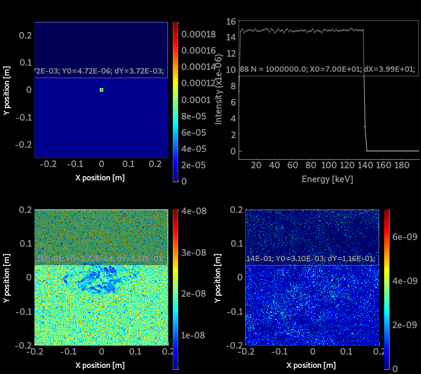
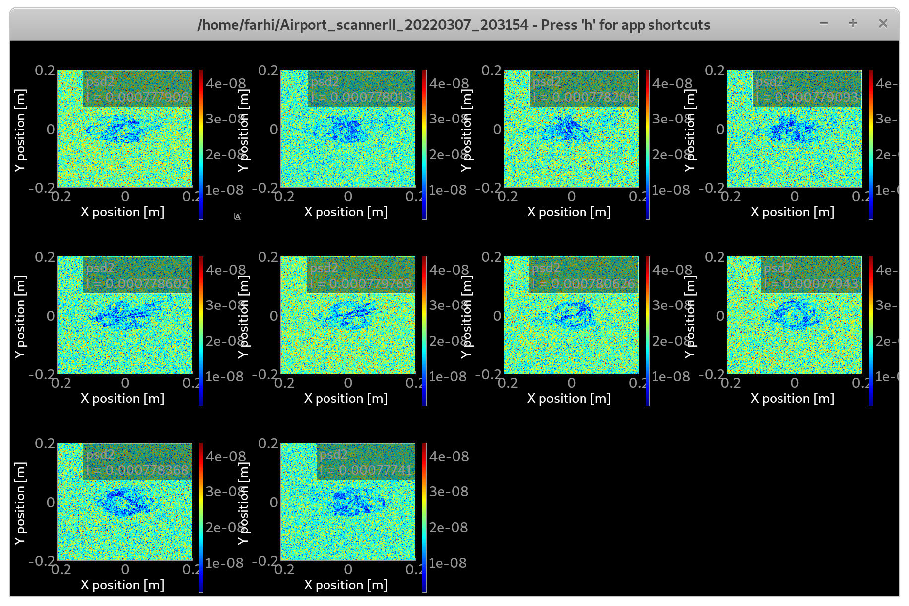
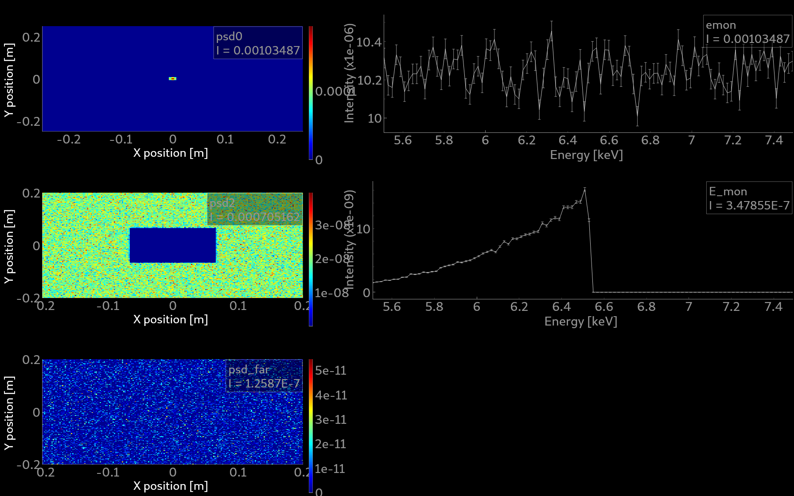
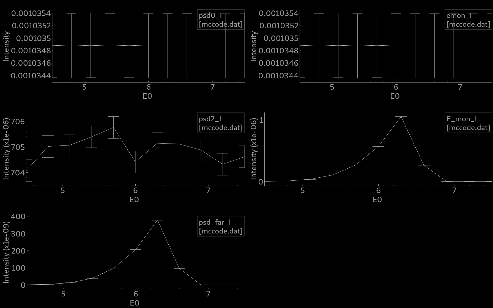

# McXtrace training: samples and virtual experiment: tomography

In this practical session we shall simulate a very simple model of an absorption spectroscopy beam-line. We shall use a sample with an "any shape" complex volume, which we can rotate to simulate a sinogram. We shall also simulate a (very small) hyper-spectral data set.

## Heating up: Absorption data files
There is a dedicated documentation and tool to get absorption data files. 
- [HOWTO: McXtrace absorption files (materials)](https://github.com/McStasMcXtrace/McCode/wiki/HOWTO%3A-McXtrace-absorption-files-%28materials%29)

Usual materials are already available in the [data](http://mcxtrace.org/download/components/3.0/data/) directory.
:warning: However, we currently only treat monoatomic elements, without handling the structure (i.e. no EXAFS).

## A simple absorption/tomography station

There are a few absorption sample components that can be used:
- [Absorption_sample](http://www.mcxtrace.org/download/components/3.0/samples/Absorption_sample.html) a 1 or 2 absorbing materials as a box or cylinder.
- [Abs_objects](http://www.mcxtrace.org/download/components/3.0/samples/Abs_objects.html) a set of absorbing objects which geometry is set from OFF/PLY files.
- [Filter](http://www.mcxtrace.org/download/components/3.0/optics/Filter.html) which can handle absorption and refraction, as a block or any OFF/PLY geometry.

A typical beam-line should look like:
- a photon source
- some optics/slits to shape the beam
- a rotating stage carrying a sample
- a detector

A good start is to search for examples that already use an absorption sample. We find the [`Airport_scannerII.instr`](http://mcxtrace.org/download/components/3.0/examples/Airport_scannerII.html) in group DTU, the [`NBI_Lab_TOMO`](http://mcxtrace.org/download/components/3.0/examples/NBI_Lab_TOMO.html) and the [`SOLEIL_ROCK`](http://mcxtrace.org/download/components/3.0/examples/SOLEIL_ROCK.html) beam-line. 

Lets start with the [`Airport_scannerII.instr`](http://mcxtrace.org/download/components/3.0/examples/Airport_scannerII.html) in which we substitute the `sample_scan` component with a `Filter` one (the `Abs_objects` seems broken). Let's use a geometry file `wire.ply` made of Mn. 

| :warning: If you use McXtrace 3.0, please copy the [3.x/Filter.comp](3.x/Filter.comp) fixed component |
|----|

:runner: Start a computation with 1e6 photon events, possibly with MPI. Plot it.

# tomogram
 
:runner: Now, do a rotation of the sample around the vertical axis with `ANGLE=0,180` in 10 steps. Use 1e6 photon events, and MPI. Computation should last e.g. 1-3 minutes. Plot the results.

:runner: To visualize the individual images, use Ctrl-click on the `psd2_I` monitor. 

# absorption edge

To make sure absorption is properly taken into account, we shall now perform an energy scan. We also need to be able to tune at will the sample material.

Looking at the current model, the energy spread is white with a fixed centre and energy spread. 

:runner: Let's restrict it to `E0` (default 6.5 keV), and `dE=0.1`. For this, input parameters `E0=6.5` and `dE=0.1` should be set in the DEFINE INSTRUMENT line. This way, we can change the white beam into a monochromatic distribution easily. Also add a new `string sample="Mn.txt"` input argument to the model. Consult the [edge energy tables](https://www.ruppweb.org/Xray/elements.html) to determine its K-edge.

:runner: Let's change the `Filter` component into the `Absorption_sample` one, with dimensions 5cm x 5cm x 0.1mm and material set as `sample` (defined above). The *outer* parameters should be used, and the inner one can be left unset. This sample component is *much* faster to computer, with its simplified geometry.

We may obtain the absorption edge by measuring the beam absorption (or transmission) *vs* energy compared with the incoming intensity. In an ideal world, this can be done directly on the white beam by inserting an energy monitor at the location of the current PSD. 

:runner: Add an `E_monitor` a few cm away from the `psd2`, with a 5x5 cm2 footprint. 

:runner: Perform a single computation with `E0=6.5` and `dE=1` keV. Plot the results. :bulb: Remember to set back the number of *sweep steps* to 1.

In real life, the quasi-monochromatic photon energy must be scanned across the edge.

:runner: Now perform an energy scan between 4.5 and 7.5 keV in 20 steps, with `dE=0.1` keV. Plot the results. 

:question: Do you recover the transmission spectra ? Can you explain the differences ?

# hyper-spectral imaging

With a narrow beam, we shall record the XANES as a function of the position of the beam hitting the sample. This corresponds with an hyper-spectral data set (X,Y,E).

In this exercise, we wish to demonstrate the concept by recording an image through the sample, as a function of the energy. In the current model, the incoming beam is wider than the sample material block, and the absorption contrast is not visible compared with the direct transmitted intensity. We thus choose to add a PSD monitor with dimensions matching the sample.

:runner: Add a 3x3 cm2 PSD monitor after the energy monitor. Perform an energy scan between 4.5 and 7.5 keV in 20 steps, with `dE=0.1` keV.

You should obtain a series of images, one per incoming energy. This is an hyper-spectral data set which can be merged into a 3D array with e.g. NumPy or Matlab. Of course, in this exercise, all images are similar as the sample is homogeneous. Putting back the `Filter` component with a complex geometry should allow to record a more realistic hyper-spectral data set. However :-1: it currently has a bug which prevents recovering the absorption spectrum. This will be fixed for the next release.

---
*McXtrace training - 2022*
