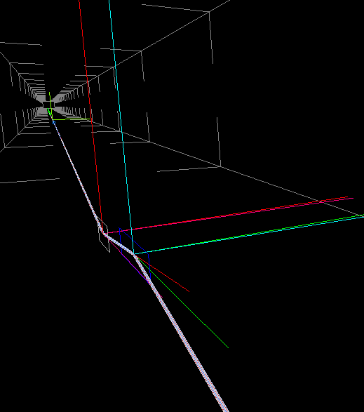
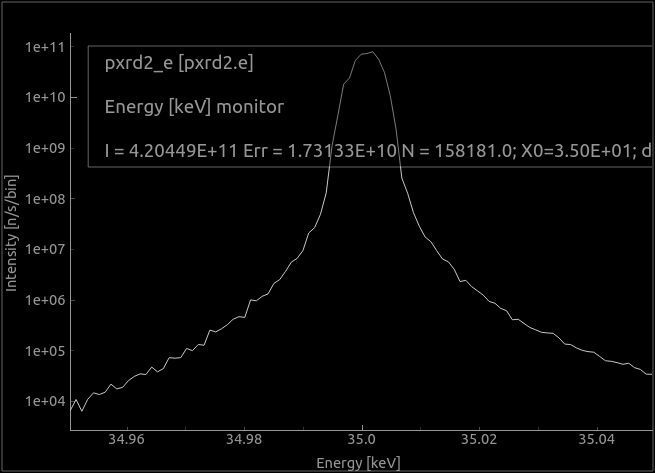
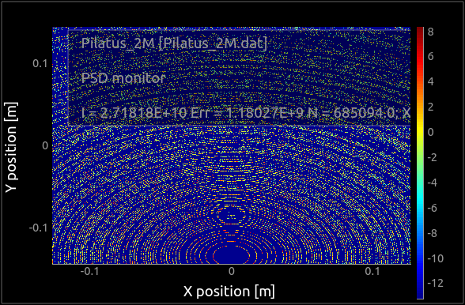
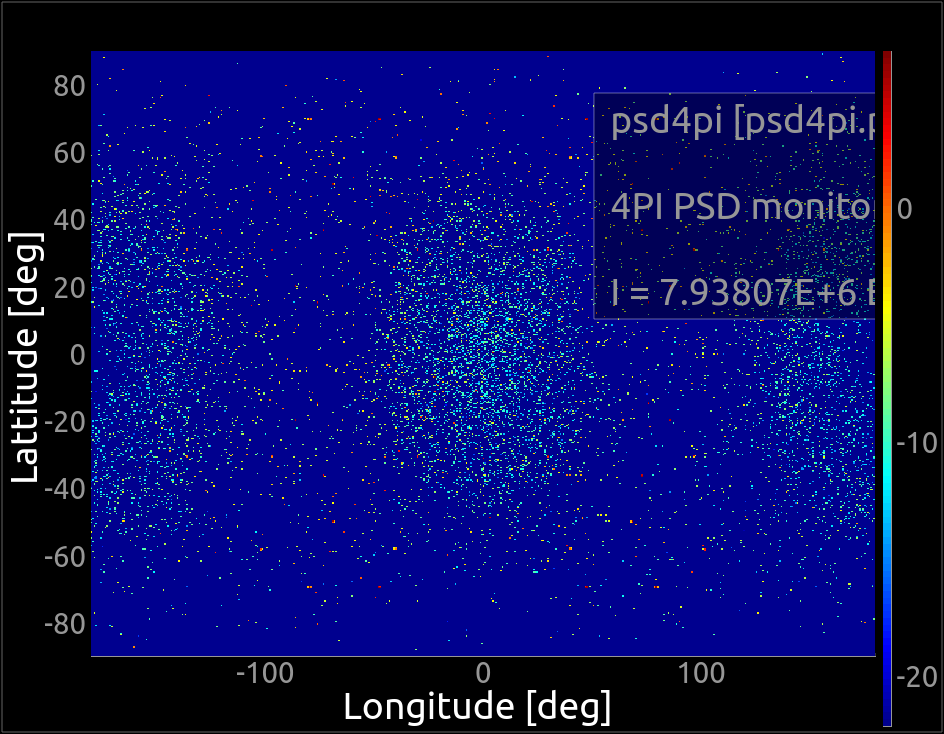
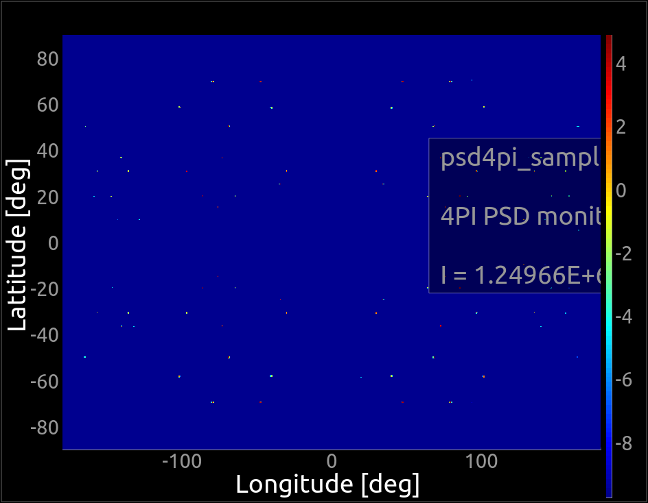

# McXtrace training: samples and virtual experiments (part 2)

This is the continuation of the [part 1](../7_Practical_Virtual_Exp_building/) session about samples. Please refer to it for general comments about Geometry and Data files (including `cif2hkl`).

---

## Exercise C: Max IV DanMAX (MX)

The idea here is to model the [DanMAX](https://www.maxiv.lu.se/accelerators-beamlines/beamlines/danmax/) beam-line at MaxIV with a powder and a single crystal.

Start by selecting the DanMAX example in its 2D version (*File > New from template > Max IV*). 

#### Step C.1: getting to know each other

To get an overview of the beam-line, run it in Trace 3D mode, with default parameter values. A 3D view will show up. Accumulate rays in the 3D view so that you can visualise the beam (_Keep rays_).

Look at its code, and navigate to its end to identify the double monochromator, the different slits and filters, the sample, and the detector. 

Notice the use of `SPLIT 100` at the sample location. It is there to enhance the scattering contribution, even when few rays actually pass the monochromator/multi-layer/slits.

🏃‍♂️️Zoom the 3D view to look at the double monochromator.

📢️ Admittedly, this rendering is not adapted to very long beam-lines (except if you are a Quake/Doom expert gamer).

🆘️Trace mode, mouse buttons:
- :arrow_upper_left: left: rotate
- :arrow_up: middle: zoom
- :arrow_upper_right: right: translate



Then, launch a simulation with e.g. 1e6 rays (MPI, recompile). Plot the results, especially the 2 last detector images (use _L_ key for log-scale intensity).

:question:
- Comment on the energy profile of the beam reaching the sample. 
- What is the origin of the energy tails ?
- Does the scattered signal look like a powder ?




#### Step C.2: then it becomes crystal clear

For the following, we wish to convert the LaB<sub>6</sub> powder sample into a single crystal one, but the provided data file [LaB6_660b_AVID2](https://github.com/McStasMcXtrace/McCode/blob/master/mcxtrace-comps/data/LaB6_660b_AVID2.hkl) only contains positive HKL Miller indices.

Search the LaB<sub>6</sub> crystal at http://crystallography.net/ and download its CIF file (for instance COD entry [1000055](http://crystallography.net/cod/1000055.html)).

Use `cif2hkl` to generate a single crystal file of F2(hkl) reflections in single crystal and x-ray mode.
``` bash
cif2hkl -x -m XRA 1000055.cif
```

:runner: Just to make sure, run the simulation with this new F2(HKL) file and still the powder sample. 

❓️
- are there any differences ? What is their origin ?

We recommend that you now remove the `sigma_` lines in the  F2(HKL) file so that the model only computes the coherent diffraction scattering, without any surrounding background.

Copy/paste the powder sample block, and modify the sample component into a Single_crystal one with same geometry, using the newly generated F2(HKL) list. 

Remove the `material` parameter to [lab6.abs](https://github.com/McStasMcXtrace/McCode/blob/master/mcxtrace-comps/data/lab6.abs) as it may hide the Bragg scattering (creates lots of background around). 

Comment the PowderN block with `/* ... */` in order to only use the SX. For simplicity, you may also add a `string sample` parameter in the DEFINE line, with default value `"LaB6_660b_AVID2"`.

``` c
DEFINE INSTRUMENT ...(..., string sample="LaB6_660b_AVID2")
SPLIT 100 COMPONENT sx = Single_crystal(
    reflections=sample,
    radius=sample_radius, mosaic=5, 
    yheight=10e-3, p_transmit = 0)
```

The scattering may occur at large angle, meaning we may miss it. In order to be sure to catch it, add a 4&pi; PSD monitor (500x500 pixels, 15 cm radius) right before the Pilatus2M, centred onto the sample location, with option `restore_xray = 1`.

:runner: Run the simulation again with `sample="1000055.cif.hkl"`.

:question:
- What is the typical scattering angle for this crystal illuminated with `E0=35` keV ?
- Is the current Pilatus detector location appropriate ?
- What solutions can be envisaged ?

#### Step C.3: feeling concentric ?

In this exercise, we wish to superpose the single crystal contribution with a model for a sample container. 

🤫️To date, this is an experimental feature. We are on the bleeding edge !

⚠️To circumvent a bug currently in McXtrace 1.5, you need to get an updated version of PowderN at https://raw.githubusercontent.com/McStasMcXtrace/McCode/master/mcxtrace-comps/samples/PowderN.comp.

🔆️The idea here is to model a Polyamide powder container kind of _around_ the LaB6 crystal. For this exercise, we shall consider that the container is made of poly-crystalline polyamide. We suggest you search for a polyamide structure (for instance COD entry [1504080](http://crystallography.net/cod/1504080.html)), then get its CIF and generate the F2(HKL) reflection list. We also recommend that you remove the `sigma_` lines in the  F2(HKL) file so that the model only computes the coherent diffraction scattering, without any surrounding background.

Add a PowderN component right after the sample, with the same geometry, but a 1 &mu;m polyamide layer _outside_ the cylinder (use a negative `thickness` parameter to extend the geometry outside the inner crystal shape). The contribution from the container is too strong compared with the single crystal. We thus suggest to reduce it artificially by lowering its packing factor (density) using `pack = 0.006`.

As an example (but your solution may be different), you may have modified at the beginning:
``` c
DEFINE INSTRUMENT MAXIV_DanMAX_pxrd2d( ...
        string sample="LaB6_660b_AVID2.hkl", 
        string container="NULL")
```
and in the TRACE section (at the sample location):
``` c
TRACE
...
SPLIT 100 COMPONENT sx = Single_crystal(
    reflections=sample,
    radius=sample_radius, mosaic=5, 
    yheight=10e-3, p_transmit = 0)
AT (0, 0, 0) RELATIVE pxrd_2d_pt
ROTATED (0,0,90) RELATIVE pxrd_2d_pt

COMPONENT powdern = PowderN(
    reflections=container,
    radius=sample_radius, thickness=-1e-6,
    yheight=10e-3, d_phi = 90, p_transmit=0.99,
    pack = 0.6, Vc=71.830, density = 4.72)
AT (0, 0, 0) RELATIVE sx
...
COMPONENT psd4pi = PSD_monitor_4PI(radius=0.15,
            nx=500, ny=500, filename="psd4pi.psd", restore_xray=1)
AT(0,0,0) RELATIVE pxrd_2d_pt
```

🏃‍♂️️Run the simulation with MPI and 10<sup>5</sup> xray events, and `sample=1000055.cif.hkl container=1504080.cif.hkl`. Plot the results and look at the 4 &pi; monitor. Identify the crystal contribution. Switch to log scale (_L_ key).

❓️
- Identify the scattering Bragg spots from the crystal.
- Identify the scattering from the container. Does it look like a powder ?

#### Step C.4: better than real life

Let's now separate the contributions from the sample and the container. In the `DECLARE` section of the beam-line description, add two variables such as:
``` c
char flag_sample, flag_container;
```

These flags must be set when the xray interacts with either the container or the sample. This is done with `EXTEND` blocks, located just after AT/ROTATED lines. We make use of the `SCATTERED` keyword, which is 0 when nothing happens, or set to the number of interactions. Add such EXTEND blocks as:
``` c
COMPONENT sx ...
AT ...
ROTATED ...
EXTEND %{
  flag_sample = SCATTERED; // or "if (SCATTERED) flag_sample=1;
%}
```
and a similar block for the powder.

Add a new monitor, which is a copy of the 4&pi; monitor, but sensitive to sample-only events (remember to update the output file name). This is achieved with a line such as:

``` c
COMPONENT psd4pi_sample = COPY(psd4pi)(filename="psd4pi_sample.psd")
WHEN flag_sample && !flag_container
AT(0,0,0) RELATIVE pxrd_2d_pt
```

🏃‍♂️️Run the simulation again with MPI and 1e5 events.

❓️ 
- Does the total signal makes sense ?
- Identify the sample-only, compare with the total signal.




🏃‍♂️️If you have time, rotate the sample slowly around the X axis (11 steps of 0.5 deg, 10<sup>5</sup> rays). 
Look at individual scan steps (e.g. directories 0,1,2, ...).
The container contribution should keep calm, while the crystal Bragg spots should move around.

---
*McXtrace training - 2022*
