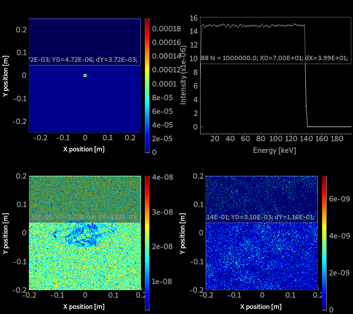

# McXtrace training: samples and virtual experiments: spectroscopy (and tomography)

In this practical session we shall simulate a very simple model of an absorption spcetroscopy beam-line. We shall use a sample with an "any shape" complex volume, which we can rotate to simulate a sinogram. We shall also simulate a (very small) hyper-spectral data set.

## Absorption data files
There is a dedicated documentation and tool to get absorption data files. 
- [HOWTO: McXtrace absorption files (materials)](https://github.com/McStasMcXtrace/McCode/wiki/HOWTO%3A-McXtrace-absorption-files-%28materials%29)

Usual materials are already available in the [data](http://mcxtrace.org/download/components/3.0/data/) directory.
:warning: However, we currently only treat monoatomic elements, without handling the structure (i.e. no EXAFS yet).

## A simple absorption/tomography station

There are a few absorption sample components that can be used:
- [Absorption_sample](http://www.mcxtrace.org/download/components/3.0/samples/Absorption_sample.html) a 1 or 2 absorbing materials as a box or cylinder.
- [Abs_objects](http://www.mcxtrace.org/download/components/3.0/samples/Abs_objects.html) a set of absorbing objects which geometry is set from OFF/PLY files.
- [Filter](http://www.mcxtrace.org/download/components/3.0/optics/Filter.html) which can handle absorption and refraction, as a block or any OFF/PLY geometry.

A typical beam-line should look like:
- a photon source
- some optics/slits to shape the beam
- a rotating stage carrying a sample
- a detector

A good start is to search for examples that already use an absorption sample. We find the [`Airport_scannerII.instr`](http://mcxtrace.org/download/components/3.0/examples/Airport_scannerII.html) in group DTU, and the [`SOLEIL_ROCK`](http://mcxtrace.org/download/components/3.0/examples/SOLEIL_ROCK.html) beam-line. 

Lets start with the [`Airport_scannerII.instr`](http://mcxtrace.org/download/components/3.0/examples/Airport_scannerII.html) in which we substitute the `sample_scan` component with a `Filter` one (the `Abs_objects` seems broken). Let's use a geometry file `wire.ply` made of Mn.

:runner: Start a computation with 1e6 photon events, possibly with MPI. Plot it.

# tomogram
 
:runner: Now, do a rotation of the sample around the vertical axis with `ANGLE=0,180` in 10 steps. Use 1e6 photon events, and MPI.

# absorption edge

To make sure absorption is properly taken into account, we shall now perform an energy scan. Looking at the current model, the energy spread is white. Lets restrict it to `E0` (default 6 keV), and `dE=0.1`. For this, a input parameters `E0=6` and `dE=0.1` should be set in the DEFINE INSTRUMENT line. We shall scan `E0`. This way we can change the white beam into a monochromatic distribution easily.

Also, the beam focus should be transformed into a small area. **TO BE DONE...**

:runner: Perform an energy scan between 5.8 and 6.8 keV. Plot the results.

# hyper-spectral imaging

With a narrow beam, we shall record the XANES as a function of the position of the beam hitting the sample. For this, we shall scan the sample position, and measure the outgoing spectrum for a flat incoming spectrum. To get a faster simulation, we use a white beam around 6 keV.

:runner: Add an energy monitor right after `psd2`.

# (Very) Simplified ROCK beamline simulation 

The goal of this short example is to simulate the behavior of a very simplified ROCK beamline that includes a bending magnet as the source, a channel cut for energy selection and an absorption sample. Several monitors will be placed between these equipments in order to show the evolution of the front of the beam across the beamline.

## Source
Let's start with inserting a bending magnet as the source. We want the energy spread to be white going from 4 to 40 keV. Make sure to choose an adequate E0 (center of emitted energy spectrum) and dE (half width of emitted energy spectrum). The storage ring electron energy (Ee) is equal to 2.75 GeV and the magnetic field (B) of the bending magnet is equal to 1.72 T.  
According to these parameters the characteristic energy is : `Ec = 0.665*Ee*Ee*B = 8.65 keV`. 

Now insert an energy monitor after the source. You can also place a PSD monitor there.

:runner: Run the simulation and observe through the energy monitor the white source.

## Double Crystal Monochromator (channel cut)

To select an energy we need to insert a channel cut double crystal monochromator. There are different ways of doing this. In this example we will use two Bragg_crystal components to materialise the channel cut.  
Add an input parameter Etohit=8 in the DEFINE INSTRUMENT line. We will calculate the Bragg angle from this energy.  
From the Bragg law we can deduce the calculated_angle : `calculated_angle = asin(m*lambda/(2*d))`. Where d is the interplanar distance (d = 3.1355 Angström for Si 111) and m the Bragg order (here m = 1). Lambda is the incident wavelength. To easily convert E(eV) to lambda(Angström) use the relation : `E(ev) = 12398.42 / lambda(Angström)`.  
In the DECLARE section, declare the calculated_angle variable by adding the line: `double calculated_angle;`  
Do the calculation in the INITIALIZE section. The angle needs to be in degrees so use RAD2DEG to convert radians into degrees.

The channel cut is made up of two parallel crystals placed at a certain attack angle. To do this :
- Insert a Si 111 crystal in between the source and the monitors. Choose 2 as the crystal_type, 2 being the diamond type. We can keep the rest of the parameters as default.  
Make the crystal rotate `-calculated_angle` (anti clockwise) around the x axis.  
Now position an arm on top of the crystal and make it rotate another `-calculated_angle` around the x axis. Make sure to use the PREVIOUS keywords.
- Place a second Si 111 crystal and it's following arm. This time the rotation will be done in the opposite direction.  
Translate the second crystal in the z direction 0.05 m (default length of the crystals) away from the first crystal.  
The vertical separation between the two parallel crystals is equal to 0.01 m so translate the second crystal in the y direction 0.01 m away from the first crystal.  
Make sure to translate (AT) the second crystal relative to the first crystal, use `RELATIVE first_crystal_name`. 

:runner: Run the simulation. Look at the energy monitor now, does the cc work?

## Monitor_nD (versatile monitor)
In order to show the vertical energy distribution insert a Monitor_nD after the channel cut, on top of the existing energy monitor. To do so :

Copy paste `char e_repartition_options[512];` in the DECLARE section and `sprintf(e_repartition_options,"energy  bins=500 limits=[%g %g],  y  bins=500",Etohit-0.02*Etohit, Etohit+0.02*Etohit);` in the INITIALIZE section.  
Now insert the Monitor_nD with `options=e_repartition_options` as one of the parameters.

:runner: Run the simulation. Explain the result of the monitor_nD.  
*Tip*: You can insert another Monitor_nD before the CC, just after the source. Change the limits of the monitor so that the energy ranges from 4.0 to 40.0 keV.

## Absorption sample
Finally, let us add an absorption sample after the monitor_nD. We will use the Absorption_sample component. We want the box in a box configuration. Choose zinc as the material for the inner box and copper for the outer box. Make sure the sample isn't too thick and remember to add the densities of the materials used (8.96 g/cm³ for Copper and 7.14 for Zinc).

Add an energy monitor right after the sample.

:runner: Do a scan in energy from 8 to 10 keV.  
Remember that the source is white, the energy scan is actually just the scan of the CC's attack angle, it's the energy we select with the CC.

Do you notice anything?  
*Tip*: Pressing `l` to view the plots in log scale can make things more obvious.

## Post-scriptum

This short example of a very Simplified ROCK beamline did not include many core elements of the real ROCK beamline such as:
- the toroidal collimating mirror (called M1 on this beamline) 
- the harmonic rejection mirror (called M2a) 
- the harmonic rejection and vertical focusing curved mirror (called M2b) 
- the vertical and horizontal slits 

If you want to play and/or improve the more realistic ROCK beamline that comprises the elements listed above you can find it here:  [ROCK](https://github.com/McStasMcXtrace/McCode/blob/master/mcxtrace-comps/examples/SOLEIL_ROCK.instr)

Happy simulating!

---

---
*McXtrace training - 2022*
