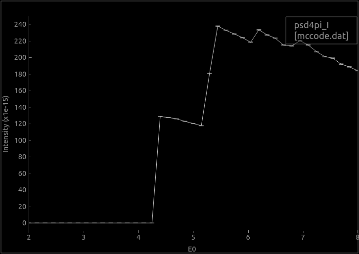

# McXtrace training: samples and virtual experiments (part 1)

In this training, we present a set of sample components to be inserted into beam-line in order to build so-called virtual beam-lines.

Currently, [McXtrace](http://www.mcxtrace.org) only supports a limited set of sample types, and mostly focuses on diffraction related studies. Other samples are planned, to model e.g. EXAFS, fluorescence, ARPES, ...). We hope you can contribute to this effort in the future. Also, these components are still under active development.

Inserting a sample component within a beam-line description constitutes a way to simulate a measurement. Such method is always limited by the amount of knowledge inserted both in the beam-line description, and the accuracy of the sample model.

---

## Sample geometry

Sample components should be given a geometrical shape. The sample coordinate frame is usually (when not rotated) *X* on the left, *Y* vertical, and *Z* is 'forward'.

The geometry can be specified as:
- a sphere `radius=<value>`
- a cylinder `radius=<value>, yheight=<value>`
- box `xwidth=<value>, yheight=<value>, zdepth=<value>`
- any shape defined with a `geometry=<file>` with a [PLY](http://en.wikipedia.org/wiki/PLY_%28file_format%29)/[OFF](http://www.geomview.org/docs/html/OFF.html) file (vertices and polygons similar to STL). Not all samples support this geometry.

Some samples can be made hollow by specifying a `thickness` parameter. This is especially useful for containers (e.g. capillary) and sample environments.

Moreover, some samples support a `concentric` mode, which allows to insert a component within an other. We shall not consider this topic during this session.

## Data files

The sample components we use in this session are diffraction oriented.

They use additional data files e.g.:
- structure factors vs HKL or d-spacing. These are stored in `laz` (for Powders, with multiplicity) or `lau` (for single crystals and powders) F<sup>2</sup>(HKL) files. We generate such files from CIF data.
- material files from e.g. [NIST](https://physics.nist.gov/PhysRefData/FFast/html/form.html) which contain Form Factors, Attenuation (absorption) and Scattering Cross-sections.

The F<sup>2</sup>(HKL) reflection list is given as a text file such as the [Mo.lau](http://www.mcxtrace.org/download/components/3.0/data/Mo.lau) file. It may be computed from a [CIF](http://crystallography.net/) file using the [cif2hkl](http://www.mcstas.org/download/share/cif2hkl.F90) tool, which is provided with McXtrace (e.g. as `/usr/share/mcxtrace/3.0/bin/cif2hkl`). There is also a web service at http://barns.ill.fr/cif2hkl.html (no guaranty this persists in the future !).

For powders (Bragg lines with multiplicity)
``` bash
cif2hkl --mode XRA  --lambda 1.0 Mo.cif 
```
For single crystals (all Bragg lines are given individually), the 'single crystal' mode is specified with the option `--xtal` as in:
``` bash
cif2hkl --xtal --mode XRA  --lambda 1.0 5000006.cif 
```

:warning: `cif2hkl` does not work properly with *mmCIF* files. Also, the `sigma_` lines in the generated file should be adapted to X-rays or removed (they are there for neutrons), especially the `sigma_abs` entry. Last, `cif2hkl `may fail converting too large structures.

The support for absorption is not fully functional yet, but we work on it.

---

## Exercise A: Powder diffraction (XRD)

Many laboratories are equipped with e.g. rotating anode X-ray sources. Indeed, powder diffraction is an efficient yet simple technique for material structure characterisation. A diffractogram allows to determine the nature and arrangement of atoms in a material. It is a very robust technique.

In this exercise, we shall simulate a simple diffractometer with:
- the [PowderN](http://www.mcxtrace.org/download/components/3.0/samples/PowderN.html) sample component ;
- the [Test_Powder](http://www.mcxtrace.org/download/components/3.0/examples/Test_Powder.html) example (using PowderN).

We shall start the MxGUI interface, and load the *Test_PowderN* example (*File > New From Template... > Tests* menu item). You then save a copy of it in your home directory. Then click the **Edit** button to open the model description. You can also use any other Text editor (GEdit and MousePad provide a nice source code highlighting).

#### The PowderN component

The [PowderN](http://www.mcxtrace.org/download/components/3.0/samples/PowderN.html) component takes as input:
-  some geometrical parameters (the sample shape) ;
- a list of F<sup>2</sup>(HKL) `reflections` which takes into account the crystal structure (space group, atom type and location, lattice parameters). We use the `lau` or `laz` extension, but this is arbitrary, and any other will work as long as the information is there ;
- an optional `material` file that provides absorption information.

A typical use for the PowderN is to model any powder material in the beam (can be e.g. a beryllium shell or a container).
``` c
COMPONENT sample = PowderN(
    reflections = "Fe_bcc229_lt13deg.dat", format=Crystallographica, material = "Fe.txt",
    radius = .5e-4, yheight = 1e-3, pack = 0.5, Vc = 123,
    p_inc = 0, p_transmit = 0.1, DW = 0)
```

The resulting scattered beam appears as so-called Debye-Scherrer cones which satisfy the equation:

n &lambda; = 2 _d_ sin &theta;

where  &lambda; = 2 &pi;/k is the incident wavelength, _d_ is a distance separating atomic planes in the material, and &theta; is the scattering angle (half take-off).

💡️The `d_phi` parameter to PowderN specifies an angular opening wrt the horizontal plane, to restrict the scattering from the powder and increase the statistics in this toroidal shape. It allows in practice to match a detector surface, and avoid sending rays outside of it. Remove it if you wish to scatter in 4&pi;.

#### Step A.1: incident photon energy parameter and single calculation

The [Test_Powder](http://www.mcxtrace.org/download/components/3.0/examples/Test_Powder.html) description has only one input parameter `TTH`, which is not so useful to us.

Change `TTH` into an `E0` incident photon energy (in keV with default value 15), update the documentation accordingly, and forward this value to the source component `src`. 

The energy spread should also be set as proportional to `E0` in order to mimic the distribution out of e.g. a monochromator. Let's us `dE=E0/100` at the source.

At the sample location, remove the `d_phi` option to allow diffraction in 4&pi; and fully illuminate our 4&pi; monitor.

Remove the `ttharm` and `detector2` components. As a comment, you can see right after the sample component that the non scattered x-rays are absorbed (removed from the calculation) in an EXTEND block. 

:runner: Run the simulation with an incident energy of 15 keV, 10<sup>7</sup> rays, and MPI (recompile) with 8 cores. This can be done from the GUI, or from the command line with, e.g.:
``` bash
mxrun --mpi 8 Test_PowderN.instr E0=15 -n 1e7
```

The data files are stored in a directory which contains text files.

:runner: Plot the results and look at the 4&pi; monitor. Switch to intensity 'log-scale' (press the *L* key on the plot). Comment. 

:question:
- Why is there no signal at small angle ? 
- Why do you get a kind of rectangle frame at 90 deg scattering angle ?


#### Step A.2: perform an energy scan

It is rather simple to vary a model parameter. For this, specify an energy range `min,max`, and a number of *Sweep steps* (in the Run dialogue) or `-N` argument on the command line.

In our case, we shall vary the incident energy `E0` from 3 to 8 keV.

:runner: Perform an energy scan (e.g. 41 steps), and plot the results. The data goes in a scan directory, which itself contains *N* sub-directories (labelled as 0 to N-1). Plot the intensity vs E0.

``` bash
mxrun --mpi 8 -N 41 Test_PowderN.instr E0=3,8 -n 1e6
mxplot <output_dir>
```





:question:
- Why do you see steps vs energy ?
- Use Ctrl-click on the detector to see its response vs Energy. Does it properly explain these steps ?
- What is needed to get a signal on the flat PSD (last monitor) in the 3-8 keV energy range ?

---

## Exercise B: Macromolecular crystallography (MX)

In this exercise, we aim to demonstrate how an MX measurement can be simulated (in a simplified way). For this, we shall use:
- the [Single_crystal](http://www.mcxtrace.org/download/components/3.0/samples/Single_crystal.html) sample component ;
- the [Test_SX](http://www.mcxtrace.org/download/components/3.0/examples/Test_SX.html) example (using the Single_crystal).

We shall start the MxGUI interface, and load the *Test_SX* example (*File > New From Template... > Tests* menu item). You then save a copy of it in your home directory. Then click the **Edit** button to open the model description. You can also use any other Text editor (GEdit and MousePad provide a nice source code highlighting).

#### The Single_crystal component

To date, the [Single_crystal](http://www.mcxtrace.org/download/components/3.0/samples/Single_crystal.html) is one of our most complex McXtrace component. It takes as input:
- some geometrical parameters (the sample shape) ;
- a list of F<sup>2</sup>(HKL) `reflections` which takes into account the crystal structure (space group, atom type and location, lattice parameters). We use the `lau` extension, but this is arbitrary, and any other will work as long as the information is there ;
- an optional `material` file that provides absorption information.

A typical use for the Single_crystal is to model any crystalline material in the beam (can be e.g. a sapphire container, filter), and of course any crystalline sample. Use a rather large mosaic to enlarge the Bragg spots.

``` c
COMPONENT sample = Single_crystal(reflections="Mo.lau", 
  radius = .5e-4, yheight = 1e-3, p_transmit = 0, mosaic=5)
```

#### Step B.1: Add a Progress_bar and clean-up some components

In order to monitor the execution of the simulation, and get an estimate of the computation time, we can add a [Progress_bar](http://www.mcxtrace.org/download/components/3.0/misc/Progress_bar.html) component. Position the cursor right after the `TRACE` keyword in the [Test_SX](http://www.mcxtrace.org/download/components/3.0/examples/Test_SX.html) example, and add the component, with no parameter, on the Origin (ABSOLUTE positioning).

Remove the `ttarm` and `detector2` components, that we won't use here. Extend the remaining detector pixel size by a factor 10 on each axis (e.g. 2k x 2k) so that it matches better a real detector binning.

Replace the `TTH` input parameter (on the `DEFINE` line), with:
- an `E0` photon energy (default: 15 keV), 
- a `sample` parameter (of type `string` and "4mea.lau" default value) to specify the sample structure factors
- two `rotX` and `rotY` angles (default: 0 deg)

Think about mirroring these changes in the file header, so that the documentation keeps in sync.

Then, indicate to the `src` component that its energy parameter `E0` is the `E0` parameter from the beam-line description (we have chosen the same name to ease understanding). Do a similar operation to set the reflection list to the `sample` input argument. You may remove the `material` parameter, which is used to compute the absorption.

Get the [4mea F2(HKL)](4mea.lau) structure file which has been created from the PDB entry https://www.rcsb.org/structure/4mea "*epoxide hydrolase from Acinetobacter nosocomialis*" (don't eat it, it's probably toxic).

:runner: Save the beam-line description, and visualize its geometry with the Trace mode in the Run dialogue. Check that everything sits at the right place. This can also be achieved at command line prompt:
``` bash
mxdisplay-webgl Test_SX.instr E0=15 -n 1e7
```


:runner: Actually, run it with e.g. 10<sup>6</sup> rays, using all the available CPU cores (MPI - recompile).

Plot the results. 

:question:
- Comment on the Bragg spot distribution, and their size. 
- What's wrong here ?

#### Step B.2: making model slightly more realistic

The diffraction pattern is rather symmetric (even though incomplete). This is usually not the case because the sample is not oriented along its principal lattice axes in experiments. This is why a normal experiment captures diffraction patterns while rotating the sample, to catch many reflections and reconstruct a larger reciprocal space area.

Specify rotations `rotX` and `rotY` along axis X and Y of the sample component. Modify the following components ROTATED statements so that they do not rotate as well.

We can remove the central beam spot in three different ways:
1. use an EXTEND block and remove all non scattered events immediately (perfect beam-stop)
2. use a [Beamstop](http://www.mcxtrace.org/download/components/3.0/optics/Beamstop.html) component 
3. use a variable of our own to record when a ray has scattered or not, and make use of it with EXTEND and WHEN keywords afterwards.

The first solution is extremely simple. Right after the sample component block, add an EXTEND block (with `%{` and `%}` delimiters), and write a C statement that implements:
- "*if the ray has not scattered, absorb it*".

The `SCATTERED` and `ABSORB` keywords should be used (don't panic, the solution is extremely simple).

:runner: Run the simulation again, and use a few degrees rotation on the sample (1-2 deg). 

:question:
- Comment on the results.


You may repeat the calculation with the L-glutamine from http://crystallography.net/cod/5000006.html. Use the [Lglutamine long F2(HKL)](Lglutamine-full.lau) file, or for a faster computation, the [Lglutamine F2(HKL)](Lglutamine.lau) file. For more contrasted detector images, it is recommended to use bigger pixels (e.g. 300 x 300).


:question:
- Does it look more realistic now ?
- Comment on the missing contributions.

---
*McXtrace training - 2019*
