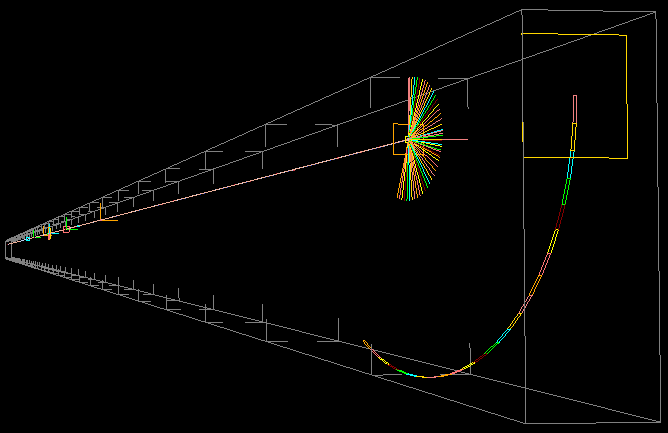

# McXtrace training: modelling synchrotron beamlines and samples

You will learn: Modelling beam-lines with [McXtrace](http://www.mcxtrace.org/), adding samples, coupling with other software, etc...

## Description

| Date | Mar 9-11, 2022 |
| --------|-------------------|
|Location |  	[Synchrotron SOLEIL](https://www.synchrotron-soleil.fr/fr) |
| Topic | synchrotron beam-line modelling with samples |
| Language | English |

This tutorial aims at presenting the [McXtrace](http://www.mcxtrace.org) software to scientific and technical staff at [SOLEIL](https://www.synchrotron-soleil.fr/fr).

McXtrace allows to describe X-ray (synchrotron and X-FEL) beam-lines with sources, optics, monitors/detectors, samples and more. It is interfaced with other software such as:
- Spectra (R) <http://spectrax.org/spectra/>
- Simplex (R) <http://spectrax.org/simplex/index.html >
- Genesis (R) <http://genesis.web.psi.ch/>
- Shadow (RW) <https://github.com/oasys-kit/shadow3>
- MCPL (GEANT4, PHITS, MCNP, SRW) (RW) <https://mctools.github.io/mcpl/>

The newly released McXtrace-3.0 allows execution on NVIDIA GPU's.

## Programme

The training is mostly focused at hands-on topical sessions, each with a few introductory slides, and guided exercises.

|         |  Wednesday, Mar 9th 2022 | Thursday, Mar 10th 2022 | Friday, Mar 11th 2022 |
|-------|-------------------|----------------------------|----------------------------|
| 09:00-10:30 | |  Lesson: [Components](https://github.com/McStasMcXtrace/Schools/tree/master/SOLEIL_March_2022/Day2_Thursday_March_10th/3_Components) | Lesson: [Advanced Tricks](https://github.com/McStasMcXtrace/Schools/tree/master/SOLEIL_March_2022/Day3_Friday_March_11th/7_Advanced_Tricks) |
| 10:30-10:45 | |	Coffee break |Coffee break|
| 10:45-12:00 | | Practical: [Optics](https://github.com/McStasMcXtrace/Schools/tree/master/SOLEIL_March_2022/Day2_Thursday_March_10th/4_Optics) | Practical: [Samples and Virtual Experiments / absorption spectroscopy](https://github.com/McStasMcXtrace/Schools/tree/master/SOLEIL_March_2022/Day3_Friday_March_11th/8_Practical_Virtual_Exp_spectroscopy) |
| 12:00-14:00 |	Lunch |	Lunch | Lunch |
| 14:00-16:00 |Lesson: [Introduction to McXtrace](https://github.com/McStasMcXtrace/Schools/tree/master/SOLEIL_March_2022/Day1_Wednesday_March_9th/1_Introduction)  | Practical: [Photon sources/external software](https://github.com/McStasMcXtrace/Schools/tree/master/SOLEIL_March_2022/Day2_Thursday_March_10th/5_Advanced_photon_sources) | Practical: [We help you to start your beam-line model](https://github.com/McStasMcXtrace/Schools/tree/master/SOLEIL_March_2022/Day3_Friday_March_11th/9_Starting_your_own_beam_line) |
| 16:00-16:15 |	Coffee break |	Coffee break |
| 16:15-18:00 |Practical: [your first McXtrace beam-line](https://github.com/McStasMcXtrace/Schools/tree/master/SOLEIL_March_2022/Day1_Wednesday_March_9th/2_1st_Beamline) | Practical: [Samples and Virtual Experiments / diffraction](https://github.com/McStasMcXtrace/Schools/tree/master/SOLEIL_March_2022/Day2_Thursday_March_10th/6_Practical_Virtual_Exp_diffraction)  | |

## Installation

You will access McXtrace via a browser on your laptop. No software installation is required.

- For SOLEIL staff (wifi, on-site): start the Data Analysis virtual machine from <http://re-grades-01.exp.synchrotron-soleil.fr/desktop/>. :+1: This option provides optimal computing power.
- For all: access a prepared McXtrace simulation environment from <https://mybinder.org/v2/gh/McStasMcXtrace/mcxtrace-binder/master?urlpath=lab>. The JupyterLab is displayed with a __Desktop__ icon on the right panel. Drag-n-drop files on the left panel to communicate with your simulation environment. :warning: This option provides a limited computing power.

In case you wish to install the software yourself, refer to the [McXtrace installation](http://mcxtrace.org/download/) page. Version 1.7 is the legacy one. Version 3 is the 'next-generation' one with a improved performance, GPU support at the cost of a slightly modified syntax/grammar.

## Registration and contacts

The school is organised by:

- [Emmanuel Farhi](emmanuel.farhi@synchrotron-soleil.fr), Synchrotron SOLEIL, FR 
- [Peter Willendrup](https://www.fysik.dtu.dk/english/Research/NEXMAP/About-NEXMAP/Staff/Person?id=38697&tab=2&qt=dtupublicationquery), DTU, DK

[Registration](https://tucana.synchrotron-soleil.fr/event/37/) is free (20 seats). Deadline for registration is February 28 2022.

This training is entirely funded by the Experiment Division at SOLEIL, with support from the Administrative Division.

## About McXtrace

[McXtrace](http://www.mcxtrace.org/) is a general Monte Carlo ray-tracing software for simulation X-ray beam-lines and experiments, distributed under the open source license of GPL.

It is a collaborative effort between DTU Physics, European Synchrotron Radiation Facility, Niels Bohr Institute, and now SOLEIL. Initial funding came from a grant under the NaBiIT program of the Danish Strategic Research Council DSF and from SAXSLAB ApS, in addition to the above parties.

It is built upon the code base of the proven and successful neutron ray-tracing package [McStas](http://mcstas.org/) and today McXtrace and McStas share a central code repository at https://github.com/McStasMcXtrace/McCode.

**References:**

1. McXtrace http://www.mcxtrace.org/
2. Downloads (version 3.0 from February 8th 2022) for Windows, Mac and Linux (CentOS, Fedora, Debian) at http://downloads.mcxtrace.org/mcxtrace-3.0/
3. E Bergbäck Knudsen, Andrea Prodi, Jana Baltser, Maria Thomsen, P Kjær Willendrup, M Sanchez del Rio, Claudio Ferrero, Emmanuel Farhi, Kristoffer Haldrup, Anette Vickery, et al. "Mcxtrace: a monte carlo software package for simulating x-ray optics, beamlines and experiments". _Journal of Applied Crystallography_, **46(3)**:679-696, 2013.
4. McXtrace/McStas Wiki https://github.com/McStasMcXtrace/McCode/wiki
5. McXtrace/McStas repository https://github.com/McStasMcXtrace/McCode

***
*McXtrace training - 2022*

