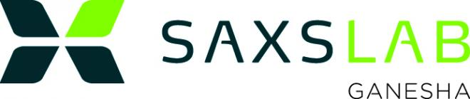

# McXtrace training: modelling synchrotron beamlines and samples

You will learn: Modelling beam-lines with [McXtrace](http://www.mcxtrace.org/), adding samples, coupling with other software, etc...

## Description

| Date | Mar 9-11, 2022 |
| --------|-------------------|
|Location |  	[Synchrotron SOLEIL](https://www.synchrotron-soleil.fr/fr) |
| Topic | synchrotron beam-line modelling with samples |
| Language | English |

This tutorial aims at presenting the [McXtrace](http://www.mcxtrace.org) software to scientific and technical staff at [SOLEIL](https://www.synchrotron-soleil.fr/fr).

McXtrace allows to describe X-ray (synchrotron and X-FEL) beam-lines with sources, optics, monitors/detectors, samples and more. It is interfaced with other software such as:
- Spectra (R) <http://spectrax.org/spectra/>
- Simplex (R) <http://spectrax.org/simplex/index.html >
- Genesis (R) <http://genesis.web.psi.ch/>
- Shadow (RW) <https://github.com/oasys-kit/shadow3>
- MCPL (GEANT4, PHITS, MCNP, SRW) (RW) <https://mctools.github.io/mcpl/>

The newly released McXtrace-3.0 allows execution on NVIDIA GPU's

## Programme

The training is mostly focused at hands-on topical sessions, each with a few introductory slides, and guided exercises.

(The below table is derived from an earlier programme and is in *DRAFT* status)

|         |  Wednesday, Mar 9th 2022 | Thursday, Mar 10th 2022 | Friday, Mar 11th 2022 |
|-------|-------------------|----------------------------|----------------------------|
| 09:00-10:30 | [Introduction to McXtrace](https://github.com/McStasMcXtrace/Schools/tree/master/SOLEIL_December_2019/Tuesday_December_3rd/1_Introduction)  | Practical: [Advanced photon sources/external software](https://github.com/McStasMcXtrace/Schools/tree/master/SOLEIL_December_2019/Wednesday_December_4th/5_Advanced_photon_sources)   | |
| 10:30-10:45 |	Coffee break |	Coffee break |
| 10:45-12:00 | Practical: [your first McXtrace beam-line](https://github.com/McStasMcXtrace/Schools/tree/master/SOLEIL_December_2019/Tuesday_December_3rd/2_1st_Beamline)  |  [Advanced Tricks](https://github.com/McStasMcXtrace/Schools/tree/master/SOLEIL_December_2019/Wednesday_December_4th/6_Advanced_Tricks)   | |
| 12:00-14:00 |	Lunch |	Lunch | Lunch |
| 14:00-16:00 | Practical: [Components](https://github.com/McStasMcXtrace/Schools/tree/master/SOLEIL_December_2019/Tuesday_December_3rd/3_Components)  |   Practical: [Samples and Virtual Experiments / part 1](https://github.com/McStasMcXtrace/Schools/tree/master/SOLEIL_December_2019/Wednesday_December_4th/7_Practical_Virtual_Exp_building)  | |
| 16:00-16:15 |	Coffee break |	Coffee break |
| 16:15-18:00 	 | Practical: [Optics](https://github.com/McStasMcXtrace/Schools/tree/master/SOLEIL_December_2019/Tuesday_December_3rd/4_Optics) |  Practical: [Samples and Virtual Experiments / part 2](https://github.com/McStasMcXtrace/Schools/tree/master/SOLEIL_December_2019/Wednesday_December_4th/8_Practical_Virtual_Exp_using)  | |

You will use the computers in the training room, which will be configured with a virtual machine running McXtrace. No installation is needed on your side. The training material will also be provided to attendees on USB sticks.

## Registration and contacts

The school is organised by:
- [Emmanuel Farhi](emmanuel.farhi@synchrotron-soleil.fr), Synchrotron SOLEIL, FR 
- [Peter Willendrup](https://www.fysik.dtu.dk/english/Research/NEXMAP/About-NEXMAP/Staff/Person?id=38697&tab=2&qt=dtupublicationquery), DTU, DK

Registration is free (20 seats), and consists in sending an email to emmanuel.farhi@synchrotron-soleil.fr with subject "Inscription tutorial McXtrace 2022". Deadline for registration is February XX 2022.

This training is entirely funded by the Experiment Division at SOLEIL, with support from the Administrative Division.

## About McXtrace

[McXtrace](http://www.mcxtrace.org/) is a general Monte Carlo ray-tracing software for simulation X-ray beam-lines and experiments, distributed under the open source license of GPL.

It is a collaborative effort between DTU Physics, European Synchrotron Radiation Facility, Niels Bohr Insitute, and now SOLEIL. Initial funding came from a grant under the NaBiIT program of the Danish Strategic Research Council DSF and from SAXSLAB ApS, in addition to the above parties.

It is built upon the code base of the proven and successful neutron ray-tracing package [McStas](http://mcstas.org/) and today McXtrace and McStas share a central code repository at https://github.com/McStasMcXtrace/McCode.

**References:**
1. McXtrace http://www.mcxtrace.org/
2. Downloads (versions 3.0 from XX February 2022) for Windows, Mac and Linux (CentOS, Fedora, Debian) at http://downloads.mcxtrace.org/mcxtrace-3.0/
3. E Bergbäck Knudsen, Andrea Prodi, Jana Baltser, Maria Thomsen, P Kjær Willendrup, M Sanchez del Rio, Claudio Ferrero, Emmanuel Farhi, Kristoffer Haldrup, Anette Vickery, et al. "Mcxtrace: a monte carlo software package for simulating x-ray optics, beamlines and experiments". _Journal of Applied Crystallography_, **46(3)**:679-696, 2013.
4. McXtrace/McStas Wiki https://github.com/McStasMcXtrace/McCode/wiki
5. McXtrace/McStas repository https://github.com/McStasMcXtrace/McCode

***
*McXtrace training - 2022*

